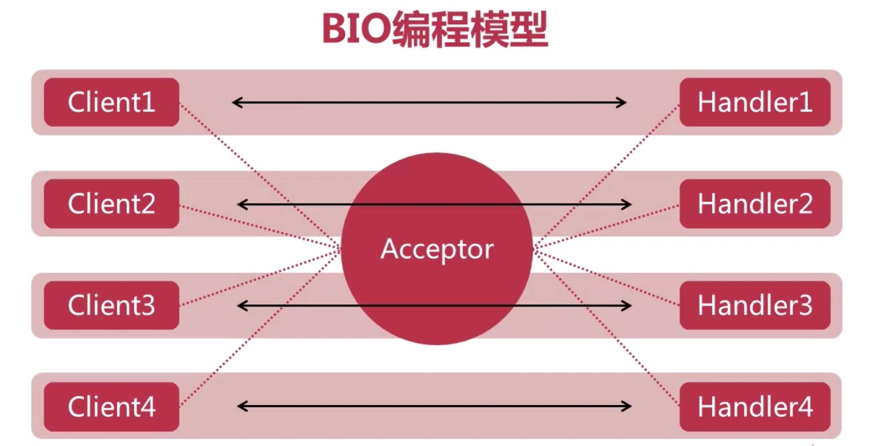

# 1. BIO 时代简介

## 1. Linux 内核

在说 BIO 之前, 需要先铺垫一波.

### 1. Linux 的 IO 操作

#### 1. kernel 简介

首先程序开发好后, 是放在磁盘中的, 然后被加载到内存中执行.

在启动电脑后, 内存中加载的第一个程序是 `kernel`, 也就是 ==**操作系统内核**==. `kernel` 是管理硬件的.

内核加载内内存后, 会注册一个 `GDT`, 叫做 全局描述附表, 会把内存所在的内存空间划分出来, 叫做 ==**内核空间**==, 其他的普通应用的空间, 用作 ==**用户空间**==. 为了更好的保护内核空间, 内核空间和用户空间分别运行在不同的级别上, 在逻辑上是相互隔离的, 所以用户进程在通常情况下无法直接访问内核空间的数据, 也无法使用内核空间的函数.

`Kernel` 是控制硬件的, 那么此时, 一个硬件内, 比如硬盘, 或者网卡内有一个数据, 如果程序(app)想读取这个数据, 应该怎么办?

由于程序无法直接访问内核内的, 也就是无法直接访问硬盘, 或者网卡, 或者其他硬件的. 能直接访问硬件的是 kernel.  

那么就需要通过 kernel 来访问硬件, 但是程序又无法直接访问内核. 所以内核提供一个 `syscall`, 暴露了一系列的方法, 这些方法可以用来读取 `kernel` 内的数据. 但是又因为 APP 无法直接访问 kernel, 所以就出现一个叫做 ==**软中断**==的东西. 通过 软中断 和 kernel 进行交互. 

#### 2. Linux 一切皆文件

在 Linux 内, 一切都可以用文件来表示, 就像 java 的一切皆对象.

通过 `strace -ff -o ./输出目录 java xxx.java` 命令可以查看程序对 kernel 有没有发生什么系统调用.并把日志输出到指定路径下

使用命令后, 

# 2. BIO编程模型

BIO(Blocking IO) 是`同步阻塞式IO`, 是jdk早期 1.4 之前采用的通信模式.

## 1. BIO 编程模型

在具体了解 BIO 之前, 先说三个角色:

- `client`: 客户端. 发起链接请求
- `acceptor`: 接收者. 位于服务端, 仅仅用于接收客户端的链接请求.
- `handler`: 位于服务端, 专门用于处理和客户端的数据通信.

- acceptor 专门用来接收客户端的链接请求.(acceptor 也是一个线程)
- acceptor 接收到 client 的链接请求后, 会为这个 client 创建一个线程, 这个线程专门用来处理和 client 之间的数据通信.
- 再接收到一个 client的链接请求, 就再创建一个专门的线程来负责和这个 client 的数据通信.
- 也就是说, client 和线程是 `1:1`的关系, 一个客户端对应一个线程.

以上就是 BIO 的编程模型, 相对来说比较简单, 但是当任务量比较大的时候, 或者说并发量比较大的时候, 系统就会创建大量的线程来为多个客户端的处理, 性能会急剧下降.

# 3. BIO 实现多人聊天室

- 基于 BIO 编程模型
- 支持多人同时在线.(多个 client)
- 每个用户的发言都会被转发给其他所有在线用户.

## 1. 设计思路

**服务器端:**

1. acceptor(主线程)每接收到一个 client 的链接请求, 都要 accept 一下, 创建一个负责这个 client 的线程, 多个 client 就要创建多个线程.
2. 当其中一个 client 发送了一条信息, 负责处理这个 client 的线程要把接收到的数据发送给其他的 client. 就需要有一个列表或者数组啥的来存储当前在线的 client.

**客户端:**

1. 客户端要和服务端建立连接, 在客户端发送一条数据后, 在等待服务端返回的这段时间其实是阻塞的,毕竟是 BIO 嘛, 那为了可以接受到其他服务端转发的其他客户端发送的信息, 那么客户端就需要有另外一条线程来负责接受其他客户端被服务端转发过来的消息.也就是说客户端至少要有两条线程,一条用于和自己对应的服务端的线程交互, 一条负责和服务端其他线程进行交互(接收服务端转发的其他客户端发送的消息).