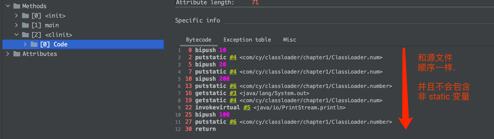

# 1. JVM 整体结构

idea 查看字节码文件工具: `jclasslib`.

## 1. JVM 整体结构

​	java 虚拟机是解释运行 ==class文件(字节码文件)==的, 通过==类加载器==, 将字节码文件装载到内存当中, 生成一个 class 对象, 这个过程涉及到 `加载, 链接, 初始化`. 将字节码文件加载到==运行时数据区==后, 就要通过==执行引擎==进行解释运行.


- 字节码文件: 也就是 `.class` 文件, `.java` 程序经过==编译器==编译后, 形成字节码文件, 每个字节码文件都对应一个类(对象).然后字节码文件进行解释执行.
- 执行引擎: 操作系统只能识别机器指令, 无法识别字节码指令, 所以需要借助执行引擎来将字节码指令翻译成操作系统可以识别的机器语言.


## 2. Java 代码执行流程

	

​	Java 源代码通过编译器编译后(第一次编译), 形成字节码文件, 字节码文件通过类加载器加载到 JVM 中, 然后通过执行引擎(翻译字节码/==JIT 编译器==)将字节码指令解释翻译为机器指令, 然后操纵系统进行运行.

​	执行引擎是 JVM 比较核心的内容之一. 目前市面上主流的虚拟机都采用了`解释执行和编译执行并存的方式`.

- 翻译字节码: 实时的根据字节码文件一行一行的进行解释执行.

- JIT 编译器: 在字节码文件中, 有一些代码是需要重复运行的, 也即是热点代码, JIT编译器 就会将这些热点代码的字节码指令再编译成机器指令(第二次编译), 然后==缓存到方法区当中==, 下次执行调用. ==所以 JIT 编译器和运行的性能有关==


## 3. JVM 指令集架构模型

JVM 的指令集架构基本上就 2 种: `基于栈的指令集架构` 和 `基于寄存器的指令集架构`.


基于栈的指令集架构特点:

- 设计和实现比较简单, 适用于资源受限的系统.
- 避开了寄存器的分配难题: 使用`零地址指令`方式分配.
- 指令流中大部分的指令都是`零地址指令`, 执行过程依赖于操作栈. `指令集更小(8位字节进行对其)`, 编译器容易实现. 相对于基于寄存器的指令集架构来说, 性能会降低, 实现同样的功能需要更多的指令.
- 不需要硬件支持, 可以移植性更好, 能更好的实现跨平台.
- 总结: 基于栈, 所以跨平台性好, 指令集小, 但是为了完成同样的功能需要更多的指令. 执行性能相对于基于寄存器的指令集架构要差一些.


基于寄存器的指令集架构特点:

- 指令集架构完全依赖硬件, 可移植性差.
- 指令要通过 CPU 执行, 由于操作数直接放在寄存器中,寄存器的速度非常快(至少相对于栈来说要快),所以性能就很优秀,执行更高效. 
- `花费更少的指令(16 位字节进行对其)`去完成一个操作.所以相当于基于栈的指令集架构来说, 可以通过更少的指令去完成一个操作.
- 大部分情况下, 基于寄存器的指令集架构的指令集往往都以一地址指令/二地址指令/三地址指令为主.


`HotSpot`使用的是 `基于栈的指令集架构`,  HotSpot任何的操作都要经过 `入栈`和`出栈`的操作. Java 代码的执行其实可以看做是通过一个一个的方法来实现的, 每运行一个方法, 就是一个入栈的操作, 栈顶就是当前正在执行的方法, 方法执行完毕后, 进行出栈操作.


- 零地址指令: 对应的还有一地址指令和二地址指令,以及三地址指令. 一地址指令就是说==如果想要执行一个指令, 那么就需要一个地址和一个操作数==, 二地址指令就是需要两个地址. 零地址就是不需要地址,只有操作数. 因为栈的会只有两个操作: 入栈和出栈, 也就是说操作栈的话其实就是操作的栈顶的数据, 所以不需要地址.


==**总结**==: 由于跨平台性的设计, Java 的指令都是根据栈来设计的. 不同平台的 CPU 架构不同, 所以不能设计为基于寄存器的.


## 4. JVM 的生命周期

`启动, 执行, 退出`


### 1. 虚拟机的启动

Java 虚拟机的启动是通过`引导类加载器(bootstrap class loader)`创建一个`初始类(initial class)`来完成的.这个类是由虚拟机的具体实现指定的.也就是说不通的实现商创建的初始类是不同的. 


也就是说,当要执行一个自己编写的 main 方法的时候,由于 java 中要加载一个类, 那么需要先加载它的父类.


### 2. 虚拟机的执行

- 一个运行中的 java 虚拟机有一个清晰的任务: `执行 java 程序`
- 程序开始执行时java 虚拟机才运行, 程序结束时 java 虚拟机就停止.
- 执行一个所谓的 java 程序的时候, 真真正正的执行的是一个叫做`Java虚拟机的进程`.


### 3. 虚拟机的退出

- 程序正常结束.
- 程序在执行过程中出现异常或者错误而异常终止.
- 由于操作系统出现错误而导致 Java 虚拟机进程终止.
- 某线程调用`Runtime` 类或 `System` 类的 `exit` 方法,或 `Runtime` 类的 `halt` 方法, 并且 Java 安全管理器也允许这次 exit 或 halt 操作.
- 除此之外, JNI(Java Native Interface)规范描述了用 JNI Invocation API 来加载或卸载 Java 虚拟机时, Java 虚拟机的退出情况.


# 2. 类加载器子系统


## 1. 类加载器子系统作用

类加载器子系统负责从文件系统或者网络中加载 class 文件,并将加载的类信息存放于`方法区`, class 文件在文件的开头有特定的文件标识(标识为 `CAFEBABE`, 通过 Hex Fiend 工具可以查看二进制字节码文件). 类加载器子系统在加载 class 文件时分为三个阶段: `加载, 连接, 初始化`.

ClassLoader 只负责 class 文件的加载, 至于它是否可以运行, 则有`执行引擎(Execution Engine)`决定.


注意: 方法区中除了存放有 ClassLoader 加载的类信息外, 还存放有运行时常量池信息. 通过 `javap -v xxx.class` 命令可以查看 class 的字节码信息, 其中 `Constant pool` 就是常量池信息, 运行的时候, 加载到内存中后就是 `运行时常量池信息`.


## 2. ClassLoader 加载类的三个阶段


### 1. Loading 阶段

加载阶段是通过一个类的 `全限定名` 获取到这个类的 `二进制字节流`, 然后将这个字节流代表的 `静态存储结构` 转化为 方法区的 `运行时数据结构`, 并在内存中生成一个代表这个类的 `java.lang.Class` 对象, 作为方法区这个类的各种数据的入口.


**加载的.class 文件的来源:**

1. 从本地系统直接加载.
2. 通过网络获取
3. 从 zip 压缩包读取, 日后的 jar/war 包等.
4. 运行时计算生成, 使用最多的是`动态代理技术`.
5. 由其他文件生成. 比如: `JSP`
6. 从专有的数据库中提取.class 文件.
7. 从加密文件中获取.


### 2. Linking 阶段

Linking 阶段分为三个阶段: `验证, 准备, 解析`


#### 1. `验证(Verify)`

目的是确保 class 文件的字节流中包含的信息符合当前虚拟机的要求, `保证被加载类的正确性`. 主要包括: `文件格式验证, 元数据验证, 字节码验证, 符号引用验证`.

比如对于二进制字节码文件的校验就是在这个阶段完成的, 可以使用 Hex Fiend 工具查看二进制字节码文件, 文件开头是 `cafebabe`.


#### 2. `准备(prepare)` 

主要是`为类变量分配内存并设计该类变量的默认值`. 比如 int 类型会赋值默认值 0. 但是 `不会为 final 修饰的 static 赋默认值`, 因为 final 在编译的时候就会分配了, 准备阶段会显示初始化., 也`不会为实例变量分配初始化`, 类变量会存放在方法区中, 而`实例变量会随着对象一起分配在堆中`.

```java
public class ClassLoader {
    private static int num = 1; // prepare: 初始化为 0 ==> initial: 赋值为 1
    public static void main(String[] args) {
        System.out.println(num);
    }
}
```


#### 3. `解析(Resolve)`: 

- 将常量池内的符号引用转化为直接引用的过程.
- 事实上, `解析操作往往会伴随着 JVM 在执行完初始化之后再执行.`
- 符号引用就是一组符号来描述所引用的目标. 符号引用的字面量形式明确定义在<Java 虚拟机规范>的 Class 文件格式中. 直接引用就是直接指向目标的指针,相对偏移量或一个间接定位到目标的句柄.
- 解析动作主要针对类/接口/字段/类方法/接口方法/方法类型等. 对应常量池中的 `constant_class_info, constant_field_info, constant_method_info 等`


### 3. Initialization 阶段

初始化阶段就是执行 `构造器方法 <clinit>()`的过程, ==**注意**==, `<clinit>()方法不需要定义, 是 javac 编译器自动收集类的所有类变量的赋值动作和静态代码块中的语句合并而来的, 并且构造器方法中的指令按照语句在源文件中出现的顺序执行.` 

`<clinit>() 方法不是编写的类的构造方法, 类的构造方法在字节码文件中是 <init>(), 而构造器方法<clinit>()中的 clinit 是指 classinit`

如果类具有父类, JVM 会保证子类的构造器方法执行前, 父类的构造器方法已经执行完毕. 并且虚拟机必须保证一个类的构造器方法在多线程下被同步加锁.


使用 `jclasslib` 查看class 字节码文件:


==**例子**==:

```java
public class ClassLoader {
    private static int num = 10;
  	private int notInClinit = 123;	// 不会被合并到构造器方法 <clinit>()中, 因为构造器方法合并的 static 静态变量.
    static {
        num = 20;
        number = 200;
      // System.out.println(num); // 可以打印, 结果就是 20
      // System.out.println(number); // 会报错, 非法的前向引用.
    }
    private static int number = 100; // prepare: 初始化为 0 ==> initial: 静态代码块中复制为 200, 然后再复制为 100
    public static void main(String[] args) {
        System.out.println(num);	// 20
        System.out.println(number); // 100
    }
}
```




## 3. 类加载器分类

JVM 支持两种类型的类加载器: `引导类加载器(bootstrap ClassLoader) 和 自定义类加载器(User-Defined ClassLoader)`, 从概念上来讲, 自定义类加载器是指开发人员自定义的一类类加载器, 但是 JVM 虚拟机规范却没有这样定义, `而是将所有派生于抽象类 java.lang.ClassLoader 的类加载器都划分为自定义类加载器`.


无论类加载器怎么划分,我们最常见的类加载始终只有 3 个:

1. 引导类加载器 bootstrap ClassLoader
2. 扩展类加载器 ExtClassLoader
3. 系统类加载器 AppClassLoader

对于用户自定义的类来说, 默认使用的时 `AppClassLoader`, 对于 Java 核心类库来说, 比如 String, 使用的是 `bootstrap ClassLoader`


==**引导类加载器/扩展类加载器/系统类加载器的上下级关系:**==


从上图来看, `bootstrap ClassLoader 是级别最高`的, `AppClassLoader 的级别最低`, 因此, bootstrap ClassLoader 只加载 Java 的核心类库, 而用户自定义的类只能使用级别最低的 AppClassLoader.

```java
/**
 * <p></p>
 *  引导类加载器: bootstrap ClassLoader
 *  扩展类加载器: ExtClassLoader
 *  系统类加载器: AppClassLoader
 * @author : cy
 */
public class ClassLoaderTest {
    public static void main(String[] args) {
        // 获取 AppClassLoader
        ClassLoader systemClassLoader = ClassLoader.getSystemClassLoader();
        System.out.println(systemClassLoader);  //sun.misc.Launcher$AppClassLoader@18b4aac2, AppClassLoader:系统类加载器

        // 通过 AppClassLoader 获取它的上层: ExtClassLoader
        ClassLoader extClassLoader = systemClassLoader.getParent();
        System.out.println(extClassLoader); // sun.misc.Launcher$ExtClassLoader@61bbe9ba , ExtClassLoader:扩展类加载器

        // 试图通过 ExtClassLoader 获取它的上层 bootstrap ClassLoader 是获取不到的.
        ClassLoader bootstrapClassLoader = extClassLoader.getParent();
        System.out.println(bootstrapClassLoader);   // null

        // 对于用户自定义类来说, 默认使用的是 AppClassLoader
        ClassLoader classLoader = ClassLoaderTest.class.getClassLoader();
        System.out.println(classLoader);    // sun.misc.Launcher$AppClassLoader@18b4aac2,

        // String 使用的是引导类加载器加载的, 也就是说 Java 的核心类库都是使用 booststrap ClassLoader 加载的
        ClassLoader classLoader1 = String.class.getClassLoader();
        System.out.println(classLoader1);	// null
    }
}
```

