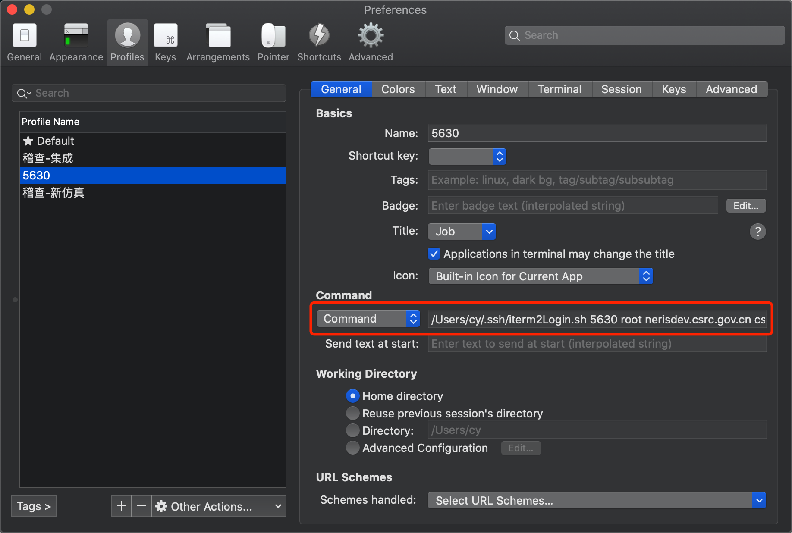

# 1. 保存ssh信息

1. 新建 `xxx.sh` 脚本, 脚本文件可以放在任意文件夹, 之前一直放在 `.ssh` 内

```shell
#!/usr/bin/expect
set timeout 30
spawn ssh -p [lindex $argv 0] [lindex $argv 1]@[lindex $argv 2]
expect {
         "(yes/no)?"
         {send "yes\n";exp_continue}
         "password:"
         {send "[lindex $argv 3]\n"}
}
interact


#[lindex $argv 0] - [lindex $argv 3] 分别代表4个参数: port, username, host, password
```


2. 给脚本权限

   ```
   chmod 777 xxx.sh
   ```

3. 配置iterm2 profile - 

   ```shell
   /Users/cy/.ssh/anguan_jicha.sh [port] [username] [host] [password]
   ```

   


4. 一般需要现在iterm2中使用 ssh连接一遍, 不知道为啥