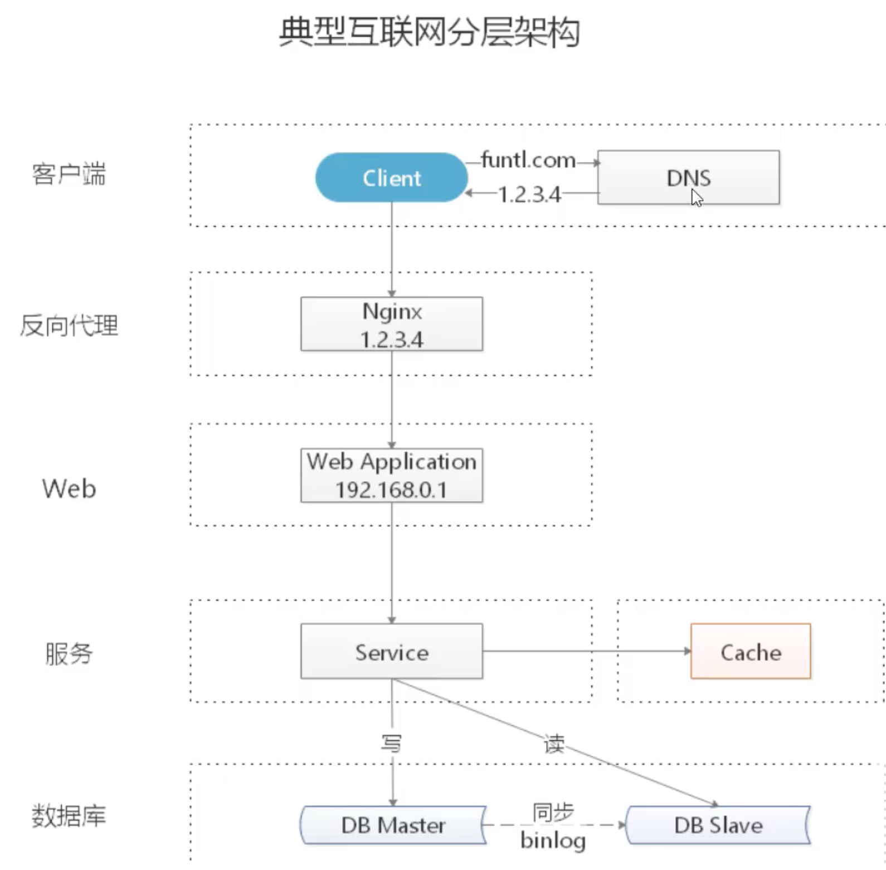
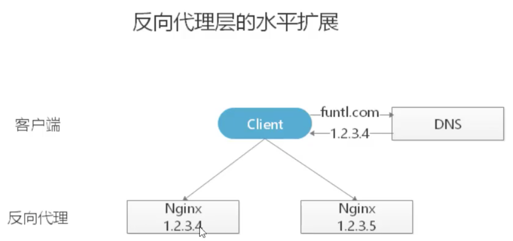
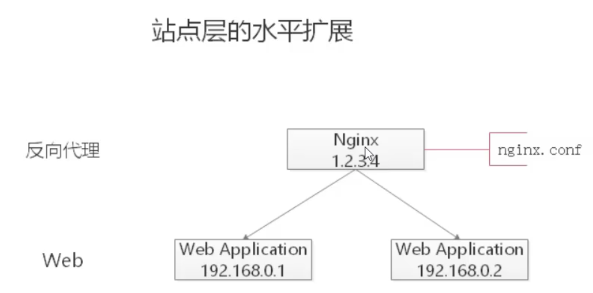
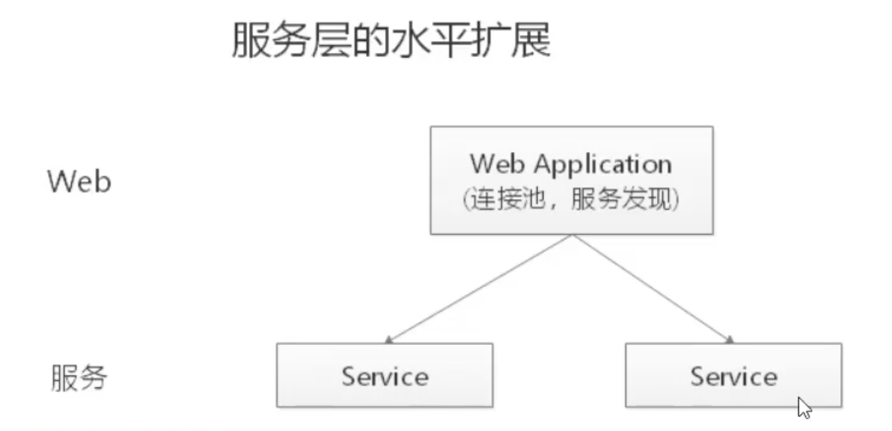

# 如何应对高并发

## 什么是高并发?

高并发(High Concurrency) 是互联网系统架构设计中必须考虑的因素之一, 是==指通过**设计**, 保证系统能够同时并行处理很多很多请求.==

高并发相关常用的一些指标有: ==响应时间==, ==吞吐量==, ==每秒查询率 QPS==, ==并发用户数==等.

- 响应时间(Response Time) : 系统对请求作出响应的时间
- 吞吐量(Throughput):单位时间(年月日时分秒)内处理的请求数量.
- QPS: 每秒响应请求数.
- 并发用户数: 同时承载正常使用系统功能的用户数. 例如一个通讯系统,同时在线用户数一定程度上表示了系统的并发用户数. 

## 如何提升系统的并发能力

理论上有两种: ==**垂直扩展**== 和 ==**水平扩展**==. 其中 ==**水平扩展**== 是最主要的方式.

### 垂直扩展

==**垂直扩展**==: 提升单机处理能力. 也有两种方式:

- 增强待机硬件性能. 例如增强 CPU, 升级 SSD 啊什么的.
- 提升单机架构性能. 例如使用缓存来减少 IO 次数. 使用异步来增加单服务吞吐量.

但是不管是提升单机硬件性能还是提升单机架构性能, 都有一个致命不足: ==**单机性能总是有极限的**==. 所以互联网分布式设计高并发的最终方案还是 ==**水平扩展**==

### 水平扩展

只要增加服务器数量, 就能线性扩展系统性能. ==水平扩展说白了就是增加服务器.==

DNS 是域名解析器. 没台服务器有唯一的一个 IP, 所以看起来是通过域名访问, 其实还是通过 DNS 对域名进行解析, 然后通过 IP 访问. DNS有一个==**轮询机制**==, 也就是说一个域名可以绑定多个 IP.

- 客户端层:
- 反向代理层
- 站点应用层: web
- 服务层: Service ==**微服务就体现在这一层.**==
- 数据缓存层. 缓存加速数据访问存储.
- 数据库层

​	在典型互联网分层架构中, 一共有 5 层, ==**每一层都可以进行水平扩展**==.

## 水平扩展分层架构

### 反向代理层的水平扩展

反向代理层的水平扩展, 是通过 ==**DNS 轮询**==实现的: DNS Server 对于一个域名配置多个解析 IP, 每次 DNS 解析请求来访问DNS Server,会轮询返回这些 IP.

当 Nginx 成为瓶颈的时候, 只要增加服务器数量, 新增 Nginx 服务的部署, 增加一个外网 IP, 就能扩展反向代理层的性能, 做到理论上的无限高并发.

### 站点应用层水平扩展

站点层的水平扩展, 是通过 ==Nginx 实现的==. 通过修改 nginx.cfg, 可以设置多个 web 后端.

当 Web 后端成为瓶颈的时候, 只要增加服务器数量, 新增 web 服务的部署, 在 Nginx 配置中配置上新的 web 后端, 就能扩展 站点层的性能, 做大理论上的无限高并发.

### 服务层的水平扩展

服务层的水平扩展, 是通过 ==服务连接池==实现的.