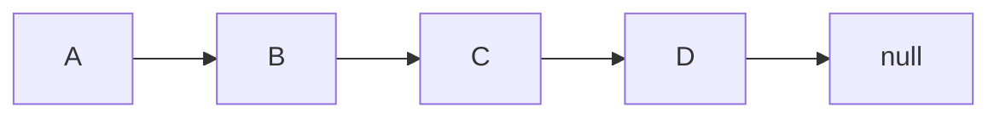

# 00.【链表简介】
动态数组, 栈, 队列, 这三种数据结构底层都依托于静态数组, 靠` resize` 方法处理`固定容量`的问题. 即解决容量问题(扩容/缩容)

## 第一章 链表简介
### 1.1 链表的一些点
- 是一种线性数据结构.
- ==*(`链表` : 是一个`真正的动态数据结构`, 也是`最简单的动态数据结构`**==
- 在链表中,比较重要的概念就是 `动态数据结构` , `引用(指针)`, `更深入的递归`, `辅助组成其他数据结构`.
- 增删改查的时间复杂度都是 O(n) 的.

### 1.2 什么是链表( Linked List)
==**数据存储在`节点(Node)`中.**==

```java
Class Node{
    E e; // 节点中真正的数据
    Node next; // 指向当前节点的下一个节点的指针.
}
```




- 节点包含两部分 : `真正的数据 E` 和 `指向下一个节点的指针 next`.
- 例如上图: 节点 A 有数据 A ,并且里边有一个指向下一个节点 B 的指针 `next`. 节点 B 有数据 B,并且有指向下一个节点的 C 的指针 `next`, 一直到节点 D, 它的 `next` 存储的是 `null`, 那么这个节点就是最后一个节点.
- ==**链表的优点: 真正的动态,不需要处理固定容量的问题.**==
- ==**列表的缺点: 丧失了随机访问的能力.就是无法通过索引快速的获取到响应位置的元素**==. 相对与数组来说, 数组元素在内存中的位置是相连接的, 可以通过偏移快速的获取到元素,而链表的节点是通过` next`一个一个连接的,所以在内存中, 这些节点的位置是不同的,不是挨着的, 只能靠 `next`一个一个的找到我们要的元素.


## 第二章 链表的使用场景
### 2.1 索引没有语义的场景.
数组比较适用于索引有语义的场景, 比如索引就是学号,索引上的元素就是学生的成绩,那么就可以快速的通过是索引获取到学生的成绩.

而在索引没有语义的场景, 使用链表比较合适, 因为链表最大的有点就是 `动态`.


### 第三章 操作链表的重点
==**目标位置或者节点的前一个节点/后一个节点**==

==**使用虚拟头结点 : 初始化链表的时候,默认会有一个虚拟头结点, 然后再进行添加操作**==


# 01.【链表 LinkedList 的基本实现】
## 第一章 实现思路
1. 可以使用泛型
2. 节点 Node 设计为 LinkedList 的内部类(之所以设计为内部类, 是因为客户不需要知道底层是怎么实现的, 他只需要知道链表是一种线性结构,可以存放数据就行了)
3. Node 内有两部分 : 一部分数据 E element, 一部分是指向下一个节点的指针 : Node next.
4. 为 Node 提供构造方法和 toString 方法.
5. 为 LinkedList 添加一个元素`head`,用于描述链表的头
6. 为 LinkedList 添加一个元素 `size`, 用于描述链表中元素的个数.

==**参数**==:

```java
Node : 内部类, 表示节点

size : 表示链表中元素的个数.
head : 指向头节点
prev : 初始时和 head 指向同一个位置.
```

## 第二章 链表的操作
==**添加元素 :**==
对于数组来说, 在数组尾部添加一个元素是比较方便的.因为数组的 `size` 变量就指向了数组尾部第一个没有元素的位置,所以可以直接通过` size` 在数组尾部添加元素.

对于链表来说,可以很方便的在链表的头部添加元素, 因为有` head` 在跟踪链表的头部,

==**在链表头添加节点 node**==

思路 : 创建一个 Node 节点 `node`,他的 `next` 指向 `head`. 然后将 `head` 指向 `node`.

==**在链表的中间添加节点 node**==:

思路 : 
1. 这个需求的关键就是 ==*找到要添加的节点的前一个节点*==.
2. 找到要添加的位置的前一个节点,比如要添加的位置的前一个节点`prev`.
3. 然后将`node` 指向` node`, 然后将` node.next`指向 `prev` 的下一个节点.
4. 然后将` prev.next` 指向` node`.
5. 第 3 步和第 4 步的顺序不能改变. 只能先指向要添加的位置的下一个节点

==**关于链表操作的重点**==

==**基本上都要找到`前一个节点` 或者 `后一个几点`**==

基本上都要找到操作节点的前一个节点或者后一个几点

### 第三章 链表代码实现
==**LinkedList API**==:

```java
// 描述节点
class Node{} : 内部类, 描述节点
Node(E element, Node next) : Node 的构造方法.

// 描述链表
int getSize() : 获取链表中元素的个数
boolean isEmpty() : 判断链表是否为空
void addFirst(E element) : 在链表头添加元素. 创建 Node 节点 node = new Node(elment),将它的 next 指向 head: node.next = head. 然后将Node 设置为头节点(也就是将 LinkedList 的 head 指向 node): head = node ; 比较简单的写法 : head = new Node(element, head);

addAtIndex(E element, int index) : 模拟出要找到的待添加位置的前边的节点 prev, 初始化prev 的位置,初始化和 head 一样. prev.next=head, 然后根据 index 进行遍历,将 prev = prev.next 一直遍历到 index-1 的位置. 这时就拿到了要找到的待添加位置的前面一个位置的节点. 然后将待添加节点 node.next 指向 prev 的下一个节点, 也就是 nodex.next = prev.next, 然后将 prev 指向node,也就是prev.next = node.
```

==**代码(不是最终版代码)**==

```java
public class LinkedList<E> {

    /** 节点.*/
    private class Node{
        public E element;
        public Node next;

        public Node(E element, Node next) {
            this.element = element;
            this.next = next;
        }

        public Node(E element) {
            this(element,  null);
        }

        public Node() {
            this(null, null);
        }

        @Override
        public String toString() {
            return element.toString();
        }
    }

    /** 指向头. */
    private Node head;

    /** 链表中元素个数. */
    private int size;

    public LinkedList() {
        head = null;
        size = 0;
    }

    public int getSize(){
        return size;
    }

    public boolean isEmpty(){
        return size == 0;
    }

    /** 在链表头添加元素. */
    public void addFirst(E element){
//        Node node = new Node(element);
//        node.next = head;
//        head = node;
        head = new Node(element, head);
        size++;
    }

    /**
     * 在链表的 index 位置添加元素 element
     * @param element 待添加的元素
     * @param index 要添加的位置
     */
    public void addAtIndex(E element, int index){
        if (index < 0 || index > size) {
            throw new IllegalArgumentException("Add failed, Illegal index.");
        }
        if (index == 0) {
            addFirst(element);
        } else {
            Node prev = head;
            for (int i = 0; i < index - 1; i++) {
                prev = prev.next;
            }
//            Node node = new Node(element);
//            node.next = prev.next;
//            prev.next = node;
            prev.next = new Node(element, prev.next);
            size++;
        }
    }

    /** 在链表尾部添加元素. */
    public void addLast(E element){
        addAtIndex(element, size);
    }

}
```

## 第四章 虚拟头结点
在链表头添加元素和在其他位置添加元素,在逻辑上会有差别,在链表中其他位置添加元素的时候,需要找到待`添加位置的前面的那个位置的节点`, 而在链表头添加节点的时候,`链表头没有前边的节点`, 所以在链表头添加节点和在其他位置添加节点会有差别.

那么久可以创建一个`虚拟头结点 dummyHead`. 这个节点不存储任何节点, `dummyHead.next` 指向真正的头结点.

`dummyHead` 来说,用户是感觉不出来的.

当有了`dummyHead`后, 初始化链表的时候,这个链表中就默认有一个节点,就是这个` dummyHead`, 这样再添加元素的时候,要找到待添加位置的前一个节点,就找到了` dummyHead`节点,因为此时只有一个这一个虚拟头节点嘛!然后就可以进行添加操作了.

对于有` dummyHead` 的节点, 添加元素时, 要从 dummyHead 开始遍历; 获取元素时,要从 dummyHead.next 开始,这样获取都是真实存在的元素.

==**为什么要使用虚拟头结点?**==:

因为对于添加等一些特定的操作,需要找到目标节点的前一个节点,那么对于没有使用虚拟头结点的时候来说, 真实存在的头节点的前面是没有节点的,所以会有一些逻辑上不一样的地方.使用虚拟头结点会比较方便


==**代码如下(不是最终版代码)**==

```java
public class LinkedListWithDummyHead<E> {

    /** 节点.*/
    private class Node{
        public E element;
        public Node next;

        public Node(E element, Node next) {
            this.element = element;
            this.next = next;
        }

        public Node(E element) {
            this(element,  null);
        }

        public Node() {
            this(null, null);
        }

        @Override
        public String toString() {
            return element.toString();
        }
    }

    /** 虚拟头结点,指向头. */
    private Node dummyHead;

    /** 链表中元素个数. */
    private int size;

    public LinkedListWithDummyHead() {
        dummyHead = new Node(null, null);
        size = 0;
    }

    public int getSize(){
        return size;
    }

    public boolean isEmpty(){
        return size == 0;
    }


    /**
     * 在链表的 index 位置添加元素 element
     * @param element 待添加的元素
     * @param index 要添加的位置
     */
    public void addAtIndex(E element, int index){
        if (index < 0 || index > size) {
            throw new IllegalArgumentException("Add failed, Illegal index.");
        }

        Node prev = dummyHead;
        for (int i = 0; i < index; i++) {
            prev = prev.next;
        }
//            Node node = new Node(element);
//            node.next = prev.next;
//            prev.next = node;
        prev.next = new Node(element, prev.next);
        size++;

    }

    /** 在链表头添加元素. */
    public void addFirst(E element){
        addAtIndex(element, 0);
    }


    /** 在链表尾部添加元素. */
    public void addLast(E element){
        addAtIndex(element, size);
    }

}
```

## 第五章 基于 dummyHead 的最终版代码
==**API**==

```java
E get(int index) : 获取指定位置的元素. 由于有虚拟节点. 首先虚拟节点是链表初始化的时候添加的. 此时链表中还没有添加如何元素,但是此时默认有一个虚拟头结点,然后进行添加操作后,虚拟头节点就作为一个真实存在的节点的前一个节点存在,所以此时遍历的时候要从 dummyhead.next 开始遍历

void set(E element, int index) : 在指定位置添加元素. 从 dummyHead.next 开始. 因为 dummyHead 是个虚拟节点.要从真实存在的节点开始比那里.

void remove(int index) : 移除指定位置的节点. 要找到要删除节点 delNode 的前一个几点 prev, 然后将 prev.next 指向要删除节点的下一个节点
```

==**最终版代码**==

```java
public class LinkedList<E> {

    /** 节点.*/
    private class Node{
        public E element;
        public Node next;

        public Node(E element, Node next) {
            this.element = element;
            this.next = next;
        }

        public Node(E element) {
            this(element,  null);
        }

        public Node() {
            this(null, null);
        }

        @Override
        public String toString() {
            return element.toString();
        }
    }

    /** 虚拟头结点,指向头. */
    private Node dummyHead;

    /** 链表中元素个数. */
    private int size;

    public LinkedList() {
        dummyHead = new Node(null, null);
        size = 0;
    }

    public int getSize(){
        return size;
    }

    public boolean isEmpty(){
        return size == 0;
    }


    /**
     * 在链表的 index 位置添加元素 element  O(n)
     * @param element 待添加的元素
     * @param index 要添加的位置
     */
    public void addAtIndex(E element, int index){
        if (index < 0 || index > size) {
            throw new IllegalArgumentException("Add failed, Illegal index.");
        }
        Node prev = dummyHead;
        for (int i = 0; i < index; i++) {
            prev = prev.next;
        }
        prev.next = new Node(element, prev.next);
        size++;

    }

    /** 在链表头添加元素.   O(1) */
    public void addFirst(E element){
        addAtIndex(element, 0);
    }


    /** 在链表尾部添加元素.   O(n) */
    public void addLast(E element){
        addAtIndex(element, size);
    }

    /**
     * 获取指定索引位置的元素
     * @param index
     * @return
     */
    public E get(int index){
        if (index < 0 || index > size) {
            throw new IllegalArgumentException("Get failed, Illegal index.");
        }
        Node cur = dummyHead.next;
        for (int i = 0; i < index; i++) {
            cur = cur.next;
        }
        return cur.element;
    }

    /** 获取第一个节点. */
    public E getFirst(){
        return get(0);
    }

    /** 获取最后一个节点. */
    public E getLast(){
        return get(size - 1);
    }


    /**
     * 修改指定索引的节点值为 element
     * @param element
     * @param index
     */
    public void set(E element, int index){
        if (index < 0 || index > size) {
            throw new IllegalArgumentException("Update failed, Illegal index.");
        }
        Node cur = dummyHead.next;
        for (int i = 0; i < index; i++) {
            cur = cur.next;
        }
        cur.element = element;
    }

    /**
     * 判断链表中是否存在 element
     * @param element
     * @return
     */
    public boolean contains(E element){
        Node cur = dummyHead.next;
        while (cur != null) {
            if (cur.element.equals(element)) {
                return true;
            }
            cur = cur.next;
        }
        return false;
    }

    /**
     * 删除指定位置的节点
     * @param index
     */
    public E remove(int index){
        if (index < 0 || index > size) {
            throw new IllegalArgumentException("Remove failed, Illegal index.");
        }
        Node prev = dummyHead;
        for (int i = 0; i < index; i++) {
            prev = prev.next;
        }
        Node delNode = prev.next;
        prev.next = delNode.next;
        delNode.next = null;
        size--;
        return delNode.element;
    }

    /** 移除第一个元素. */
    public E removeFirst(){
        return remove(0);
    }

    /** 移除最后一个元素. */
    public E removeLast(){
        return remove(size - 1);
    }


    @Override
    public String toString() {
        StringBuilder sb = new StringBuilder();
        Node cur = dummyHead.next;
        sb.append("LinkedList : [ ");
        while (cur != null){
            sb.append(cur + " --> ");
            cur = cur.next;
        }
        sb.append("NULL ]");
        return sb.toString();
    }
}
```
