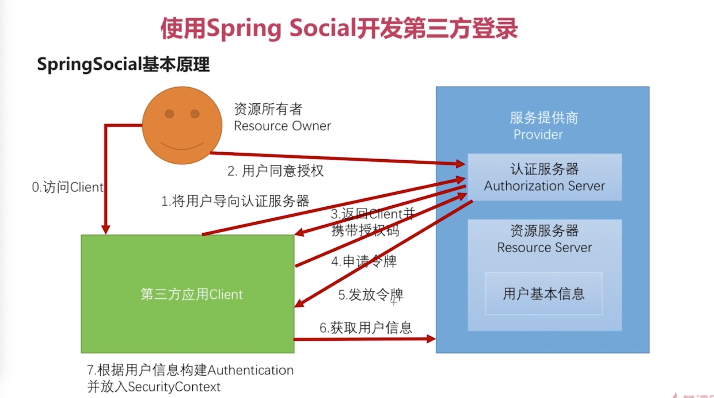
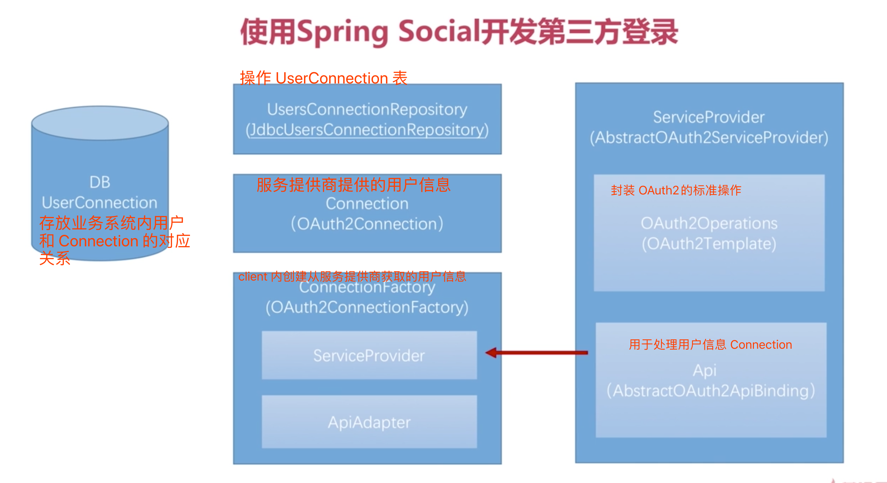
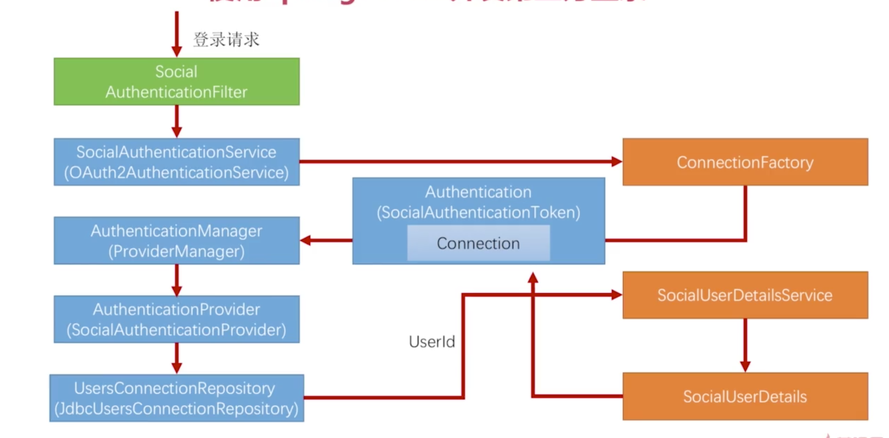

# OAuth2协议 和 Social

第三方登录时基于 OAuth 协议进行的.

涉及到的类:

- ==**SocialUserDetailsService**== : Social 提供的用于第三方登录时通过 UserConnection 表中的 userId 获取用户信息的接口

- ==***ObjectMapper***== : 将 String 封装为对象
- ==Encryptors== : Social 中对数据进行加解密的, 在配置 UsersConnectionRepository(JdbcUsersConnectionRepository)时使用.

## 1 OAuth协议简介

OAuth 协议其实是一个授权协议, 为了让用户不向第三方应用暴露用户名密码的情况下, 让第三方可以访问用户在服务提供商的资源.

### 1.1 OAuth 协议要解决的问题

场景: 比如微信中有很多小程序, 都需要微信授权.

1. 问题一 : 应用可以访问用户在微信上的所有数据.

   通过用户名和密码授权后, 应用就可以访问用户在微信上的所有数据,无法指定只可以访问指定的数据.

2. 问题二 : 用户只有修改密码才能收回授权.

   通过用户名和密码授权后, 只有在用户修改密码后, 才能收回授权. 否则无法收回授权.

3. 问题三 : 密码泄露的可能性大大提高.

   因为会有很多小程序, 那么就要授权多次, 每个小程序都知道了用户的用户名和密码, 那么任何一个小程序泄露了密码, 就大大提供了密码泄露的风险.

==**OAuth 就是为了解决以上问题. OAuth 是基于令牌 *token*工作的. 不再通过用户名和密码进行授权, 而是交给应用一个 *Token*, 那么小程序再次访问用户在微信上的数据的时候**==

- ==**token 告诉小程序只可以访问指定的数据. 其他数据无权访问**==
- ==**token 会有一个有效期, 过了有效期后就无法再次访问微信数据**==
- ==**没有把用户名和密码交给小程序, 所以也就不存在泄露用户名和密码的问题了.**==

### 1.2 OAuth 协议中的各种角色

1. ==*Resource Owner*== : 资源所有者. 就是上边说的微信的用户. 
2. ==*Client*== : 第三方应用. 
3. ==*Provider*== : 服务提供商. 提供 *==Token==*. 就是上边说的微信. 服务提供商内还有两个角色 : 
   1. ==*Authorization Server*== : 认证服务器. 作用是认证用户的身份, 并且产生令牌 ==*token*==.
   2. ==*Resource Server*== : 资源服务器. 用于==*保存用户的资源数据, 验证令牌*==. 

所以, client 发送请求时会带着 Authorization Server 产生的令牌, 发往 Resource Server , 在 Resource Server 进行令牌验证.

==Resource Server== 和 ==Authorization Server== 并不是必须要布在两台服务器上, 可以是在一台服务器上.

### 1.3 OAuth 协议运行流程

1. 用户访问 Client.
2. Client 请求授权.
3. ***==用户决定是否同意授权==***.(关键点)
4. 同意授权的话, Client 访问 Authorization Server, 申请 token
5. Authorization Server 验证用户是否同意授权.
6. 验证确实同意授权, Authorization Server 产生 token, 发给 Client
7. Client 在请求中带着 token 访问 Resource Server.
8. Resource Server 验证 token 是否有效, 有效才能访问

### 1.4 OAuth 协议中的授权模式

也就是上边的第二步: ==***用户决定是否同意授权***==. 这个操作可以有以下四种方式实现:

1. ==*Authorization code*== : 授权码模式 (一般第三方登录会用这种模式), **<u>功能最全面的模式, 流程最严密的模式</u>**
2. implicit : 简化模式
3. ==*Resource owner password credentials*== : 密码模式 (一般app 认证中会比较常用这种模式)
4. client credentials : 客户端模式

#### 1.4.1 授权码模式

这种模式是功能最完整,  流程最严密的模式.

1. 用户访问client
2. 如果 client 需要用户授权, 会将用户导向 Authorization Server. 
3. 用户同意授权的动作在 Authorization Server 上完成.
4. 如果用户同意授权, Authorization Server 会将用户导向 Client 的一个地址(client 和 Authorization Server 约定好的地址), 同时会携带一个授权码(不是 token)
5. client 收到授权码后, 会携带授权码向 Authorization Server 申请 token.(这一步对用户不可见)
6. Authorization Server 验证授权码是否是之前发送的, 如果是, 就向 client 发送产生的 token.
7. client 向服务提供商获取用户信息.
8. client 根据获取到的用户信息, 封装 Authentication, 并放入 SecurityContext.

主要特点:

1. 用户同意授权的动作是在 Authorization Server 上完成的. 其他几种模式都是在 client 上完成的.
2. 用户同意授权的时候, Authorization Server 会发送授权码, 然后 client 会拿着授权码去 Authorization Server 中换令牌.

==**OAuth 其实就是对 服务提供商行为的封装.**==

## 2 Spring Social

### 2.1 Spring Social 简介

client 拿到 token 后,会从服务提供商获取用户信息, 然后根据用户信息构建 Authentication, 并放入 SecurityContext, 此时就认为已经登录了.

SpringSocial 就是将以上的步骤(从用户访问 client 到最终的封装 Authentication)封装了起来, 其实就是 ==client 的行为封装了起来!== 封装为一个 ***==SocialAuthenticationFilter==***, 放在Security 的过滤器链中.

==**服务提供商中比较重要的接口和类:**==

==**封装服务提供商 0 ~ 6 的操作的类**== :

- ==*ServiceProvider*== : 服务提供商的抽象. Spring Social 提供了一个抽象的实现类 : ==**AbstractOAuth2ServiceProvider**==, 当需要实现自己的功能的时候, 只要继承 AbstractOAuth2ServiceProvider 就行了.

  在上边的步骤中, 0~5 是标准化流程. 第 6 步是个性化流程, 因为每个服务提供商可能提供的用户信息不一样,比如属性个数, 属性名称等,所以针对这两块, 在 ServiceProvider 中两个封装 : 

- ==*OAuth2Operations*==: 封装了 OAuth的标准操作, 也就是 0 ~ 5. 提供了默认的实现 ==OAuth2Template==.

- ==*API*== : 提供了实现类 *==AbstractOAuth2ApiBinding==*,用于实现第六步, 获取用户信息

==**在步骤 7, 是在client 中完成的, 相关类 :**== 

- ==*Connection*== : 封装 0 ~ 6 完成后服务提供商提供的的用户信息. 提供的实现类 ==*OAuth2Connection*==
  - Connection 是固定的数据结构, 字段名啥的时固定的.
- ==*ConnectionFactory*== : 用于生产封装了用户信息的 ==Connection==. 实际上用到的实现类是 *==OAuth2ConnectionFactory==*.
  - 在 ConnectionFactory 中维护的有一个 ==**ServiceProvider**==对象, 用于走 0 ~ 6 的流程. 然后获取到用户信息, 封装到 Connection 中.
  - 上边说了 0~5 是标准化流程, 第 6 步是个性化流程,也就是每个服务提供商提供的用户信息可能是不一样的,但是 ==Connection== 是一个固定的数据结构, 所以就需要转化, 通过 *==ApiAdapter==* 来完成.

那么现在有一个问题, Connection 是服务提供商提供的用户信息, 而在业务系统中, 一般是把用户信息存放一个用户表里, 业务系统里的用户信息如何和服务提供商里的用户信息怎么对应? 也就是说业务表里的用户 A 登录的时候,可能是服务提供商内的 B 登录, 或者服务提供商内的 C 登录可能是业务系统内的 D 登录, 怎么建立这个对应关系?

**==在 SpringSocial中是将这个关系存放在一个叫做 UserConnection 的表内,存储了业务系统内用户表内的用户 ID 和服务提供商的用户 Connection 的对应关系.==**

- ==*UsersConnectionRepository*== : 用来操作 ==UserConnection 表==. 实际使用的实现类是 *==JdbcUsersConnectionRepository==*. 建表语句在 JdbcUsersConnectionRepository 同级包内.

### 2.2 流程详解

==***<u>Soclai 运行流程:</u>***== 和用户名密码登录, 手机验证码登录 核心上都是一致的.

简单的将就是一个相应的过滤器拦截到请求, 然后将需要认证的新的包装在一个 Authentication(AbstractAuthenticationToken) 里边, 并将认证表示设置为 false, 然后交给 ProviderManager进行认证, ProviderManager 通过内部维护的 AuthenticationProvider 列表进行匹配,匹配到适用的 provider 就使用这个 provider 进行相关的处理,在处理的过程中会调用 UserDetailsService 获取业务系统中用户信息, 然后将用户信息封装在一个 UserDetails 中. 经过一些列的检查和校验,通过后就将用户信息封装在之前包装的 Authentication(AbstractAuthenticationToken) 里边,并将认证状态设置为 true, 然后将这个 Authentication(AbstractAuthenticationToken) 放在 SecurityContext里边, 到此整个认证流程结束.

==*<u>**上图中橘黄色的部分是自己实现的.**</u>*== 

**流程简单梳理:**

- ==OAuth2AuthenticationService== 的作用是执行整个 OAuth2 的流程. 会去调用实现的 ==ConnectionFactory==.
- ==ConnectionFactory== 会拿到实现的 ==ServiceProvider==
- ==ServiceProvider== 会拿到 ==OAuth2Operations(OAuth2Template)==
- ==OAuth2Operations(OAuth2Template)== 会帮助 SpringSocial 完成整个流程.需要实现自己的==OAuth2Operations==, 覆盖点 createRestTemplate 方法, 添加一个处理 ==html/text==的操作. , 继承 OAuth2Template, 因为 OAuth2Opertaions 默认的实现 OAuth2Template 无法处理 **==html/text==**的响应.
- 完成流程后, 会拿到服务提供商的用户信息, 然后通过 Adapter 封装到 Connection 中.会被封装为一个 SocialAuthenticationToken
- 然后会将 SocialAuthenticationToken 交给 ProvdierManager 进行处理.
- ProvdierManager 调到 SocialAuthenticationProvider 处理这个 token.
- SocialAuthenticationProvider 会根据传进来的服务提供商的用户信息, 使用 UsersConnectionRepository 查到一个 userId 出来
- 然后通过自己实现的 SocialUserDetailsService 通过 userId 获取到 SocialUserDetails 信息.也就是业务系统里真正要放到 session 里的用户信息
- 然后将 SocialUserDetails 放在 SocialAuthenticationToken 里边, 并将认证状态设置为 true.
- 然后将 Authentication(SocialAuthenticaionToken) 放到 SecurityContext 中, 完成整个认证流程.

 

流程详细说明:

- 请求过来后, 首先被 ==AbstractAuthenticationProcessingFilter== 过滤器拦截, 执行它的 ==doFilter== 方法
- 在方法中, 通过执行 ==authResult = attemptAuthentication(request, response);== 让它的子类, 也就是 ==SocialAuthenticationFilter== 过滤器来执行当前请求. 执行 ==SocialAuthenticationFilter#attemptAuthService==方法.

- 执行==SocialAuthenticationFilter#attemptAuthService==, 在这个方法中执行 ==authService.getAuthToken(request, response)== 调用以下方法:

  - ==OAuth2AuthenticationService#getAuthToken==, 当前方法会根据请求参数中是否有 ==code(也就是授权码)== 来判断是当前请求是 **将用户导向认证服务器的请求**, 还是 **认证服务器带着授权码返回到 Client 的请求**
  - 如果是 **将用户导向认证服务器的请求**, 则会通过抛出异常 ==SocialAuthenticationRedirectException==
    - 这个异常会被往上抛到 ==AbstractAuthenticationProcessingFilter==中
    - 在 ==doFilter== 中被 catch 到. 
    - ==SocialAuthenticationRedirectException== 异常是 ==AuthenticationException== 类型的异常. 所以执行这个 catch
    - 然后在当前 catch 中调用 ==unsuccessfulAuthentication(request, response, failed);== 方法
    - 在以上方法中执行 ==failureHandler.onAuthenticationFailure(request, response, failed);==语句, 会通过一个失败处理器来进行处理
    - 也就是会通过 ==SocialAuthenticationFailureHandler==失败处理器来进行处理.
    - 在这个失败处理器中, 会将请求重定向到一个 ==SocialAuthenticationRedirectException==中维护的 ==redirectUrl== 路径
    - 也就是将用户导向了 QQ 服务器.
  - 如果是 **认证服务器带着授权码返回到 Client 的请求**
    - 通过执行 ==getConnectionFactory().getOAuthOperations().exchangeForAccess(code, returnToUrl, null);== 来调用 ==OAuth2Template#exchangeForAccess==, 拿着授权码交换 token
    - 在上述方法中, 首先判断属性 ==useParametersForClientAuthentication== 是否为 true, 如果为 true 就会将 ==appId, appSecret==挂载在请求参数中.
    - 然后通过执行 ==postForAccessGrant(accessTokenUrl, params);== 调用 ==OAuth2Template#postForAccessGrant(一般需要重写这个方法, 以为原生的方法是以 json 的格式处理 QQ 放回的数据, 但是实际上 QQ 返回的时字符串, 所以需要重写)==方法来发送申请 token 令牌的请求.
    - 将结果封装为一个 ==AccessGrant==对象进行返回. 最终返回到 ==OAuth2AuthenticationService#getAuthToken== 中, 并继续向下执行.
  - ==OAuth2AuthenticationService#getAuthToken==获取到 ==AccessGrant==对象后, 通过执行==return getConnectionFactory().createConnection(accessGrant);== 来构建 ==**Connection**==.
  - 在上述方法中, 通过执行 ==OAuth2Connection==的构造方法的方式来构建 Connection. == ==new OAuth2Connection<S>====
    - 在 ==OAuth2Connection==构造方法中会通过传入的参数进行一些初始化工作.例如以下操作:
      - 初始化 API, 也就是调用 ==getApi()==, 也就是调用自己实现的 Api
      - 然后会 new 自己实现的 API 的实现类.在构造方法中会进行以下操作:
        - 调用 API 的父类 ==AbstractOAuth2ApiBinding==的构造方法, 会创建 ==RestTemplate== 并进行一些配置
        - 发送请求获取 ==openId==
        - 初始化 appId.
      - 调用获取服务商用户信息的请求, 也就是自己实现的 API 的实现方法.
      - 将服务商用户信息转换为标准 ==Connection==
      - 到此, 就获取到了标准的 ==Connection==, 并进行返回
    - 将获取到的 ==Connection== 返回到 ==OAuth2AuthenticationService#getAuthToken== 方法中.并继续向下执行
  - 在上述方法中执行 ==return new SocialAuthenticationToken(connection, null);== 将 Connection 封装到 ==SocialAuthenticationToken==中并进行返回.返回到 ==SocialAuthenticationFilter==并继续向下执行.

- 封装好的 ==Token== 被返回到 ==SocialAuthenticationFilter#attemptAuthService== 方法中.

  - 执行 ==SocialAuthenticationFilter#getAuthentication== 方法从 ==SecurityContext== 中获取 ==Authentication==.

  - 对获取到的 ==Authentication== 进行判断

  - 如果 ==Authentication 为空或者认证状态为 false==

  - 则调用 ==SocialAuthenticationFilter#doAuthentication== 方法

    - 在上述方法中, 通过执行 ==getAuthenticationManager().authenticate(token)==, 进行认证操作.
    - 上述语句会调用 ==ProviderManager#authenticate== 方法进行认证操作.
      - 在上述方法中, 通过执行 ==provider.supports(toTest)== , 从 ==ProviderManager==中维护的 ==List<AuthenticationProvider>==列表中选中一个支持 ==SocialAuthenticationToken==类型的provider 进行认证操作. 只要有一个支持就执行.
      - 上述操作会选中 ==SocialAuthenticationProvider== 并执行, 也就是会执行 ==SocialAuthenticationProvider.authenticate(authentication);==方法进行认证操作
        - 在上述方法中会进行一些判断, 比如当前传入的 ==Authentication 是否是 SocialAuthenticationToken类型==等
        - 通过执行 ==String userId = toUserId(connection)==方法从 ==UserConnection 表== 中获得 ==userId==.
          - 上述语句会执行 ==SocialAuthenticationProvider#toUserId==方法,  然后会调用 ==jdbc.JdbcUsersConnectionRepository#findUserIdsWithConnection== 方法, 通过 ==providerId==等参数去 ==UserConnection 表==中获取 ==userId==.
      - 如果没有获取到 ==userId==, 会在 ==SocialAuthenticationProvider#authenticate== 方法中抛出一个异常 ==throw new BadCredentialsException("Unknown access token")==. 
        - 上述异常会被 ==ProviderManager#authenticate== 方法捕获, 继续向上抛
        - 上述异常会被 ==SocialAuthenticationFilter#doAuthentication== 捕获
        - 在 ==SocialAuthenticationFilter#doAuthentication== 的 catch 中,判断 ==signupUrl==是否为空
        - signupUrl默认为 /signup, 一般需要进行配置, 就是当获取到服务商用户信息后, 业务系统中没有UserConnection 中没有对应的数据,就是业务系统中没有注册或者绑定的时候, 需要跳转的路径, 一般是一个注册/绑定页面 
        - 如果不为空,则会向 Session 中存放一些参数, 然后抛出一个 ==new SocialAuthenticationRedirectException(buildSignupUrl(request));==异常
        - 这个异常会继续往上抛出, 最终被 ==SocialAuthenticationFilter的父类 AbstractAuthenticationProcessingFilter==捕获
        - 然后会在 ==AbstractAuthenticationProcessingFilter#doFilter==中, catch 为 ==AuthenticationException== 的块中执行 ==unsuccessfulAuthentication(request, response, failed);== 中调用 ==SocialAuthenticationFailureHandler==失败处理器进行处理
        - 在 ==SocialAuthenticationFailureHandler==处理器中会将页面重定向为 指定的 ==signupUrl== 页面.
      - 如果获取到了 userId, 则通过配置

    

- 如果 ==Authentication不为空并且认证状态为 true==
  - 则调用 ==SocialAuthenticationFilter#addConnection(...)== 方法

- 在 ==attemptAuthentication== 方法中, 通过 ==*SocialAuthenticationServiceLocator(SocialAuthenticationServiceRegistry)*==的 ==*getAuthenticationService*== 方法获取到 ==*OAuth2AuthenticationService*== 实例.
- SocialAuthenticationServiceRegistry 中维护的有一个 ==*map*== , ==key 是 providerID, Value 就是 SocialAuthenticationService实例.==
- 然后会调用 OAuth2AuthenticationService 的 getToken 方法.

==***OAuth2AuthenticationService***==

- 这个类主要就是为了执行整个 OAuth2 流程, 然后获取到 Connection, 并返回 token.
- 这个类中最重要的方法就是 ==*getToken*== 方法
  - 这个方法会做两件事, 判断当前请求是 将用户导向认证服务器的请求 还是 认证服务器带着授权码返回 Client 的请求.
  - 判断标准是判断请求参数里有没有授权码, 字段是 ==code==
  - 如果没有, 就说明是将用户导向认证服务器的请求.就抛出一个重定向异常, 并将用户重定向到 QQ 的网站.
  - 如果有, 则说明是认证服务服务器带着授权码返回的请求, ==*那么会构建 ConnectionFactory, 然后做拿着授权码换令牌的操作*==, 换令牌的操作是在 ==OAuth2Template== 类中完成的. 这个类需要实现自己的, 也就是继承 OAuth2Template, 然后设置一个 true, 重写两个方法. 详情查看 **==开发流程==**.

==***SocialAuthenticationProvider***== 

这个类是在执行过中, 在获取到服务提供的 Connection 后, 会掉用 ==toUserId(Connection)== 方法去数据库中查询业务系统中是否有这个用户, 如果没有的话,  会抛出一个 ==UsernameNotFoundException== 异常, 然后 ==SocialAuthenticationFilter== 会捕获异常,  在处理异常的过程中, 会判断 signupUrl 是否为空, 如果不为空, 则将获取到的 Connection 信息放到 session 里边,然后会跳转到一个 ==SocialAuthenticationFilter== 默认设置的 ==/singup== 页面.

- 这里有两种情况:
  1. 在系统中不存在这个用户
  2. 在系统有这个用户, 但是没有进行绑定.
  3. 以上两种情况, 有两种方式:
     1. 引导客户到注册或者绑定页面.
     2. 在后台自动进行注册或者绑定.

1. ==***引导客户到注册/绑定页面,进行注册或者绑定***==

- 涉及的操作:
  1. 配置注册页, 并在 ==SpringSocialConfigurer== 中指定 signupUrl
  2. 编写注册或者绑定逻辑,注册的需要将用户写入业务系统用户表, 注册和绑定都需要将 userId 交给 Social, 将 userId 和 providerId 等信息一起存入 ==UserConnection 表==中.  为了处理个问题, Spring Social 提供了一个工具类 : **==ProviderSignInUtils==**, 这个工具类需要在Social 中进行配置(实现了 ==SocialConfigurerAdapter==的配置类中)
- 配置注册页
  1. 在配置项读取类中配置 signup url.
  2. 在 实现了 ==SocialConfigurerAdapter== 的Social 配置类中, 在创建 ==SpringSocialConfigurer== 的方法里边, 指定 signupUrl 为配置的 URL.
  3. 配置文件中添加配置
  4. 在 Security 中配置 signup url 不用经过认证.

2. ==**在后台进行自动注册或者绑定**==

- 在 SocialAuthenticationProvider 中维护的有一个 ==connectionSignUp==接口对象, 
- 通过 usersConnectionRepository.findUserIdsWithConnection(connection) 获取 userId 的时候, 在 ==findUserIdsWithConnection==方法内部, 通过 providerId 等信息去 UserConnection 表中查询 userId 后, 如果 userId列表长度为 0, 并且 ==connectionSignUp== 不为空, 就会调用 ==connectionSignUp==接口的 ==execute== 方法, 获取到一个新的 userId, 如果 userId 不为空, 就会将这个 userId 添加到 UserConnection 表中.
- ==connectionSignUp== 需要自己实现, 并维护到自己添加的 ==UsersConnectionRepository== 中

- 要实现 QQ 登录, ==**关键是要走一个 OAuth 的流程, 拿到服务提供商(也就是 QQ)的用户信息, 也就是 Connection**==, 

- 那么为了拿到一个 ==Connection== 就需要拿到一个 ==ConnectionFactory==, 需要 ==ConnectionFactory== 就需要两个对象: ==ServiceProvider==, ==ApiAdapter==
- 而 ServiceProvider 也需要两个条件: OAuth2Operations(OAuth2Template), Api(AbstractOAuth2ApiBinding).

==***<u>相关的过滤器:</u>***==

- ==*SocialAuthenticationFilter*== : 默认拦截所有的 ==/auth== 开头的 URL.
  - 修改默认拦截的 URL
  - SocialAuthenticationFilter 是在 ==SpringSocialConfigurer#configure== 中 new 出来 并添加到过滤器链中的,
     * 在添加之前, 调用了一个 postProcess 方法进行了一些操作
     * 那么可以通过继承 ==SpringSocialConfigurer== 的方式, 重写 postProcess 方法来对 SocialAuthenticationFilter 做一些操作,
     *  比如修改默认要处理的 URL, 默认为 /auth
     *  然后
  - 配置 ==SpringSocialConfigurer== 这个 bean, 然后在 Security 的主配置中注入这个 bean, 使 ==*SocialAuthenticationFilter*== 过滤器生效.

