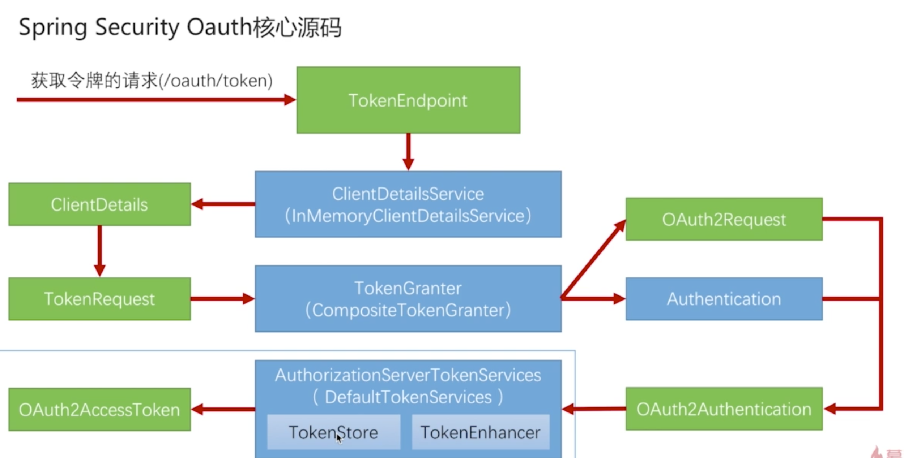

## 2. 源码解析

### 2.1 主要的类和接口



- TokenEndpoint : 入口类, 相当于一个 Controller, 处理 /oauth/token 请求.
- ClientDetailsService : 读取第三方应用信息的接口.
- ClientDetails : 封装第三方应用信息的类.
- TokenRequest : 封装了请求中了参数的类.
- TokenGranter : 接口, 封装了 4 种授权类型
- OAuth2Request : 对 ClientDetails 和 TokenRequest 信息的一个整合.
- Authentication : 封装了正在做授权的用户的信息.
- OAuth2Authentication : OAuth2Request 和 Authentication 组合起来的对象, 包含当前是哪一个第三方应用, 在请求哪一个用户授权, 使用的授权模式是什么, 参数是什么.
- AuthorizationServerTokenServices : 认证服务器拿到 OAuth2Authentication 生成 token 的接口.
- TokenStore : 处理 token 的存取.
- TokenEnhancer : 可以对 token 进行增强. 在 token 生成后, 可以对 token 进行改造.


### 2.2 源码详解 (基于密码模式)

- 首先发送 /oauth/token 请求, TokenEndpoint 接收到请求.
- 调用 TokenEndpoint#postAccessToken 方法.
- 执行 getClientId(principal) 获取到 clientId.
- 执行 getClientDetailsService().loadClientByClientId(clientId), 获取到第三方应用信息对象 clientDetails.
- 执行 getOAuth2RequestFactory().createTokenRequest(parameters, authenticatedClient), 通过 clientDetails 获取到请求中的参数的信息
- 执行 isAuthCodeRequest(parameters) 判断当前是不是 授权码模式, 如果是授权码的请求, 会将 tokenRequest 里的 scope 设置成空的. 因为 XXXXX (6-3, 9:00)
- 执行 isRefreshTokenRequest(parameters) 判断当前是不是 刷新令牌的请求. 如果是刷新令牌的请求, 会将 tokenRequest 内的 scope 重新设置
- 执行 ==getTokenGranter().grant(tokenRequest.getGrantType(), tokenRequest)== 来生成 token. (CompositeTokenGranter 类)
- 在 CompositeTokenGranter 中维护了一个 TokenGranter 的列表.
- 遍历列表, 通过参数中的 grant_type 判断使用哪种 granter.
- 密码模式使用的是 AbstractTokenGranter
- 在 AbstractTokenGranter#grant 方法中
- 首先判断传过来的 grant_type 和 AbstractTokenGranter里维护的 grantType 是否相同, 不相同就直接返回 null.
- 如果相同, 重新获取 第三方应用信息.
- 最终执行当前类的 ==getAccessToken(client, tokenRequest)== 方法产生令牌并返回.
- 在 getAccessToken(client, tokenRequest) 方法中,
- 执行 getOAuth2Authentication(client, tokenRequest) , 根据不同的授权模式, 根据不同的逻辑生成 OAuth2Authentication.
- 将得到的 OAuth2Authentication 作为参数调用 ==DefaultTokenServices#createAccessToken== 方法.
- 在 ==DefaultTokenServices#createAccessToken== 方法中
- 首先从 tokenStore 获取已经存在的 token
- 通过判断获取 token 是否为空来判断当前用户是否请求过令牌.
- 如果不为空, 则说明之前发过令牌, 判断是否过期
  - 如果过期了, 会从 tokenStore 中移除这个过期的令牌.
  - 如果没过期, 会通过 tokenStore 在将这个令牌存储一遍, 然后将这个令牌作为请求的结果, 返回这个令牌
- 如果为空, 会判断 刷新令牌是否为空.
  - 如果为空, 会创建一个刷新令牌, 然后执行 ==createAccessToken(authentication, refreshToken)==; 通过 OAuth2Authentication 和刷新令牌创建一个 token, 然后返回回去.
  - 如果不为空, 


## 3. 自定义授权模式

### 3.1 思路梳理

- 首先, 自定义授权模式(也即是生成 token)的话, 默认的获取客户端信息(clientDetails), 获取请求信息(tokenRequest), 然后到默认的 CompositeTokenGranter处理, 一直到获取 Authentication, OAuth2Request 之前都是不能用的, 需要自己来实现.

- 要将原来的 发送获取令牌的请求 换成 登录请求,然后经过自己的登录逻辑处理, 最终到 ==AuthenticationSuccessHandler== 来处理.也就是认证成功后的处理器.在这里封装 ==Authentication, OAuth2Request==,也即是获取 ==OAuth2Authentication==, 然后再往下运行.

- 在登录逻辑中, 已经获取了 Authentication, 所以这里只要能获取到 OAuth2Request 就可以构建 OAuth2Authentication 了.

- 封装 OAuth2Request 就需要两个对象 : ClientDetails 和 TokenRequest. ClientDetails是通过 ClientDetailsService 获取的, tokenRequest 是通过 ClientDetails 和请求参数中的数据 new 出来的.

- 总结:

  - 在 认证成功处理器中进行以上逻辑, 最终目标是要构建出一个 ==OAuth2Request==出来.

  - 所以就需要 ClientDetails 和 TokenRequest 两个对象.

  - 而TokenRequest 是通过 ClientDetails 和请求中的一些参数 new 出来的, 所以最重要的就是获取到 ClientDetails.

  - ClientDetails 是在 ClientDetailsService 通过 clientId 获取的.

  - 所以入手点就是 clientId.

  - 所以需要从请求头中拿到加密的串, 然后解析出 clientId. Security 提供了 ==BasicAuthenticationFilter==, 通过这个类可以解析 请求头用来做登录, 可以借鉴这里边的解析请求头的代码.

    


### 3.2 开发流程

#### 3.2.1 开发流程梳理

- 在自定义的登录成功处理器中
- 解析 client, 获取到 token, 首先判断请求头是否以 Basic 开头等, 然后进行 base64 解析(可以复制 BasicAuthenticationFilter#doFilterInternal中调用的 BasicAuthenticationConverter#convert里边的代码)
- 获取到的 token 数组的第一个元素就是 clientId, 第二个元素是 clientSecret.
- 通过 ClientDetailsService#loadClientByClientId 获取到 clientDetails.
- new TokenRequest
- 通过 tokenRequest.createOAuth2Request(clientDetails) 创建 OAuth2Request.
- new OAuth2Authentication(oauth2Request, authentication)
- 通过 authorizationServerTokenServices.createAccessToken(oauth2Authentication) 创建 token.
- 然后就没了

```java
@Slf4j
@Component
public class SecurityAuthenticationSuccHandler extends SavedRequestAwareAuthenticationSuccessHandler {

    @Autowired
    private ObjectMapper objectMapper;

    @Autowired
    private BaseProperties baseProperties;

    private RedirectStrategy redirectStrategy = new DefaultRedirectStrategy();

    @Autowired
    private ClientDetailsService clientDetailsService;
		// 用于创建 AccessToken
    @Autowired
    private AuthorizationServerTokenServices authorizationServerTokenServices;

    @Override
    public void onAuthenticationSuccess(HttpServletRequest request, HttpServletResponse response, Authentication authentication) throws ServletException, IOException {
        log.info("登录成功");

        String[] tokens = convert(request);
        if (null == tokens) {
            throw new UnapprovedClientAuthenticationException("请求头中无 client 信息");
        }

        assert tokens.length == 2;
        String clientId = tokens[0];
        String clientSecret = tokens[1];
        ClientDetails clientDetails = clientDetailsService.loadClientByClientId(clientId);

        if (null == clientDetails) {
            throw new UnapprovedClientAuthenticationException("clientId 对应的配置信息不存在 : " + clientId);
        } else if (StringUtils.equals(clientDetails.getClientSecret(), clientSecret)) {
            throw new UnapprovedClientAuthenticationException("clientSecret 不匹配 : " + clientSecret);
        }

        TokenRequest tokenRequest = new TokenRequest(MapUtils.EMPTY_MAP, clientId, clientDetails.getScope(), "custom");

        OAuth2Request oAuth2Request = tokenRequest.createOAuth2Request(clientDetails);

        OAuth2Authentication oAuth2Authentication = new OAuth2Authentication(oAuth2Request, authentication);

        OAuth2AccessToken accessToken = authorizationServerTokenServices.createAccessToken(oAuth2Authentication);

        response.setContentType("application/json;charset=utf-8");
        response.getWriter().write(objectMapper.writeValueAsString(accessToken));
    }
		// 获取 token
    public String[] convert(HttpServletRequest request) {
        String header = request.getHeader(AUTHORIZATION);
        if (header == null) {
            return null;
        }
        header = header.trim();
        if (!org.springframework.util.StringUtils.startsWithIgnoreCase(header, "Basic")) {
            return null;
        }
        byte[] base64Token = header.substring(6).getBytes(StandardCharsets.UTF_8);
        byte[] decoded;
        try {
            decoded = Base64.getDecoder().decode(base64Token);
        } catch (IllegalArgumentException e) {
            throw new BadCredentialsException(
                    "Failed to decode basic authentication token");
        }
        String token = new String(decoded, Charset.forName("UTF-8"));
        int delim = token.indexOf(":");
        if (delim == -1) {
            throw new BadCredentialsException("Invalid basic authentication token");
        }
        return new String[]{token.substring(0, delim), token.substring(delim + 1)};
    }
}
```


#### 3.2.2 相关配置

- 只是要获取令牌, 所以不需要rememberMe, loginOut等
- 需要登录相关配置, 需要配置不需要认证的 URL等.

**==相关配置==**

```

```


## 4. Token 

#### 4.1 Token 基本参数配置

token 是由认证服务器创建的, 所以token 的基本配置是在认证服务器上完成, 就需要继承认证服务器的一个类: ==**AuthorizationServerConfigurerAdapter**==, 这个类有三个重载的方法 ==configre()==

- ==configure(AuthorizationServerEndpointsConfigurer endpoints)== : 对入口点(**==TokenEndpoint==**)的配置
- ==configure(AuthorizationServerSecurityConfigurer security)== : 
- ==configure(ClientDetailsServiceConfigurer clients)== : 配置客户端

```java
@Configuration
@EnableAuthorizationServer
public class BaseAuthorizationServerConfig extends AuthorizationServerConfigurerAdapter {

    @Autowired
    private AuthenticationManager authenticationManager;

    @Autowired
    private BaseUserDetailService userDetailsService;

    /**
     * TokenEndpoint 是 /oauth/token 的入口点,所以这里就是对入口点的一些配置
     * 需要配置的是 : AuthenticationManager, UserDetailsService .
     * @param endpoints
     * @throws Exception
     */
    @Override
    public void configure(AuthorizationServerEndpointsConfigurer endpoints) throws Exception {
      // 没有继承 AuthorizationServerConfigurerAdapter的时候, 会自动去找这些 bean. 如果继承了, 则需要显式的去自己手动配置这些 bean
        endpoints.authenticationManager(authenticationManager)
                .userDetailsService(userDetailsService);
    }

    @Override
    public void configure(AuthorizationServerSecurityConfigurer security) throws Exception {
        super.configure(security);
    }

    /**
     * 客户端 相关的配置
     * 当重写了这个方法后, 配置文件中配置的 clientid 和 clientsecret 就不好使了,
     * 会根据这个方法的配置去指定发令牌的客户端.
     * @param clients
     * @throws Exception
     */
    @Override
    public void configure(ClientDetailsServiceConfigurer clients) throws Exception {
        clients
                // 指定 client 存放位置 jdbc(dataSource) 存放在数据库
//                .jdbc(dataSource)
                .inMemory()
                // clientId
                .withClient("test")
                // clientSecret
                .secret("testSecret")
          			// token令牌 的有效期 (秒), 如果不指定或者不配置, 则是 0, 就代表发放的 token 是不会过期的
           			.accessTokenValiditySeconds(7200)
          			// 对当前指定的 client 的授权模式, 参数是一个字符串数组
                .authorizedGrantTypes("authorization_code", "refresh_token")
          			// 指定 scopes, 那么客户端在发送请求的时候, 要么不带 scope 参数, 要么所带的 scope 参数必须在这里配置的数组内.
          			// 如果请求中没有携带 scope 参数, 那么会自动将这里的 scopes 数组都设置进去
          			.scopes("all", "read")
          			// 发送授权码后, 跳转回的页面.
                .redirectUris("http://example.com");
      
      					// 如果想设置可以给多个 client 发令牌, 则可以使用 and() 在下边继续进行配置
      					.and()
                .withClient(...)
                .....
                // 可以将 client 的配置项配置在配置文件内, 这样比较灵活一点, 否则根据以上的配置, 只能给以上配置的 client 发令牌.
    }
}
```

配置项读取类以及配置项

```java
# OAuth2 配置
security.basic.conf.oAuth2.clients[0].clientId = test1
security.basic.conf.oAuth2.clients[0].clientSecret = testSecret1
security.basic.conf.oAuth2.clients[0].accessTokenValiditySeconds = 3600

security.basic.conf.oAuth2.clients[1].clientId = test2
security.basic.conf.oAuth2.clients[1].clientSecret = testSecret2
security.basic.conf.oAuth2.clients[1].accessTokenValiditySeconds = 7200

@Data
public class Oauth2ClientProperties {
    private String clientId;
    private String clientSecret;
    private Integer accessTokenValiditySeconds = 600;
}

@Data
public class OAuth2Properties {
    private Oauth2ClientProperties[] clients;
}

@Data
@Component
@ConfigurationProperties(prefix = "security.basic.conf")
public class BaseProperties {

    // 默认登录页面
    private String loginPage = "/login.html";

    // 默认首页, 登录成功后跳转到首页
    private String indexPage;

    // 授权相关配置
    private AuthorizeProperties authorize;
    
    // OAuth2 配置
    private OAuth2Properties oAuth2;
}
```

修改配置类中关于 client 的configure 方法

```java
@Autowired
private BaseProperties baseProperties;

@Override
    public void configure(ClientDetailsServiceConfigurer clients) throws Exception {
    	InMemoryClientDetailsServiceBuilder builder = clients.inMemory();
        Oauth2ClientProperties[] oauth2s = baseProperties.getOAuth2().getClients();
        if (ArrayUtils.isNotEmpty(oauth2s)) {
            for (Oauth2ClientProperties oauth2 : oauth2s) {
                builder
                        .withClient(oauth2.getClientId())
                        // clientSecret
                        .secret(oauth2.getClientSecret())
                        // 令牌有效时间 (秒), 需要在配置类中配置默认的事件
                        .accessTokenValiditySeconds(oauth2.getAccessTokenValiditySeconds())
                        // 指定 scopes, 那么客户端在发送请求的时候, 要么不带 scope 参数, 要么所带的 scope 参数必须在这里配置的数组内.
                        // 以下配置省略
//                        .scopes(oauth2.getXXXX)
//                        .authorizedGrantTypes("authorization_code")
//                        .redirectUris("http://example.com");
            }
        }    
    }
```


#### 4.2 令牌的存储

当使用内存存储 token 时, 每次重启服务, 所有的令牌都会失效. 

所以可以将 token 的存储配置在 Redis 内.毕竟令牌的访问比较频繁.

==**配置 RedisTokenStore**==

```java
@Configuration
public class TokenStoreConfig {
    // redis 连接工厂
    @Autowired
    private RedisConnectionFactory redisConnectionFactory;

    // 通过指定 Redis 连接工厂, 创建一个 RedisTokenStore(OAuth2 提供的) 的 bean
    @Bean
    public TokenStore redisTokenStore(){
        return new RedisTokenStore(redisConnectionFactory);
    }
}
```

==**在认证服务器配置类(继承 AuthorizationServerConfigurerAdater的配置类)中, 配置入口点的 configure 方法内 RedisTokenStore**==

```java
@Configuration
@EnableAuthorizationServer
public class BaseAuthorizationServerConfig extends AuthorizationServerConfigurerAdapter {

    @Autowired
    private AuthenticationManager authenticationManager;

    @Autowired
    private BaseUserDetailService userDetailsService;

    @Autowired
    private RedisTokenStore redisTokenStore;

    /**
     * TokenEndpoint 是 /oauth/token 的入口点,所以这里就是对入口点的一些配置
     * 需要配置的是 : AuthenticationManager, UserDetailsService .
     * @param endpoints
     * @throws Exception
     */
    @Override
    public void configure(AuthorizationServerEndpointsConfigurer endpoints) throws Exception {
        endpoints
                .tokenStore(redisTokenStore)
                .authenticationManager(authenticationManager)
                .userDetailsService(userDetailsService);
    }
}
```

==**此时, 在产生 token 后, 就会存入到 Redis 上. 重启服务的话, 之前的令牌也是有效的. 会自动取 Redis 内拿令牌**==


#### 4.2 使用 JWT 替换掉默认的 Token


#### 4.3 扩展和解析 JWT