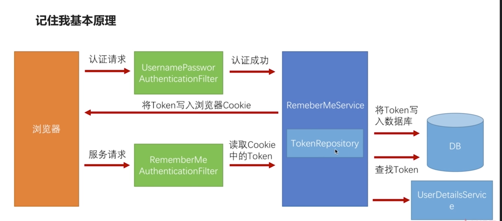

# Security 功能开发

==***涉及到的类和接口***==

==***<u>用于认证逻辑的:</u>***==

- RequestCache : 在进行认证的时候, 由 Security 进行判断当前请求是否需要跳转, 如果需要跳转, Security 会将当前的请求缓存到 *==HttpSessionRequestCache==* 中, *==HttpSessionRequestCache==* 是 *==RequestCache==* 接口的实现类. 一般情况下是 Security 在判断需要跳转后, 是根据继承了 *==WebSecurityConfigurerAdapter==*  的配置类中配置的 *==loginPage("/static/login.html")==* 跳转到登录页面中去, 但是如果想跳转到的 Controller 中然后进行操作, 则需要使用这个类进行可以通过这个类获取当需要跳转的请求,然后进行一些操作.
- *==RedirectStrategy==* : 用于跳转.
- ***==AuthenticationSuccessHandler==*** : 用于自定义登录成功后的处理. Security 默认的操作是在登录成功后, 跳转到之前缓存起来的的 URL 上, 比如访问 *==locahost:uouo/user==*触发登录流程, 登录成功后会跳转回 *==localhost:uouo/user==* 上. 在基于 ==ajax== 异步的请求上, 前端其实需要的时在登录成功后获得用户的信息, 而不是进行跳转, 为了完成这样的需求, 就可以通过实现 *==AuthenticationSuccessHandler==* 来完成.
- *==SavedRequestAwareAuthenticationSuccessHandler==* : Security 默认的登录成功后的处理器. 返回到通过 ==RequestCache==缓存起来的请求上.
- ==*AuthenticationFailureHandler*== : 用于自定义登录失败后的处理器
- ==*AuthenticationException*== : 是在身份认证过程中,所有的抛出的异常的基类. 使用方式是 : 编写自定义异常类, 继承这个类


记住我功能

- ==*PersistentTokenRespository*== : 用于在记住我功能中, 生成 token, 以及向数据库和 cookie 中写入 token.并写入到 cookie 中. 一般用的时它的实现类 : *==JdbcTokenRepository==*. JdbcTokenRepository 中维护的有一个建表语句. 可以拿出来自己执行, 也可以通过 jdbcTokenRepository#setCreateTableOnStartup(true) 设置为在启动的时候自动执行. (最好是手动执行, 否则第二期启动会包错, 因为不能创建同名的表.或者第二次启动的时候注释掉)

***关于过滤器链的操作:***

- ==*OncePerRequestFilter*==: 这个类是 Spring 提供的确保一次请求中只通过一次 Filter 的功能, 这个类实现了 *==Filter==* 接口. 向过滤器链中添加自定义的过滤器时使用.


*==**其他操作:**==*

- *==InitializingBean==* : 有时候我们的Bean中有某个属性需要注入，但是又不能通过一般的方式注入，什么意思呢？举个栗子：首先我们有个Service,在该Service中有一个属性，但是该属性不支持Spring注入，只能通过Build或者new的方式创建（比如StringBuffer之类的），但是我们想在Spring配置Bean的时候一起将该属性注入进来，这时候该怎么办呢？这时候可以通过实现InitializingBean接口来解决！
- BufferedImage : 用于生成图片验证码时的操作
- ==*AntPathMatcher*== : 用于关于 URL 的判断. 比如判断一个 URL 的列表中, 是否有 URL 可以和 request 的 URL 匹配上.
- ==*ServletWebRequest*== : Spring 提供的封装请求和响应的工具类.
- ==***ObjectMapper***== : 是一个工具类, 在 SpringMVC 启动的时候会自动的注册一个 *==ObjectMapper==*, 可以直接通过 *==@Autowried==* 注入. 用于将 Authentication 以 JSON 格式写回去.

## 1. 用户认证逻辑

- 默认认证
- 自定义认证流程
- 自定义登录页面
- 自定义到 Controller
- 自定义登录成功处理
- 自定义登录失败处理
- 认证流程源码
- 认证信息在多个请求之间的共享
- 图片验证码

### 1.1 默认认证 (基于 SpringBoot)

如果不做任何配置, 那么启动项目后, 需要进行 http 方式的验证. 不能满足需求. 所以需要通过配置, 以表单的形式进行验证.

```java
public class BrowserSecurityConfig extends WebSecurityConfigurerAdapter {

    /**
     * @param http
     * @throws Exception
     */
    @Override
    protected void configure(HttpSecurity http) throws Exception {
        // 指定身份认证方式为 表单登录
        http.formLogin()
                // 进行 表单登录 配置
                .and()
                // 对请求进行授权, 这句下边都是授权的配置
                .authorizeRequests()
                // 所有请求
                .anyRequest()
                // 都需要进行身份认证
                .authenticated();
    }
}
```


### 1.2 自定义用户认证流程

- 处理用户信息获取逻辑 ==*UserDetailsService*==
- 处理用户校验逻辑 
- 处理密码加密逻辑 ==*PasswordEncoder*==

#### 1.2.1 处理用户信息获取逻辑 ==UserDetailsService==

1. 编写配置类, 需要继承 ==*WebSecurityConfigurerAdapter*==, 并重写 ==*configure(HttpSecurity http)*== 方法.

   ```java
   @Configuration
   public class BrowserSecurityConfig extends WebSecurityConfigurerAdapter {
   
       /**
        * @param http
        * @throws Exception
        */
       @Override
       protected void configure(HttpSecurity http) throws Exception {
           // 指定身份认证方式为 basic
   //        http.httpBasic()
           // 指定身份认证方式为 表单登录
           http.formLogin()
                   // 进行 表单登录 配置
                   .and()
                   // 对请求进行授权, 这句下边都是授权的配置
                   .authorizeRequests()
                   // 所有请求, 包括请求的 html, jsp, url等
                   .anyRequest()
                   // 都需要进行身份认证后才能访问
                   .authenticated();
       }
   }
   ```

2. 实现 *==UserDetailsService==*, 用于获取用户信息以及授权

   ```java
   // 当前是模拟登录, 实际应该是通过实现 UserDetailsService 接口, 然后通过用户输入的用户名获取到 UserDetails, 然后将用户输入的密码
   // 和 获取到的 UserDetails 密码进行对比.
   @Slf4j
   @Component
   public class FormLoginUserDetails implements UserDetailsService {
   
   //    @Autowired
   //    注入 dao, 从数据库获取用户信息
   
       @Override
       public UserDetails loadUserByUsername(String username) throws UsernameNotFoundException {
           log.info("login name : [{}]", username);
           // 省略从数据库获取用户信息的逻辑
           // 默认用户
           /**
            * 参数 1: 用户输入的用户名
            * 参数 2: 数据库存储的用户密码
            *  以上连个参数用于认证
            * 参数 3: 用于在认证通过后, 进行授权
            */
           return new User("tom", "123456", AuthorityUtils.commaSeparatedStringToAuthorityList("admin"));
       }
   }
   ```

3. 此时由于配置的是 ==formLogin== 的认证方式, 所以会调用 ==UsernamePasswordAuthenticationFilter==.

4. *==UsernamePasswordAuthenticationFilter==* 会判断当前请求是否是 *==post 的 /login==* 请求, 如果是则获取用户名, 密码. 然后在方法 *==attemptAuthentication==* 中最后一行调用 *==UserDetailsService#loadUserByUsername==*. 进行认证.

#### 4.2.2 处理用户校验逻辑

**用户校验逻辑涉及两方面:**

1. **密码是否匹配**. 关于密码的校验, 是 Security 进行的, 只需要在 *==loadUserByUsername==* 方法中获取到数据库存储的密码就行了.
2. **用户是否被冻结, 密码是否过期**等

依然是在实现了 *==UserDetailsService==* 的类里实现的.

想实现 **用户是否被冻结, 密码是否过期等** 的校验, 也是从数据库查询到的结果进行判断的.

```java
// 当前是模拟登录, 实际应该是通过实现 UserDetailsService 接口, 然后通过用户输入的用户名获取到 UserDetails, 然后将用户输入的密码
// 和 获取到的 UserDetails 密码进行对比.
@Slf4j
@Component
public class FormLoginUserDetails implements UserDetailsService {

//    @Autowired
//    注入 dao, 从数据库获取用户信息

    @Override
    public UserDetails loadUserByUsername(String username) throws UsernameNotFoundException {
        log.info("login name : [{}]", username);
			// 注意 和上边使用的 User 构造方法不一样. 这里的密码是数据库存储的密码.
        return new User("tom", "123456",
                true, true, true, true,
                AuthorityUtils.commaSeparatedStringToAuthorityList(“admin”));
    }
}
```

#### 1.2.3 密码的加密和解密 

密码的加密和解密是通过 *==PasswordEncoder==* 实现的,位于包 *==org.springframework.security.crypto.password==*

***==PasswordEncoder==* 有两个方法:**

1. *==String encode(CharSequence rawPassword)==* : **由开发者调用**.对密码进行加密, 在注册时候,保存用户之前, 调用一些这个方法.
2. ==*boolean matches(CharSequence rawPassword, String encodedPassword)*== :**由 Security 自己调用**, 将用户输入的密码和获取到的 UserDetails的密码进行匹配. 一般由实现类 *==BCryptPasswordEncoder==* 来完成.

***==PasswordEncoder==* 声明如下:**

```java
package org.springframework.security.crypto.password;
public interface PasswordEncoder {
	// 对密码进行加密, 在用户注册的时候, 在保存之前, 需要调用一下这个方法.
	String encode(CharSequence rawPassword);
	// 判断加密后的密码和用户输入的密码是否匹配.
	boolean matches(CharSequence rawPassword, String encodedPassword);
}
```

**==*PasswordEncoder*== 的使用**

1. 在配置类中使用 *==@Bean==* 返回一个 *==PasswordEncoder==*. (可以使用自己的密码加密逻辑, 也可以使用 Security 自带的==*BCryptPasswordEncoder*==)
2. 在注册的时候, 手动调用 *====* 方法

```java
// 1. 配置 PasswordEncoder
@Configuration
public class BasicSecurityConfig extends WebSecurityConfigurerAdapter {

    /**
     * @return 如果想用自己的密码加密解密所及, 这里需要返回自己的加密解密类, 这个类需要实现 PasswordEncoder接口
     */
    @Bean
    public PasswordEncoder passwordEncoder(){
        return new BCryptPasswordEncoder();
    }

    @Override
    protected void configure(HttpSecurity http) throws Exception {
        http.formLogin()
                .and()
                .authorizeRequests()
                .anyRequest()
                .authenticated();
    }
}

// 2. 用户登录认证
// 当前是模拟登录, 实际应该是通过实现 UserDetailsService 接口, 然后通过用户输入的用户名获取到 UserDetails, 然后将用户输入的密码
// 和 获取到的 UserDetails 密码进行对比.
@Slf4j
@Component
public class FormLoginUserDetails implements UserDetailsService {

    @Autowired
    private PasswordEncoder passwordEncoder;

    @Override
    public UserDetails loadUserByUsername(String username) throws UsernameNotFoundException {
        log.info("login name : [{}]", username);
        String encode = passwordEncoder.encode("123456");
        log.info("login password : {}", encode);
        return new User("tom", encode,
                true, true, true, true,
                AuthorityUtils.commaSeparatedStringToAuthorityList("admin"));
    }
}
```

### 1.3 个性化用户认证流程

**涉及以下三个方面**:

- 自定义登录页面
- 自定义登录成功处理 (上边的 4.2 用户认证是在登录成功后跳转到了请求的 URL 上)
- 自定义登录失败处理

==*CSRF*== : 跨站请求伪造的防护

#### 1.3.1 自定义登录页面

1. 在继承了 *==WebSecurityConfigurerAdapter==* 配置类中, 在 *==formLogin()==* 后添加 *==loginPage("/login.html")==* 配置.
2. 对于表单认证, Security 是通过 *==UsernamePasswordAuthenticationFilter==* 进行的,这个过滤器只会处理 ==post 的 /login== 请求, 但是在配置的登录页面 *==login.html==* 中的 form 表单的提交 URL 可能不是 ==*/login*==, 那么就需要在 *==loginPage("/login.html")==* 后边添加 *==loginProcessingUrl("login.html 中 form 表单的 URL")==*, 这样当提交 *==login.html==* 中的登录表单的时候, Security 就知道要通过 ==*UsernamePasswordAuthenticationFilter*== 来处理这个 URL.
3. 配置了 *==loginPage==* 后, 就不能配置所有请求都要身份认证了, 需要通过配置 *==antMatchers("/login.html).permitAll()==* 来指定访问 *==login.html==* 页面是不进行认证.
4. Security 默认通过 ***==CSRF==*** 来进行 **跨站请求伪造防护**, 这里可以先把 CSRF 功能关掉.

**==需要注意的时 login.html 的存放位置, 参考 [SpringBoot.md] 下关于 SpringBoot 资源存放位置的说明==**

*==login.html==*, 存放在 resources/static/下

```html
<!DOCTYPE html>
<html lang="en">
<head>
    <meta charset="UTF-8">
    <title>标准登录</title>
</head>
<body>
<form action="/authentication/form" method="post">
    username : <input type="text" name="username">
    password : <input type="password" name="password">
    <input type="submit" value="提交">
</form>
</body>
</html>
```

==*Security配置类*==

```java
@Configuration
public class BasicSecurityConfig extends WebSecurityConfigurerAdapter {

    /**
     * @return 如果想用自己的密码加密解密所及, 这里需要返回自己的加密解密类, 这个类需要实现 PasswordEncoder接口
     */
    @Bean
    public PasswordEncoder passwordEncoder(){
        return new BCryptPasswordEncoder();
    }

    @Override
    protected void configure(HttpSecurity http) throws Exception {
        http.formLogin()
                // 配置自定义登录页面. 在配置文件中配置了资源的位置, 所以需要指定 static. 如果没有配置资源位置, 则可以省略 /static
                .loginPage("/static/login.html")
                // 当访问这个 URL 的时候, 会用UsernamePasswordAuthenticationFilter进行认证
                .loginProcessingUrl("/authentication/form")
                .and()
                .authorizeRequests()
                // 指定
                .antMatchers("/static/login.html").permitAll()
                .anyRequest()
                .authenticated()
                .and()
                // 关闭 CSRF 跨站请求伪造防护 功能
                .csrf().disable();
    }
}
```

以上流程是 Security 判断当前请求是否需要跳转, 如果需要跳转的话就会跳转到 *==login.html==*.

认证登录流程是基于 **==4.2 自定义用户认证流程==** 展开的.

然后, 访问 ==localhost:8080/user== 就会先去登录.

#### 1.3.2 需要进行身份认证的请求跳转到一个 Controller

**==4.3.1== 的逻辑是登录后, 跳转到访问的 URL 上, 但是一般情况下, 是需要跳转到 Controller 内, 然后根据不同类型的请求做不同的处理, 比如是是 *=="text/html"==* 类型的请求,则返回一个页面. 否则返回一串 json 串.**


根据这个思路, 将 **==4.3.1 的流程==** 修改为当需要进行认证的时候, 是跳转到一个 Controller, 然后根据请求类型的不同,来进行不同类型的操作, 就是 *==Security 配置类==* 内配置的 *==loginPage("/static/login.html")==* 中的配置修改为一个 *==Controller==*(那么在后的 *==antMatchers==*要同步的进行修改), **在这个 Controller 中定义一个方法, 用于处理需要进行身份认证的请求.**

==***场景:***==

接收到请求后, Security 进行判断是否需要认证, 如果需要认证的话就跳转到一个 Controller 中, 在 Controller 中获取当前需要跳转的请求, 然后根据请求的是 ==html== 还是其他的, 比如说方法等, 然后进行不同的操作 :

- 比如可以让请求的是 ==html== 的请求跳转到默认登录页, 也可以是其他的登录页
- 如果不是 ==html== 请求, 则返回一个状态码, 并提示它需要进行身份认证.

==***效果***==:

访问 ==html== 页面, 跳转到登录页, 直接方位 Controller 方法,  则给提示信息以及业务代码.

==***流程***==:

1. 发送请求
2. Security 根据配置判断当前请求是否需要跳转.
3. 如果需要跳转, 则跳转到 Controller
4. 在 Controller 中判断是什么请求
5. 如果是 ==html== 请求, 则跳转到 登录页.(如果配置了, 则跳转到配置的登录页, 没有没有配置, 则跳转到默认的登录页, 所以要在 ==antMatchers 中将两个登录页都配置为不用认证==).
6. 如果不是 ==html== 请求, 则给提示信息, 以及业务代码.

==**<u>*涉及到的功能点:*</u>**==

- 需要根据当前请求是不是请求的 ==html== 来判断是否跳转到登录页.
- 当需要跳转到登录页的时候, 需要可以跳转到默认的登录页, 也可以跳转到其他的登录页.(通过在配置文件中配置)

==***<u>涉及到的类</u>:***==

- ==*RequestCache*== : 当前思路是需要根据请求方式(是否是 HTMl) 来进行不同的操作, 所以需要获取到触发认证的请求, ==RequestCache== 就是获取这个请求.
- *==RedirectStrategy==* : 用于跳转.
- *==@ResponseStatus(code = httpStatus.UNAUTHORIZED)==* : 标注在方法上, 用于返回状态码,==httpStatus.UNAUTHORIZED== 表示未授权.
- *==自定义一个 SimpleResponse 类==* : 用于在当前请求不是 ==html== 的时候, 返回状态码和提示信息的时候, 对信息进行封装.
- *==自定义一个配置项读取类==*, 用于读取配置文件配置的登录页.

***==env.properties== 配置其他的登录页***

```properties
security.basic.page.singin = /static/singin1.html
```

==***配置项读取类:***==

```java
@Component
@PropertySource("classpath:env.properties")	// 从指定的配置文件读取配置项.
@ConfigurationProperties(prefix = "security.basic.page")
public class SecurityBasicProperties {

    private String singin = "/static/login.html";

    public String getSingin() {
        return singin;
    }

    public void setSingin(String singin) {
        this.singin = singin;
    }
}
```

***==SimpleResponse==*** 用于返回信息

```java
public class SimpleResponse {

    private Object content;

    public Object getContent() {
        return content;
    }

    public void setContent(Object content) {
        this.content = content;
    }

    public SimpleResponse(Object content) {
        this.content = content;
    }
}
```

***==Security 配置类==***

```java
@Configuration
public class BasicSecurityConfig extends WebSecurityConfigurerAdapter {

    @Autowired
    private SecurityBasicProperties securityBasicProperties;

    /**
     * @return 如果想用自己的密码加密解密所及, 这里需要返回自己的加密解密类, 这个类需要实现 PasswordEncoder接口
     */
    @Bean
    public PasswordEncoder passwordEncoder(){
        return new BCryptPasswordEncoder();
    }

    @Override
    protected void configure(HttpSecurity http) throws Exception {
        http.formLogin()
                // 配置自定义登录页面
                // .loginPage("/static/login.html")
                .loginPage("/authentication/required")
                // 当访问这个 URL 的时候, 会用UsernamePasswordAuthenticationFilter进行认证
                .loginProcessingUrl("/authentication/form")
                .and()
                .authorizeRequests()
                // 指定不需要认证的请求路径
                .antMatchers("/authentication/required", securityBasicProperties.getSingin()).permitAll()
                .anyRequest()
                .authenticated()
                .and()
                // 关闭 CSRF 跨站请求伪造防护 功能
                .csrf().disable();
    }
}
```

***==Controller==***

```java
@Slf4j
@RestController
public class SecurityController {

    @Autowired
    private SecurityBasicProperties securityBasicProperties;
    // 可以获取到 Security 缓存的需要跳转的请求对象.
    private RequestCache requestCache = new HttpSessionRequestCache();
    // 用于跳转
    private RedirectStrategy redirectStrategy = new DefaultRedirectStrategy();

    @RequestMapping("/authentication/required")
    @ResponseStatus(code = HttpStatus.UNAUTHORIZED)
    public SimpleResponse requiredAuthentication(HttpServletRequest request, HttpServletResponse response) throws IOException {
        SavedRequest savedRequest = requestCache.getRequest(request, response);
        if (null != savedRequest) {
            String targetUrl = savedRequest.getRedirectUrl();
            log.info("引发跳转的 URL : [{}]", targetUrl);
            if (StringUtils.endsWithIgnoreCase(targetUrl, ".html")) {
                redirectStrategy.sendRedirect(request, response, securityBasicProperties.getSingin());
            }
        }
        return new SimpleResponse("访问的资源需要身份认证, 请引导用户到登录页面");
    }
}
```

==***运行流程:***==

1. 首先 Security 会根据 *==BasicSecurityConfig==* 的配置进行判断当前请求是否需要进行认证 (根据 *==antMatchers==* 的配置进行判断).
2. 如果需要认证, Security 会自动将当前请求缓存在 *==RequestCache==* 中.
3. 如果不需要, 则放过.
4. 如果需要认证, 则会跳转到 *==loginPage==* 路径, 也即是配置的一个 Controller.
5. 在 Controller 中通过 *==RequestCache==* 获取到 Security 缓存的当前需要认证的请求.
6. 如果当前请求为空,则返回 ==*SimpleResponse*== 信息.
7. 如果当前请求不为空, 判断请求是否已 *==.html==* 结尾
8. 如果是以 *==.html==* 结尾, 则用 *==RedirectStrategy==* 跳转到配置的登录页(如果没有配置则会跳转 *==SecurityBasicProperties==* 默认的登录页).
9. 如果不是以 *==.html==* 结尾, 则返回 SimpleResponse 封装的提示信息, 以及方法上通过 *==ResponseStatus==* 指定的代码.


#### 1.3.3 自定义登录成功处理

Security 默认的处理是在登录成功后, 跳转到之前访问的那个 URL 上, 比如访问 *==localhost:8080/user==*, 触发了认证流程, 会跳转到登录页面, 在登录成功后, 在跳转回到 *==localhost:8080/user==*上.

==***场景***== : 但是有的场景是这样的, 登录不是同步的方式进行的,而是通过 ==ajax== 异步完成的, 这时前端实际上需要的是用户的一些信息, 而不是进行跳转.

为了完成这样的场景, 需要自定义登录成功后处理, 其实只要实现一个接口口就行了 : ***==AuthenticationSuccessHandler==***. 


==**AuthenticationSuccessHandler 声明如下:**==

```java
public interface AuthenticationSuccessHandler {

	/**
	 * Called when a user has been successfully authenticated.
	 *
	 * @param request the request which caused the successful authentication
	 * @param response the response
	 * @param authentication 认证接口, 可以获得 UserDetails, 权限列表等信息
	 */
  [asdad](#authentication)
	void onAuthenticationSuccess(HttpServletRequest request,
			HttpServletResponse response, Authentication authentication)
			throws IOException, ServletException;
}
```


***==效果==***:

登录成功后, 通过 ***==Authentication==*** 以 JSON 的格式写会到页面.


***==涉及到的类==***:

- ==***ObjectMapper***== : 是一个工具类, 在 SpringMVC 启动的时候会自动的注册一个 *==ObjectMapper==*, 可以直接通过 *==@Autowried==* 注入. 用于将 Authentication 以 JSON 格式写回去.


自定义登录成功操作的步骤:

1. 实现 *==AuthenticationSuccessHandler==* 接口.
2. 通过继承 ***==WebSecurityConfigurationAdapter==*** 的配置类配置 ==successHandler(自己实现的行为)== 将登录成功后的行为配置为自己显现的 *==AuthenticationSuccessHandler==*, 而不是用 Security 默认的行为.


==***自定义登录成功后的处理类***==

```java
@Slf4j
@Component
public class CustomerAuthenticationSuccessHandler implements AuthenticationSuccessHandler {

    @Autowired
    private ObjectMapper objectMapper;

    @Override
    public void onAuthenticationSuccess(HttpServletRequest request, HttpServletResponse response, Authentication authentication) throws IOException, ServletException {
        response.setContentType("application/json;charset=utf-8");
        log.info("登录成功");
        response.getWriter().write(objectMapper.writeValueAsString(authentication));
    }
}
```

==***配置类***==

```java
@Configuration
public class BasicSecurityConfig extends WebSecurityConfigurerAdapter {

    @Autowired
    private SecurityBasicProperties securityBasicProperties;
		
  	// 自定义的实现了 AuthenticationSuccessHandler 接口的登录成功后的处理类.
    @Autowired
    private CustomerAuthenticationSuccessHandler customerAuthenticationSuccessHandler;

    @Bean
    public PasswordEncoder passwordEncoder(){
        return new BCryptPasswordEncoder();
    }

    @Override
    protected void configure(HttpSecurity http) throws Exception {
        http.formLogin()
                .loginPage("/authentication/required")
                .loginProcessingUrl("/authentication/form")
          			// 注入自定义的登录成功后的处理类, 然后在这里配置. 这样在登录成功后就会执行自定义的成功后的逻辑, 而不是默认的逻辑
                .successHandler(customerAuthenticationSuccessHandler)
                .and()
                .authorizeRequests()
                .antMatchers("/authentication/required", securityBasicProperties.getSingin()).permitAll()
                .anyRequest()
                .authenticated()
                .and()
                .csrf().disable();
    }
}
```


#### 1.3.4 自定义登录失败处理

自定义登录失败后的处理, 也是要在登录失败后返回一个 JSON 信息, 而不是跳转到页面. 只要实现 *==AuthenticationFailureHandler==* 接口就行了.


==**AuthenticationFailureHandler声明如下:**==

```java
public interface AuthenticationFailureHandler {

	/**
	 * Called when an authentication attempt fails.
	 * @param request the request during which the authentication attempt occurred.
	 * @param response the response.
	 * @param exception 在登录失败后, 产生的异常.
	 */
	void onAuthenticationFailure(HttpServletRequest request,
			HttpServletResponse response, AuthenticationException exception)
			throws IOException, ServletException;
}
```


==**自定义登录失败后的处理步骤**==

1. 实现 *==AuthenticationFailureHandler==* 接口.
2. 在实现了 *==WebSecurityConfigurationAdapter==*的配置类中配置 *==failureHandler(自定义的失败处理)==*将登录失败后的处理行为设置为自定义的行为, 而不是默认的行为.


==**自定义失败处理**==

```java
@Slf4j
@Component
public class CustomAuthenticationFailureHandler implements AuthenticationFailureHandler {

    @Autowired
    private ObjectMapper objectMapper;

    @Override
    public void onAuthenticationFailure(HttpServletRequest request, HttpServletResponse response, AuthenticationException exception) throws IOException, ServletException {
        log.info("登录失败");
        response.setContentType("application/json;charset=utf-8");
        response.getWriter().write(objectMapper.writeValueAsString(exception));
    }
}
```

==**配置类**==

```java
@Configuration
public class BasicSecurityConfig extends WebSecurityConfigurerAdapter {

    @Autowired
    private SecurityBasicProperties securityBasicProperties;

		// 自定义的实现了 AuthenticationSuccessHandler 接口的登录成功后的处理类.
    @Autowired
    private CustomAuthenticationSuccessHandler customerAuthenticationSuccessHandler;

  	// 自定义的实现了 AuthenticationFailurehandler 接口的登录失败后的处理类.
    @Autowired
    private CustomAuthenticationFailureHandler customAuthenticationFailureHandler;

    @Bean
    public PasswordEncoder passwordEncoder(){
        return new BCryptPasswordEncoder();
    }

    @Override
    protected void configure(HttpSecurity http) throws Exception {
        http.formLogin()
                .loginPage("/authentication/required")
                .loginProcessingUrl("/authentication/form")
                // 登录成功后的处理
                .successHandler(customerAuthenticationSuccessHandler)
                // 登录失败后的处理
                .failureHandler(customAuthenticationFailureHandler)
                .and()
                .authorizeRequests()
                .antMatchers("/authentication/required", securityBasicProperties.getSingin()).permitAll()
                .anyRequest()
                .authenticated()
                .and()
                .csrf().disable();
    }
}
```


#### 1.3.5 通过配置来决定在登录成功失败后怎么处理

1.3.4 的流程是在登录成功或者失败后都返回 JSON, 但是在多模块或者有其他需求的情况时, 可能有的要返回页面, 有的要返回 JSON. 所以1.3.4 的流程过于固定.

场景 :有时候登录成功或者失败后需要返回页面, 有时会需要返回 JSON.


==**修改方法 :**==

- 4.3.4 中自定义的登录成功或者失败的处理类, 不再实现 *==AuthenticationSuccessHandler 或者 AuthenticationFailureHandler==*, 而是继承 Security 默认的处理类 : *==SavedRequestAwareAuthenticationSuccessHandler 或者 SimpleUrlAuthenticationFailureHandler==*, 添加一个配置 ==loginType==,  然后在处理类中根据一个根据配置进行判断, 如果是 **==JSON==** , 则返回 JSON, 如果不是, 则返回一个页面.


==**涉及到的类:**==

- *==SimpleUrlAuthenticationSuccessHandler==* : Security 默认的登录成功后的处理类, 默认是认证之前访问的路径
- *==SimpleUrlAuthenticationFailureHandler==*: Security 默认的登录失败后的处理类

- *==SavedRequestAwareAuthenticationSuccessHandler==* : 实现了 *==SimpleUrlAuthenticationSuccessHandler==*


==**配置项读取类**==

```java
// loginType 枚举
public enum LoginType {
    REDIRECT,
    JSON
}

// 配置项读取类
@Component
@PropertySource("classpath:env.properties")
@ConfigurationProperties(prefix = "security.basic.page")
public class SecurityBasicProperties {

    private String singin = "/static/login.html";
    private LoginType loginType = LoginType.JSON;
  
  // 省略 get/set 方法
}
```

==**登录成功处理类修改:**==

```java
@Slf4j
@Component
//public class CustomAuthenticationSuccessHandler implements AuthenticationSuccessHandler {
public class CustomAuthenticationSuccessHandler extends SavedRequestAwareAuthenticationSuccessHandler {

    @Autowired
    private ObjectMapper objectMapper;

    @Autowired
    private SecurityBasicProperties securityBasicProperties;

    @Override
    public void onAuthenticationSuccess(HttpServletRequest request, HttpServletResponse response, Authentication authentication) throws IOException, ServletException {
        log.info("登录成功");

        if (LoginType.JSON.equals(securityBasicProperties.getLoginType())) {
          // 如果是 JSON, 则返回 JSON 字符串
            response.setContentType("application/json;charset=utf-8");
            response.getWriter().write(objectMapper.writeValueAsString(authentication));
        } else {
            // 配置的不是 JSON, 则之前请求的 URL
            super.onAuthenticationSuccess(request, response, authentication);
        }

    }
}
```


==**登录失败后的处理类**==

```java
@Slf4j
@Component
//public class CustomAuthenticationFailureHandler implements AuthenticationFailureHandler {
public class CustomAuthenticationFailureHandler extends SimpleUrlAuthenticationFailureHandler {

    @Autowired
    private ObjectMapper objectMapper;

    @Autowired
    private SecurityBasicProperties securityBasicProperties;

    @Override
    public void onAuthenticationFailure(HttpServletRequest request, HttpServletResponse response, AuthenticationException exception) throws IOException, ServletException {
        log.info("登录失败");

        if (LoginType.JSON.equals(securityBasicProperties.getLoginType())) {
            response.setStatus(HttpStatus.INTERNAL_SERVER_ERROR.value());
            response.setContentType("application/json;charset=utf-8");
            response.getWriter().write(objectMapper.writeValueAsString(exception));
        } else {
            super.onAuthenticationFailure(request, response, exception);
        }
    }
}
```


Security 配置类不用修改.

那么此时,如果配置文件内没有配置 ==loginType==, 当访问一个页面的时候, 比如访问 ==localhost:8080/static/index.html==(需要先创建 index.html), 登录成功/失败都是返回 JSON.

如果配置文件内配置 *==security.basic.page.login-type=redirect==*, 那么访问 *==localhost:8080/static/index.html==*时, 登录成功则跳转到 ==*index.html*==页面, 登录失败则返回到 ==*401.html*== (401.html为自定义页面, 因为认证失败的错误代码为 401)


### 1.4 在过滤器链上添加自己的过滤器

在一些场景中, 可能会需要实现自己的过滤器, 而这些添加的过滤器可能和 Security 的过滤器链有先后顺序, 比如图片验证码, 就需要在调用 *==UsernamePasswordAuthenticationFilter==* 之前调用自己的 Filter 来验证图片验证码, 如果成功就调用 *==UsernamePasswordAuthenticationFilter==*.


*==**涉及的类**==:*

- ==*OncePerRequestFilter*==: 这个类是 Spring 提供的确保一次请求中只通过一次 Filter 的功能, 这个类实现了 *==Filter==* 接口.
- ==*AuthenticationException*==: 认证过程中所有抛出的异常的基类.


==***实现方式***==:

- 编写自己的过滤器, 继承 *==OncePerRequestFilter==*
- 在继承了 *==SecurityConfigurationAdapter==* 的配置类中通过添加 *==addFilterBefore==* 进行配置.


==**将自定义的 Filter 添加到过滤器链中指定的过滤器前边**==, 可以在继承了 *==SecurityConfigurationAdapter==* 配置类中, 通过 ==*http.addFilterBefore(自定义 Filter, 过滤器链中的 Filter)*== 来实现.

- HttpSecurity.addFilterBefore : 在过滤器链中指定过滤器前边添加继承了 *==OncePerRequestFilter==* 的过滤器.
- HttpSecurity.addFilterAfter : 在过滤器链中指定过滤器后边添加继承了 *==OncePerRequestFilter==* 的过滤器.


==**自定义过滤器**==

```java
@Slf4j
public class ValidateCodeFilter extends OncePerRequestFilter {
    @Override
    protected void doFilterInternal(HttpServletRequest request, HttpServletResponse response, FilterChain filterChain) throws ServletException, IOException {
        log.info("自定义过滤器执行了");
        filterChain.doFilter(request, response);
    }
}
```


==**配置**==

```java
@Configuration
public class BasicSecurityConfig extends WebSecurityConfigurerAdapter {

    @Autowired
    private SecurityBasicProperties securityBasicProperties;

    @Autowired
    private CustomAuthenticationSuccessHandler customerAuthenticationSuccessHandler;

    @Autowired
    private CustomAuthenticationFailureHandler customAuthenticationFailureHandler;

    @Bean
    public PasswordEncoder passwordEncoder(){
        return new BCryptPasswordEncoder();
    }

    @Override
    protected void configure(HttpSecurity http) throws Exception {
        http
          // 在 UsernamePasswordAuthenticationFilter 前边添加自定义的过滤器       
          .addFilterBefore(new ValidateCodeFilter(), UsernamePasswordAuthenticationFilter.class)
                .formLogin()
                .loginPage("/authentication/required")
                .loginProcessingUrl("/authentication/form")
                .successHandler(customerAuthenticationSuccessHandler)
                .failureHandler(customAuthenticationFailureHandler)
                .and()
                .authorizeRequests()
                .antMatchers("/authentication/required", securityBasicProperties.getSingin()).permitAll()
                .anyRequest()
                .authenticated()
                .and()
                .csrf().disable();
    }
}
```


### 1.5 认证流程源码解析

- 认证处理流程说明
- 认证结果如何在多个请求间共享
- 获取认证用户信息

#### 1.5.1 认证处理流程说明 (基于 ==formLogin==)

- UsernamePasswordAuthenticationToken : 包含有用户信息, 是否通过认证等信息. 流程最终返回的就是这个.

简单的将就是一个相应的过滤器拦截到请求, 然后将需要认证的新的包装在一个 Authentication(AbstractAuthenticationToken) 里边, 并将认证表示设置为 false, 然后交给 ProviderManager进行认证, ProviderManager 通过内部维护的 AuthenticationProvider 列表进行匹配,匹配到适用的 provider 就使用这个 provider 进行相关的处理,在处理的过程中会调用 UserDetailsService 获取业务系统中用户信息, 然后将用户信息封装在一个 UserDetails 中. 经过一些列的检查和校验(例如密码校验),通过后就将用户信息封装在之前包装的 Authentication(AbstractAuthenticationToken) 里边,并将认证状态设置为 true, 然后将这个 Authentication(AbstractAuthenticationToken) 放在 SecurityContext里边, 到此整个认证流程结束.


1. 登录请求
2. *==UsernamePasswordAuthenticationFilter==* 判断是否为 ==*post 的 login*== 请求. 如果是则封装一个 ==*UsernamePasswordAuthenticationToken*== 对象.
   1. 通过 *==UsernamePasswordAuthenticationToken==*的构造方法(UsernamePasswordAuthenticationToken实现了 ==Authentication接口==), 构建一个对象, 并且设置为==*setAuthenticated(fasle) 没有认证*==.
   2. 将当前请求设置到 *==UsernamePasswordAuthenticationToken==* 对象中.
3. 通过调用 *==AuthenticationManager#authenticate(? extends Authentication)==* 进行认证. 源码中是把封装好的 *==UsernamePasswordAuthenticationToken==* 作为参数传入这个方法中.
   1. 实际上调用的是 *==AuthenticationManager 的实现类 ProviderManager#authenticate(Authentication)==* 方法.
      1. 在此方法中, 会获取 *==ProviderManager==* 中维护的一个 *==List<AuthenticationProvider>==* 列表.
         1. 遍历这个列表, 判断当前 *==AuthenticationProvider==* 是否支持当前类型的 *==Authentication==*, 如果支持, 则往下运行.(不同的登录方式的 *==Authentication==*是不一样的. formLogin 的是 *==UsernamePasswordAuthenticationToken==* ).
         2. 执行 ==*AuthenticationProvider#authenticate*==.
         3. 当前 *==formLogin==* 方式使用的是 *==DaoAuthenticationProvider==*, 它继承了 *==AbstractUserDetailsAuthenticationProvider==* 抽象类.
         4. 所以第四步实际上执行的是 *==AbstractUserDetailsAuthenticationProvider#authenticate(Authentication)==* 方法.
         5. 执行 *==AbstractUserDetailsAuthenticationProvider#authenticate==* 方法中, 会执行到一个 *==retrieveUser==* 方法, 这里实际上调用的是 ==*DaoAuthenticationProvider#retrieveUser*==方法.
            1. *==DaoAuthenticationProvider#retrieveUser==* 通过 *==DaoAuthenticationProvider==* 中维护的 *==UserDetailsService==* 的 *==loadUserByUsername==* 获取到 UserDetails. 实际上调用的是 ***==开发者自己实现的 UserDetailsService==***.
               1. 如果没有获取到 UserDetails,则会抛出一个 *==UsernameNotFoundException==* 异常.
               2. 如果获取到, 则将 *==UserDetails==* 返回到 **==AbstractUserDetailsAuthenticationProvider==**, 然后继续往下执行.
         6. 获取到 *==UserDetails==*后, 在 *==AbstractUserDetailsAuthenticationProvider==* 中对获取到的 *==UserDetails==* 进行检查, 有三轮检查 : 预检查, 附件检查, 后检查.
            1. **==*预检查 : preAuthenticationChecks.check(UserDetails).*==** *==preAuthenticationChecks==* 是 *==AbstractUserDetailsAuthenticationProvider==* 内部维护的一个 ==*UserDetailsChecker*== 对象. 最终调用的时 *==AbstractUserDetailsAuthenticationProvider==* 的内部类 *==DefaultPreAuthenticationChecks 类==* 的 ==*check*== 方法. 检查==**是否启用, 账户是否过期, 账户是否锁定**== 三项.
            2. ==附件检查 : additionalAuthenticationChecks(UserDetails, UsernamePasswordAuthenticationToken)== : 检查密码是否匹配.
            3. ==*后检查 : postAuthenticationChecks*== : 检查密码是否过期.
         7. 三个检查都通过后, 会调用 *==createSuccessAuthentication==* 方法, 封装一个 ==*Authentication*==
            1. 在 *==createSuccessAuthentication==* 方法中, 其实是调用有三个参数的 *==UsernamePasswordAuthenticationToken==* 的构造方法, 设置权限列表, 用户, 密码, 同时将认证状态设置为 ==true==.  这个方法执行完后, 最终返回一个 *==Authentication==*.
      2. 将认证后的 *==Authentication==* 返回到 *==ProviderManager==* .
      3. 在列表中, 只要有一个 *==AuthenticationProvider==* 认证通过, 就可以认为当前登录请求通过认证.
4. 最终将认证后的 *==Authentication==* 返回到 ==*UsernamePasswordAuthenticationFilter*== 中.
5. 执行 *==UsernamePasswordAuthenticationFilter==* 的父类 *==AbstractAuthenticationProcessingFilter#doFilter==* 方法. 在这个方法中最终会调用当前类的 *==successfulAuthentication==* 方法
   1. 在 *==successfulAuthentication==* 方法中, 会将 *==Authentication==* 通过 *==SecurityContextHolder.getContext().setAuthentication(Authentication)==* 设置到上下文中.
   2. 然后通过 ==*successHandler.onAuthneticationSuccess*== 调用 **==自己实现的登录成功后的处理器进行处理==**


#### 1.5.2 认证结果如何在多个请求之间共享

在认证过程中,  调用 *==AbstractAuthenticationProcessingFilter#successfulAuthentication==* 方法中会调用 *==SecurityContextHolder.getContext().setAuthentication(Authentication)==* 将通过认证的 *==Authentication==* 设置到 ==*SecurityContext*== 中. 

==*SecurityContextHolder*== 默认使用的是 *==ThreadLocalSecurityContextHolderStrategy==*, 内部维护的是 *==ThreadLocal<SecurityContext>==*, 所以在当前的请求(或者说当前线程中), 都可以通过 *==getContext()==* 方法获取到 *==Authentication==*.


Security 过滤器链的第一个过滤器 : **==SecurityContextPersistenceFilter==**. 

这个过来器会在请求刚过来的时候, 检查 Session 中是否有 SecurityContext, 如果有, 则拿出来并放入到线程中去.如果没有则放过.

在最终返回的时候, 会检查线程中是否有 SecurityContext, 如果有, 则拿出来放入到 Session 中. 


到此, 就可以实现认证结果在多个请求之间共享.


#### 1.5.3 获取认证用户信息

```java
@GetMapping("/currentUser")
public Object getCurrentUser(){
  	return SecurityContextHolder.getContext().getAuthentication().getPrincipal();
}

// 基于 SpringMVC
@GetMapping("/currentUser")
public Object getCurrentUser(Authentication authentication){
	return authentication.getPrincipal();
}
```


### 1.6 图片验证码

- 开发生成图形验证码接口
- 在认证流程中加入图片验证码校验
- 验证码参数可配置
  - 大小
  - 过期时间
  - 验证码过滤器要拦截的 URL. 因为验证码可能在多个地方使用
  - 验证码生成逻辑可配置

#### 1.6.1 生成图形验证码

- 根据随机数生成图片
- 将随机数存到 Session 中
- 将生成的图片写到接口的响应中, 然后写到页面.

==涉及到的类==

- *==BufferedImage==* : 图片类
- ==*ImageIO*== : 
- ==*SessionStrategy*== : Spring 中操作 Session 的工具类
- *==InitializingBean==* : 作用是其他参数初始化完毕后, 初始化一些无法通过@Autowired 等 Spring 常规方式注入的 bean.


验证码过滤器

```java
@Slf4j
public class ValidateCodeFilter extends OncePerRequestFilter implements InitializingBean {

    private SessionStrategy sessionStrategy = new HttpSessionSessionStrategy();
		// 需要 get/set 方法.  忽略 get/set 方法.
    private AuthenticationFailureHandler authenticationFailureHandler;
		// 需要 get/set 方法.  忽略 get/set 方法.
    private Set<String> urls = new HashSet<>();
    // 无法通过 @Autowired 进行注入, 只能提供 get/set 方法, 在配置类中进行 set, 忽略 get/set 方法.
    private SecurityBasicProperties securityBasicProperties;
    // 用于对 URL 进行匹配
    private AntPathMatcher antPathMatcher = new AntPathMatcher();

    // 此方法为 InitializingBean 接口的方法, 在 Bean 初始化完毕后, 初始化一些无法通过 Spring 注入的参数
    @Override
    public void afterPropertiesSet() throws ServletException {
        super.afterPropertiesSet();
        String[] configUrls = StringUtils.splitByWholeSeparatorPreserveAllTokens(securityBasicProperties.getCode().getImage().getUrl(), ",");
        for (String configUrl : configUrls) {
            urls.add(configUrl);
        }
        urls.add("/authentication/form");
    }

    @Override
    protected void doFilterInternal(HttpServletRequest request, HttpServletResponse response, FilterChain filterChain) throws ServletException, IOException {

        boolean action = false;
        // 如果当前请求 URL 在配置的需要进行验证码校验的 URL 中, 则返回 true
        for (String url : urls) {
            if (antPathMatcher.match(url, request.getRequestURI())) {
                action = true;
            }
        }
        if (action) {
            try {
                validate(new ServletWebRequest(request));
            } catch (ValidateCodeException e) {
                authenticationFailureHandler.onAuthenticationFailure(request, response, e);
                return;
            }
        }
        filterChain.doFilter(request, response);
    }

    private void validate(ServletWebRequest request) throws ServletRequestBindingException {
        ImageCode codeInSession = (ImageCode)sessionStrategy.getAttribute(request, ValidateCodeController.SESSION_KEY);
        String codeInRequest = ServletRequestUtils.getStringParameter(request.getRequest(), "imageCode");

        if (StringUtils.isBlank(codeInRequest)) {
            throw new ValidateCodeException("验证码不能为空");
        }
        if (null == codeInSession) {
            throw new ValidateCodeException("验证码不存在");
        }
        if (codeInSession.isExpired()) {
            sessionStrategy.removeAttribute(request, ValidateCodeController.SESSION_KEY);
            throw new ValidateCodeException("验证码已过期");
        }
        if (StringUtils.equals(codeInSession.getCode(), codeInRequest)) {
            throw new ValidateCodeException("验证码不匹配");
        }

        // 如果验证码是一次性的, 则最终也移除
        // sessionStrategy.removeAttribute(request, ValidateCodeController.SESSION_KEY);
    }
}
```


配置类

```java
@Configuration
public class BasicSecurityConfig extends WebSecurityConfigurerAdapter {

    @Autowired
    private SecurityBasicProperties securityBasicProperties;

    @Autowired
    private CustomAuthenticationSuccessHandler customerAuthenticationSuccessHandler;

    @Autowired
    private CustomAuthenticationFailureHandler customAuthenticationFailureHandler;

    /**
     * @return 如果想用自己的密码加密解密所及, 这里需要返回自己的加密解密类, 这个类需要实现 PasswordEncoder接口
     */
    @Bean
    public PasswordEncoder passwordEncoder() {
        return new BCryptPasswordEncoder();
    }

    @Override
    protected void configure(HttpSecurity http) throws Exception {
        // 封装 ValidateCodeFilter
        ValidateCodeFilter validateCodeFilter = new ValidateCodeFilter();
        validateCodeFilter.setAuthenticationFailureHandler(customAuthenticationFailureHandler);
        validateCodeFilter.setSecurityBasicProperties(securityBasicProperties);
        validateCodeFilter.afterPropertiesSet();

        http		
          			// 将 validateCodeFilter 添加到 UsernamePasswordAuthenticationFilter 前边
                .addFilterBefore(validateCodeFilter, UsernamePasswordAuthenticationFilter.class)
                .formLogin()
                // 配置自定义登录页面
                .loginPage("/authentication/required")
                // 当访问这个 URL 的时候, 会用UsernamePasswordAuthenticationFilter进行认证
                .loginProcessingUrl("/authentication/form")
                // 登录成功后的处理
                .successHandler(customerAuthenticationSuccessHandler)
                // 登录失败后的处理
                .failureHandler(customAuthenticationFailureHandler)
                .and()
                .authorizeRequests()
                // 指定不需要认证的 URL
                .antMatchers("/authentication/required",
                        securityBasicProperties.getAuthentication().getSingin(),
                        "/code/image").permitAll()
                .anyRequest()
                .authenticated()
                .and()
                // 关闭 CSRF 跨站请求伪造防护 功能
                .csrf().disable();
    }
}
```

配置项读取类

```java
// 1. 总的配置项读取类
@Data
@Component
@PropertySource("classpath:env.properties")
@ConfigurationProperties(prefix = "security.basic.prp")
public class SecurityBasicProperties {

    // 登录认证配置参数
    private AuthenticationBasicProperites authentication = new AuthenticationBasicProperites();

    // 验证码配置参数
    private ValidateCodeProperties code = new ValidateCodeProperties();
}

// 2. 登录项配置项读取类
@Data
public class AuthenticationBasicProperites {
    private String singin = "/static/login.html";

    private LoginType loginType = LoginType.JSON;
}

// 3. 验证码配置项读取类
@Data
public class ValidateCodeProperties {
    // 图片验证码
    private ImageCodeProperties image = new ImageCodeProperties();
    // 手机验证码
    private PhoneCodeProperties phone = new PhoneCodeProperties();
}

// 4. 图片验证码配置项读取类
@Data
public class ImageCodeProperties {

    // 图片宽度
    private int width = 67;
    // 图片高度
    private int height = 23;
    // 验证码长度
    private int lenght = 4;
    // 验证码有效期 秒
    private int expireIn = 60;
    // 需要进行图片验证的 URL
    private String url;
}

// 5. 手机验证码配置项读取类
@Data
public class PhoneCodeProperties {
    private int length = 5;
}
```


配置项

```properties
# 登录认证配置
#security.basic.prp.authentication.singin = /static/singin1.html
security.basic.prp.authentication.login-type= json

# 验证码配置
security.basic.prp.code.image.width = 6
security.basic.prp.code.image.length = 100
security.basic.prp.code.image.url = /user/*
security.basic.prp.code.phone.length = 5
```


此时, 基于之前的代码,做了以上修改后, 就可以实现图片验证码的生成, 校验, 以及可配置化.

#### 1.6.2 图片验证码生成逻辑可配置

- 创建一个接口, 提供生成图片验证码的方法.
- 创建实现类, 实现生成图片验证码的逻辑
- 创建配置类, 使用 @Bean + @ConditionalMissBean 实现当 Spring 容器中没有指定 bean 的时候,向系统添加 bean.


创建接口

```java
public interface ValidateCodeGenerator {
    // 生成验证码
    ImageCode generate(HttpServletRequest request);
}
```


创建实现类

```java
public class ImageCodeGenerator implements ValidateCodeGenerator {

    private SecurityBasicProperties securityBasicProperties;
    
    @Override
    public ImageCode generate(HttpServletRequest request) {
    	// 生成验证码逻辑
    }
}
```

配置类

```java
@Configuration
public class ValidateCodeGeneratorConfig {
		// 当 Spring 容器中没有名称为 imageCodeGenerator 的 bean 时, 
  	// 向 Spring 容器中添加一个 类型为 ValidateCodeGenerator, 名称为 imageCodeGenerator 的 bean
  	// 创建的过程中, 注入 SecurityBasicProperties, SecurityBasicProperties为使用 @Component 标注的 bean
    @Bean
    @ConditionalOnMissingBean(name = "imageCodeGenerator")
    public ValidateCodeGenerator imageCodeGenerator(SecurityBasicProperties securityBasicProperties){
        ImageCodeGenerator imageCodeGenerator = new ImageCodeGenerator();
        imageCodeGenerator.setSecurityBasicProperties(securityBasicProperties);
        return imageCodeGenerator;
    }
}
```

调用

```java
@Autowired
private ValidateCodeGenerator imageCodeGenerator;
```

此时调用,这个 bean, 就是正常注入, 调用.


如果在创建一个实现 ValidateCodeGenerator 的 bean, 使用 ==*@Component*== 标注, 并且指定名称为 ==*imageCodeGenerator*==, 那么实际上调用的就是这个新创建的 bean, 因为在上边的配置类中, 指定的条件是当系统中不存在名称为 imageCodeGenerator 的 bean 的时候才会创建 bean 并交给框架处理

```java
@Component("imageCodeGenerator")
public class ImageCodeGenerator2 implements ValidateCodeGenerator {

    @Override
    public ImageCode generate(HttpServletRequest request) {
        System.out.println("123");
        return null;
    }
}
```

调用

```java
@Autowired
private ValidateCodeGenerator imageCodeGenerator;
```

这时候再注入调用, 就会输出 123.


### 1.7 记住登录用户

场景: 用户登录一次后, 在一段时间内不需要再次进行认证就可以登录进系统.

==***记住登录用户原理***==: 



- 首先浏览器发送认证请求
- UsernamePasswordAuthenticationFilter 进行认证.
- 认证通过后调用一个 *==RememberMeService==*, 需要维护了一个 *==TokenRepository==*, 将 token 写入到浏览器的 cookie 内, 同时写入到 DB 内,同时也会把用户名写入到 DB, 也就是用户名和 Token 是一一对应的.
- 过一段时间后, 发送请求, 首先经过 *==RememberMeAuthenticationFilter==*, 会从 cookie 内读取 token,然后交给 ==*RemberMeService*==.
- RemberMeService 会去数据库内查询有没有这个 token 的记录, 
- 如果有, 会将用户名取出来,然后通过实现了 *==UserDetailsService==* 的类去获取 UserDetails,然后把当前的用户信息放到 SecurityContext中.
- 在登录成功后, 在 *==AbstractAuthenticationProcessingFilter==* 中会调用 *==rememberMeServices.loginSuccess==* 来进行记住我操作

==***<u>一句话, 就是基于向 cookie 内写入一个 token 实现的.</u>***==

==**需要注意的问题:**==

- 因为记住我功能基本上不需要写逻辑代码, 完全是通过配置完成的, 所以在登录页中添加记住我的 *==input checkbox==* 时, input 的 ==**name 值是固定**==的, 一定要写作 *==remember-me==*


==**涉及的类**==

- ==*PersistentTokenRespository*== : 用于在记住我功能中, 生成 token, 以及向数据库和 cookie 中写入 token.并写入到 cookie 中. 一般用的时它的实现类 : *==JdbcTokenRepository==*. JdbcTokenRepository 中维护的有一个建表语句. 可以拿出来自己执行, 也可以通过 jdbcTokenRepository#setCreateTableOnStartup(true) 设置为在启动的时候自动执行. (最好是手动执行, 否则第二期启动会包错, 因为不能创建同名的表.或者第二次启动的时候注释掉)
- 一般是通过 ==*@Bean*== 将 JdbcTokenRepository 将给框架管理.


==*PersistentTokenRespository*==

- 需要指定数据源
- 建表语句要么自己手动执行, 要么通过方法设置为启动时自动执行.


==***实现步骤:***== **不用写逻辑代码, 都是配置**

1. 使用 @Bean 创建 PersistentTokenRepository 的 bean
2. 通过 ==HttpSecurity.remrmber()== 开始进行记住我的配置.
   1. tokenRepository() : 配置 TokenRepository
   2. tokenValiditySeconds() : 配置 token 过期时间
   3. UserDetailsService() : 配置 UserDetailsServic,在通过 TokenRepository 拿到用户名后, 用 UserDetailsService 进行登录.


==***登录页***==

```html
<!DOCTYPE html>
<html lang="en">
<head>
    <meta charset="UTF-8">
    <title>标准登录</title>
</head>
<body>
<form action="/authentication/form" method="post">
    username : <input type="text" name="username"> <br>
    password : <input type="password" name="password"> <br>
    验证码 : <input type="text" name="imageCode">
<!--    src 指向 生成图片验证码的 URL-->
     <br>
    <!-- name 为固定的, 叫做 remember-me -->
    记住我 <input type="checkbox" value="true" name="remember-me">
    <input type="submit" value="提交">
</form>
</body>
</html>
```

==***配置参数读取类***==

```java
@Data
public class RememberMeProperties {
    private int tokenValiditySeconds = 3600;
}
```


==***记住我配置***==

```java
@Configuration
public class BasicSecurityConfig extends WebSecurityConfigurerAdapter {

    @Autowired
    private SecurityBasicProperties securityBasicProperties;
    @Autowired
    private CustomAuthenticationSuccessHandler customerAuthenticationSuccessHandler;
    @Autowired
    private CustomAuthenticationFailureHandler customAuthenticationFailureHandler;
		// 用于为 PersistentTokenRepository 设置数据源
    @Autowired
    private DataSource dataSource;
		// 用于 记住我后, 拿到用户名后进行登录.
    @Autowired
    private UserDetailsService userDetailsService;
    // 用于在记住我功能中从数据库中拿到 token 和用户名的对应关系
  	@Bean
    public PersistentTokenRepository persistentTokenRepository(){
        JdbcTokenRepositoryImpl jdbcTokenRepository = new JdbcTokenRepositoryImpl();
        // 设置数据源
        jdbcTokenRepository.setDataSource(dataSource);
        // 设置为启动时自动创建表. 但是第二此启动需要注释掉. 或者将建表语句拿出来手动执行
//        jdbcTokenRepository.setCreateTableOnStartup(true);
        return jdbcTokenRepository;
    }

    @Bean
    public PasswordEncoder passwordEncoder() {
        return new BCryptPasswordEncoder();
    }

    @Override
    protected void configure(HttpSecurity http) throws Exception {
        // 封装 ValidateCodeFilter
        ValidateCodeFilter validateCodeFilter = new ValidateCodeFilter();
        validateCodeFilter.setAuthenticationFailureHandler(customAuthenticationFailureHandler);
        validateCodeFilter.setSecurityBasicProperties(securityBasicProperties);
        validateCodeFilter.afterPropertiesSet();

        http
                .addFilterBefore(validateCodeFilter, UsernamePasswordAuthenticationFilter.class)
                .formLogin()
//                .loginPage("/static/login.html")
                .loginPage("/authentication/required")
                .loginProcessingUrl("/authentication/form")
                .successHandler(customerAuthenticationSuccessHandler)
                .failureHandler(customAuthenticationFailureHandler)
                .and()
                // 记住我的配置
                .rememberMe()
                // 配置 PersistentTokenrRepository , 用于创建 token, 以及向 cookie 和 DB 中写入 Token, 向 DB 写时, 同时会将用户名写入,和 token 一一对应
                .tokenRepository(persistentTokenRepository())
                // 配置 Token 过期时间
                .tokenValiditySeconds(securityBasicProperties.getRememberMe().getTokenValiditySeconds())
                // 用于获取用户名后的登录操作
                .userDetailsService(userDetailsService)
                .and()
                .authorizeRequests()
                .antMatchers("/authentication/required",
                        securityBasicProperties.getAuthentication().getSingin(),
                        "/code/image").permitAll()
                .anyRequest()
                .authenticated()
                .and()
                .csrf().disable();
    }
}
```


### 1.8 短息验证码登录


实现原理 : 默认表单登录的流程, 模仿 UsernamePasswordAuthenticationFilter, UsernamePasswordAuthenticationToken, DaoAuthenticationProvider 的写法和逻辑.

- SmsAuthenticationToken : 用于封装数据
- SmsAuthenticationFilter : 指定要拦截的请求 URL 和方式, 然后通过 ProviderManager 进行校验
- ==SmsCodeAuthenticationProvider== : 在运行到 ProviderManager 的方法的时候, 判断当前 provider 是否支持 SmsAuthenticationToken, 如果支持则使用这个 Provider 进行用户认证.其实就是获取用户信息, 然后封装成一个 Authentication. 前提是验证手机短信验证码的过滤器通过.


首先通过一个加在UsernamePasswordAuthenticationFilter前边的过滤器验证手机验证码, 验证逻辑和图片验证码是一样的, 验证通过后, 运行上边的逻辑,


配置 : 

分为两部分, 一部分是短信验证码过滤器, 另一部分是配置验证逻辑中的过滤器和 provider.


### 1.8.1 涉及到的类

- ==RandomStringUtils.randomNumeric(5)==: 生成一个随机的 5 位的串数字的字符串

- 开发短信验证码接口
- 校验短信验证码并登录


编写关于短信验证码的配置参数读取类

编写关于短信验证码的基本参数类

登录页面

```html
<!DOCTYPE html>
<html lang="en">
<head>
    <meta charset="UTF-8">
    <title>标准登录</title>
</head>
<body>
<h3>短信登录</h3>
<form action="/authentication/mobile" method="post">
    mobile : <input type="text" name="mobile" value="17610971666"> <br>
    验证码 : <input type="text" name="smsCode">
    <a href="/code/sms?mobile=17610971666">发送手机验证码</a>
    <input type="submit" value="提交">
</form>
</body>
</html>
```


发送验证码的后台 Controller

```java
@Slf4j
@RestController
public class ValidateCodeController {

    public static final String SESSION_KEY = "SESSION_KEY_IMAGE_CODE";

    private SessionStrategy sessionStrategy = new HttpSessionSessionStrategy();

    // 短信验证码生成器
    @Autowired
    private ValidateCodeGenerator smsCodeGenerator;

    @Autowired
    private SmsCodeSender smsCodeSender;

    /**
     * 手机短信验证码
     * @param request
     * @param response
     * @throws IOException
     */
    @GetMapping("/code/sms")
    public void createSmsCode(HttpServletRequest request, HttpServletResponse response) throws ServletRequestBindingException {

        ValidateCode smsCode = smsCodeGenerator.generate(new ServletWebRequest(request));
        // 将请求放入到 SessionStrategy 中, SessionStrategy会自动取 request 中拿 Session
        sessionStrategy.setAttribute(new ServletWebRequest(request), SESSION_KEY, smsCode);
        // 发送手机验证码
        String mobile = ServletRequestUtils.getRequiredStringParameter(request, "mobile");
        smsCodeSender.send(mobile, smsCode.getCode());
    }
}
```

短信验证码生成器接口和实现

```java
// 1. 接口
public interface ValidateCodeGenerator {
    // 生成验证码
    ValidateCode generate(ServletWebRequest request);
}

// 2. 实现
public class SmsCodeGenerator implements ValidateCodeGenerator {

    private SecurityBasicProperties securityBasicProperties;
    /**
     * 生成手机短信验证码
     * @param request
     * @return
     */
    @Override
    public ValidateCode generate(ServletWebRequest request) {
        String code = RandomStringUtils.randomNumeric(securityBasicProperties.getCode().getPhone().getLength());
        return new ValidateCode(code, securityBasicProperties.getCode().getPhone().getExpireIn());
    }

    /**
     * @return securityBasicProperties
     */
    public SecurityBasicProperties getSecurityBasicProperties() {
        return securityBasicProperties;
    }

    /**
     * @param securityBasicProperties set securityBasicProperties
     */
    public void setSecurityBasicProperties(SecurityBasicProperties securityBasicProperties) {
        this.securityBasicProperties = securityBasicProperties;
    }
}
```

发送手机短信验证码接口和实现

```java
// 1. 接口
public interface SmsCodeSender {
    void send(String mobile, String code);
}

// 2. 实现
// 没有使用 @Component, 在配置类中使用 @Configuration + @Bean + @ConditionalOnMissBean 进行管理
@Slf4j
public class DefaultSmsCodeSender implements SmsCodeSender {
    @Override
    public void send(String mobile, String code) {
        log.info("向手机号码为 [ {} ] 的手机发送验证码 [ {} ]", mobile, code);
    }
}
```


手机短信验证码过滤器

```java
@Slf4j
public class ValidateSmsCodeFilter extends OncePerRequestFilter implements InitializingBean {
		// 需要 get/set 方法, 省略了
    private SessionStrategy sessionStrategy = new HttpSessionSessionStrategy();
		// 需要 get/set 方法, 省略了
    private AuthenticationFailureHandler authenticationFailureHandler;
		// 需要 get/set 方法, 省略了
    private Set<String> urls = new HashSet<>();
    // 无法通过 @Autowired 进行注入, 只能提供 get/set 方法, 在配置类中进行 set
    private SecurityBasicProperties securityBasicProperties;

    // 用于对 URL 进行匹配
    private AntPathMatcher antPathMatcher = new AntPathMatcher();

    // 此方法为 InitializingBean 接口的方法, 在 Bean 初始化完毕后, 初始化一些无法通过 Spring 注入的参数
    @Override
    public void afterPropertiesSet() throws ServletException {
        super.afterPropertiesSet();
        String[] configUrls = StringUtils.splitByWholeSeparatorPreserveAllTokens(securityBasicProperties.getCode().getPhone().getUrl(), ",");
        if (null != configUrls) {
            for (String configUrl : configUrls) {
                urls.add(configUrl);
            }
        }
        urls.add("/authentication/mobile");
    }

    @Override
    protected void doFilterInternal(HttpServletRequest request, HttpServletResponse response, FilterChain filterChain) throws ServletException, IOException {

        boolean action = false;
        // 如果当前请求 URL 在配置的需要进行验证码校验的 URL 中, 则返回 true
        for (String url : urls) {
            if (antPathMatcher.match(url, request.getRequestURI())) {
                action = true;
            }
        }
        if (action) {
            try {
                validate(new ServletWebRequest(request));
            } catch (ValidateCodeException e) {
                authenticationFailureHandler.onAuthenticationFailure(request, response, e);
                return;
            }
        }
        filterChain.doFilter(request, response);
    }

    private void validate(ServletWebRequest request) throws ServletRequestBindingException {
        ValidateCode codeInSession = (ValidateCode)sessionStrategy.getAttribute(request, ValidateCodeController.SESSION_KEY);
        //
        String codeInRequest = ServletRequestUtils.getStringParameter(request.getRequest(), "smsCode");

        if (StringUtils.isBlank(codeInRequest)) {
            throw new ValidateCodeException("验证码不能为空");
        }
        if (null == codeInSession) {
            throw new ValidateCodeException("验证码不存在");
        }
        if (codeInSession.isExpired()) {
            sessionStrategy.removeAttribute(request, ValidateCodeController.SESSION_KEY);
            throw new ValidateCodeException("验证码已过期");
        }
        if (!StringUtils.equals(codeInSession.getCode(), codeInRequest)) {
            throw new ValidateCodeException("验证码不匹配");
        }

        // 如果验证码是一次性的, 则最终也移除
        // sessionStrategy.removeAttribute(request, ValidateCodeController.SESSION_KEY);
    }
}
```


在手机短信验证码登录认证中短信验证码校验通过后要执行的认证客户信息的过滤器

```java
// 当前过滤器只拦截 post 方式的 /authentication/mobile请求. 模拟 UsernamePasswordAuthenticationFilter 写的.
public class SmsCodeAuthenticationFilter extends AbstractAuthenticationProcessingFilter {
   
    public static final String MOBILE_KEY = "mobile";
    // 指定请求携带的手机号参数的名称
    private String mobileParameter = MOBILE_KEY;
    private boolean postOnly = true;


    /**
     * 指定当前过滤器处理要处理的请求
     */
    public SmsCodeAuthenticationFilter() {
        super(new AntPathRequestMatcher("/authentication/mobile", "POST"));
    }

    public Authentication attemptAuthentication(HttpServletRequest request,
                                                HttpServletResponse response) throws AuthenticationException {
        if (postOnly && !request.getMethod().equals("POST")) {
            throw new AuthenticationServiceException(
                    "Authentication method not supported: " + request.getMethod());
        }

        String mobile = obtainMobile(request);

        if (mobile == null) {
            mobile = "";
        }

        mobile = mobile.trim();

        SmsCodeAuthenticationToken authRequest = new SmsCodeAuthenticationToken(mobile);

        // Allow subclasses to set the "details" property
        setDetails(request, authRequest);

        return this.getAuthenticationManager().authenticate(authRequest);
    }

    /**
     * 获取手机号
     * @param request
     * @return
     */
    protected String obtainMobile(HttpServletRequest request) {
        return request.getParameter(mobileParameter);
    }

    /**
     * 将请求详情设置到 token 里边去
     */
    protected void setDetails(HttpServletRequest request,
                              SmsCodeAuthenticationToken authRequest) {
        authRequest.setDetails(authenticationDetailsSource.buildDetails(request));
    }


    public void setPostOnly(boolean postOnly) {
        this.postOnly = postOnly;
    }

    /**
     * 获取手机号
     * @return
     */
    public final String getMobileParameter() {
        return mobileParameter;
    }
}
```

用户认证过程中使用的 SmsCodeAuthenticationToken 类

```java
// 用于认证过程中数据和结果的封装. 模仿 UsernamePasswordAuthenticationToken 编写
public class SmsCodeAuthenticationToken  extends AbstractAuthenticationToken{
    private static final long serialVersionUID = SpringSecurityCoreVersion.SERIAL_VERSION_UID;

    // 存放认证信息. 认证之前存放手机号, 认证之后放用户信息
    private final Object principal;


    /**
     * 认证之前执行调用的构造方法. 执行了认证状态为 false
     */
    public SmsCodeAuthenticationToken(String mobile) {
        super(null);
        this.principal = mobile;
        setAuthenticated(false);
    }

    /**
     * 用户认证成功之后执行调用的构造方法. 执行了认证状态为 true
     */
    public SmsCodeAuthenticationToken(Object principal,
                                               Collection<? extends GrantedAuthority> authorities) {
        super(authorities);
        this.principal = principal;
        super.setAuthenticated(true); // must use super, as we override
    }


    @Override
    public Object getCredentials() {
        return null;
    }

    public Object getPrincipal() {
        return this.principal;
    }

    public void setAuthenticated(boolean isAuthenticated) throws IllegalArgumentException {
        if (isAuthenticated) {
            throw new IllegalArgumentException(
                    "Cannot set this token to trusted - use constructor which takes a GrantedAuthority list instead");
        }

        super.setAuthenticated(false);
    }

    @Override
    public void eraseCredentials() {
        super.eraseCredentials();
    }
}
```

编写处理认证逻辑的 Provider

```java
// 处理认证逻辑, 通过手机号
public class SmsCodeAuthenticationProvider implements AuthenticationProvider {

    private UserDetailsService userDetailsService;

    /**
     * 身份认证的逻辑
     * @param authentication
     * @return
     * @throws AuthenticationException
     */
    @Override
    public Authentication authenticate(Authentication authentication) throws AuthenticationException {
        SmsCodeAuthenticationToken token = (SmsCodeAuthenticationToken)authentication;
        UserDetails userDetails = userDetailsService.loadUserByUsername((String) token.getPrincipal());
        if (null == userDetails) {
            throw new InternalAuthenticationServiceException("无法读取用户信息");
        }
        SmsCodeAuthenticationToken smsCodeAuthenticationToken = new SmsCodeAuthenticationToken(userDetails, userDetails.getAuthorities());
        // 认证前, 将请求的详细信息设置到了 SmsCodeAuthenticationToken 内, 现在将请求详细信息设置到要返回的 SmsCodeAuthenticationToken里边
        smsCodeAuthenticationToken.setDetails(token.getDetails());
        return smsCodeAuthenticationToken;
    }

    /**
     * 判断当前 Provier 支不支持当前类型的 authentication, 如果支持, 就用当前 Provider 处理 authentication
     * @param authentication
     * @return
     */
    @Override
    public boolean supports(Class<?> authentication) {
        // 判断 传进来的 authentication 是不是  SmsCodeAuthenticationToken 类型.
        return SmsCodeAuthenticationToken.class.isAssignableFrom(authentication);
    }

    /**
     * @return userDetailsService
     */
    public UserDetailsService getUserDetailsService() {
        return userDetailsService;
    }

    /**
     * @param userDetailsService set userDetailsService
     */
    public void setUserDetailsService(UserDetailsService userDetailsService) {
        this.userDetailsService = userDetailsService;
    }
}
```

配置 关于 bean 的管理

```java
@Configuration
public class ValidateCodeGeneratorConfig {

    /**
     * 当系统中
     * @param securityBasicProperties
     * @return
     */
    @Bean
    @ConditionalOnMissingBean(name = "smsCodeGenerator")
    public ValidateCodeGenerator smsCodeGenerator(SecurityBasicProperties securityBasicProperties){
        SmsCodeGenerator smsCodeGenerator = new SmsCodeGenerator();
        smsCodeGenerator.setSecurityBasicProperties(securityBasicProperties);
        return smsCodeGenerator;
    }

    /**
     * 当系统中没有 smsCodeSender 的 bean时,也就是没有显示的@Component SmsCodeSender 时,, 使用默认的短信发送器
     * @param securityBasicProperties
     * @return
     */
    @Bean
    @ConditionalOnMissingBean(name = "smsCodeSender")
    public SmsCodeSender smsCodeSender(SecurityBasicProperties securityBasicProperties){
        return new DefaultSmsCodeSender();
    }
}
```


模仿着编写的 Filter, token, provider 的配置

```java
@Component
public class SmsCodeAuthenticationSecurityConfig extends SecurityConfigurerAdapter<DefaultSecurityFilterChain, HttpSecurity> {

    @Autowired
    private CustomAuthenticationSuccessHandler customAuthenticationSuccessHandler;

    @Autowired
    private CustomAuthenticationFailureHandler customAuthenticationFailureHandler;

    @Autowired
    private UserDetailsService userDetailsService;
    @Override
    public void configure(HttpSecurity http) throws Exception {
        // 配置 SmsCodeAuthenticationFilter
        SmsCodeAuthenticationFilter smsCodeAuthenticationFilter = new SmsCodeAuthenticationFilter();
        smsCodeAuthenticationFilter.setAuthenticationManager(http.getSharedObject(AuthenticationManager.class));
        smsCodeAuthenticationFilter.setAuthenticationSuccessHandler(customAuthenticationSuccessHandler);
        smsCodeAuthenticationFilter.setAuthenticationFailureHandler(customAuthenticationFailureHandler);

        // 配置 SmsCodeAuthenticationProvider
        SmsCodeAuthenticationProvider smsCodeAuthenticationProvider = new SmsCodeAuthenticationProvider();
        smsCodeAuthenticationProvider.setUserDetailsService(userDetailsService);

        http
                // 将自己写的 Provider 添加到 ProviderManager 管理的 List<AuthenticationProvider> 集合中
                .authenticationProvider(smsCodeAuthenticationProvider)
                // 将自己写的只处理 手机短信验证码登录的 请求的 Filter 添加到 UsernamePasswordAuthenticationFilter 后边
                .addFilterAfter(smsCodeAuthenticationFilter, UsernamePasswordAuthenticationFilter.class);
    }
}
```

将模仿着编写的 Filter, token, provider 的配置 添加到总的配置上

```java
@Configuration
public class BasicSecurityConfig extends WebSecurityConfigurerAdapter {

    @Autowired
    private SecurityBasicProperties securityBasicProperties;

    @Autowired
    private CustomAuthenticationSuccessHandler customerAuthenticationSuccessHandler;

    @Autowired
    private CustomAuthenticationFailureHandler customAuthenticationFailureHandler;

    @Autowired
    private DataSource dataSource;

    @Autowired
    private UserDetailsService userDetailsService;

    @Autowired
    private SpringSocialConfigurer customSpringSocialConfigurer;

    // 注入 手机验证码认证中 关于 认证的 Filter, token, provider 的配置
    @Autowired
    private SmsCodeAuthenticationSecurityConfig smsCodeAuthenticationSecurityConfig;
		
    @Bean
    public PersistentTokenRepository persistentTokenRepository() {
        JdbcTokenRepositoryImpl jdbcTokenRepository = new JdbcTokenRepositoryImpl();
        jdbcTokenRepository.setDataSource(dataSource);
        return jdbcTokenRepository;
    }

    @Bean
    public PasswordEncoder passwordEncoder() {
        return new BCryptPasswordEncoder();
    }

    @Override
    protected void configure(HttpSecurity http) throws Exception {
        // 封装 ValidateCodeFilter
        ValidateCodeFilter validateCodeFilter = new ValidateCodeFilter();
        validateCodeFilter.setAuthenticationFailureHandler(customAuthenticationFailureHandler);
        validateCodeFilter.setSecurityBasicProperties(securityBasicProperties);
        validateCodeFilter.afterPropertiesSet();

        // 封装 ValidateSmsCodeFilter
        ValidateSmsCodeFilter validateSmsCodeFilter = new ValidateSmsCodeFilter();
        validateSmsCodeFilter.setAuthenticationFailureHandler(customAuthenticationFailureHandler);
        validateSmsCodeFilter.setSecurityBasicProperties(securityBasicProperties);
        validateSmsCodeFilter.afterPropertiesSet();

        http
                .addFilterBefore(validateCodeFilter, UsernamePasswordAuthenticationFilter.class)
                .addFilterBefore(validateSmsCodeFilter, UsernamePasswordAuthenticationFilter.class)
                .formLogin()
                .loginPage("/authentication/required")
                .loginProcessingUrl("/authentication/form")
                .successHandler(customerAuthenticationSuccessHandler)
                .failureHandler(customAuthenticationFailureHandler)
                .and()
                .rememberMe()
                .tokenRepository(persistentTokenRepository())
                .tokenValiditySeconds(securityBasicProperties.getRememberMe().getTokenValiditySeconds())
                .userDetailsService(userDetailsService)
                .and()
                .authorizeRequests()
                .antMatchers("/authentication/required",
                        securityBasicProperties.getAuthentication().getSingin(),
                             // 需要将发送手机验证码的 URL 也设置为不用经过认证
                        "/code/*").permitAll()
                .anyRequest()
                .authenticated()
                .and()
                .csrf().disable()
                // 将关于 手机短信验证码 认证功能的 Filter, Token, provider 的配置导入
                .apply(smsCodeAuthenticationSecurityConfig);
    }
}
```

