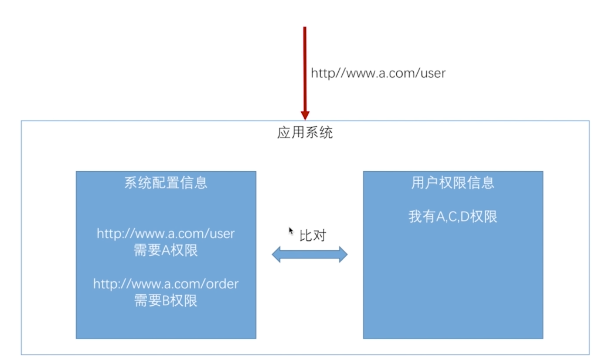
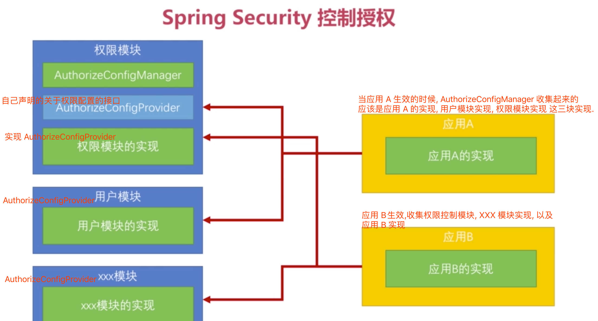
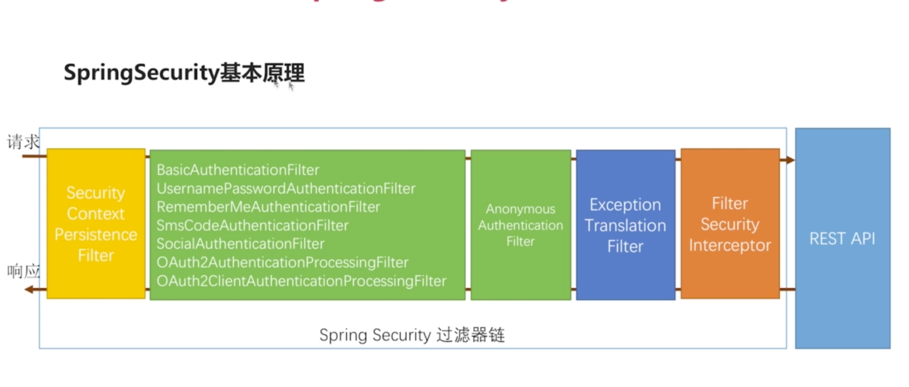
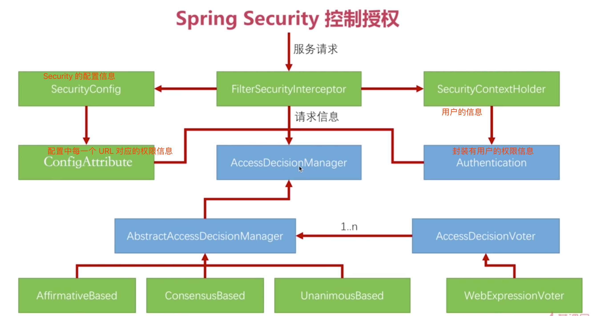
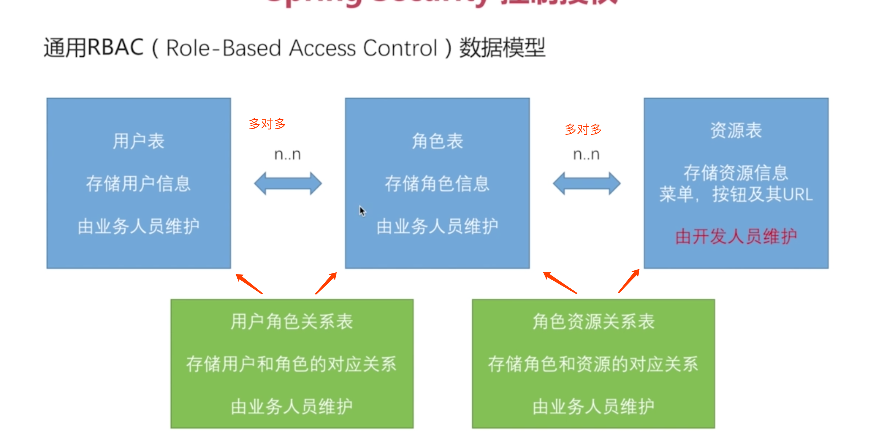
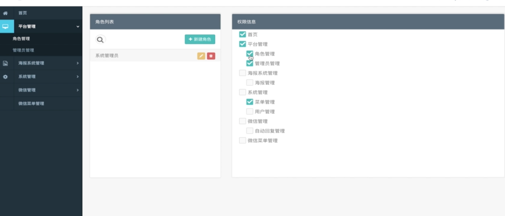

# Security 授权

## 1. 对于授权的理解

授权不应该只是页面中一些资源的可见性, 比如按钮是否可见等. 对于一个按钮的权限来说, 应该是对于 URL 访问的权限, 因为加入有人知道按钮对应的 URL, 那么就算不可见, 通过直接发送 URL 请求, 其实和直接点按钮差不多. 所以对于授权来说, ==**真正应该管理起来的是对于 URL 是否有权进行访问.**==


例如下图:



通过配置, 对于一个 URL 进行权限配置, 比如上图中 user 的 URL, 它需要 A 权限, order 的 URL,它需要 B权限, 当一个用户登录后, 这个用户有 A, C,D 的权限, 当它发送 user 请求的时候, 它就可以访问, 因为用户 A 有权限 A, 而 user 请求就需要权限 A. 当用户发送一个 order 请求的时候, 因为 order 需要 B 权限, 而用户没有 B 权限, 所以用户就无法访问 order 请求


## 2. Security 中权限的配置

在 Security 中, 可以通过 ==antMatchers(url).hasRole("ADMIN")== 来进行配置

```java
// 以 /user 开头的 URL, 只能被有 ADMIN 权限的用户访问. 这种方式是写死的, 只有 /user 是需要 ADMIN 权限, /user/1 就不需要
httpSecurity.antMatchers("/user").hasRole("ADMIN");
// 以下是指 需要有 amdin 权限才可以访问 /static/demo.html
httpSecurity.antMatchers("/static/demo.html").hasRole("ADMIN");
// 以 /user/ 开头的所有 URL 都需要 ADMIN 权限. 这种写法, /user/1需要 ADMIN 权限, /user不需要 ADMIN 权限.
httpSecurity.antMatchers("/user/*").hasRole("ADMIN");
// 以 get 方式发送的 /user/* 请求需要 ADMIN 权限. 此时以 post 发送的不需要 ADMIN 权限.
httpSecurity.antMatchers(HttpMethod.GET, "/user/*").hasRole("/ADMIN")
```


### 2.1 Security 支持的权限表达式

#### 2.1.1 Security 支持的权限表达式

以下表达式是是最终的 ConfigAttribute 列表中存储的代表权限的字符串, 每一个权限字符串都会对应 ==antMatchers==后的一个方法.

- ==permitAll== : 永远返回 true. 当一个 URL 的权限表达式是 ==permitAll==的时候, 直接就让通过.

- ==denyAll== : 永远返回发生了. 当一个 URL 的权限表达式是 ==denyAll==的时候, 直接不让通过.

- ==anonymous== : 当前用户是的权限是 ==anonymous== 的时候, 就返回 true.

- ==authenticated== : 当前用户不是 anonymous 时, 返回 true.

- ==rememberMe== : 当前用户是 ==remermberMe== 用户时返回 true.

- ==fullAuthenticated== : 当前用户不是 rememberMe 和 anonymous 时返回 true.

- ==hasRole(role)== : 当前用户拥有指定权限的时候返回 true.==在配置中 antMathcers 后使用此方式指定权限时, 不需要 ROLE_前缀,在后台代码赋值时, 需要指定 ROLE_ 前缀==

  ```java
  // 配置中不需要指定 ROLE_ 前缀
  HttpSecurity.antMatchers(HttpMethod.GET ,"/user/*").hasRole("ADMIN");
  // 后台进行赋权的时候, 或者向数据库存储的时候, 需要添加 ROLE_ 前缀
  AuthorityUtils.commaSeparatedStringToAuthorityList("ROLE_ADMIN")
  ```

  

- ==hasAnyRole([role1, role2...])== : 当前用户拥有任意一个指定的权限role1, role2等等时返回. 和 hasRole 一样, 后台赋权时需要指定 ROLE_ 前缀

- ==hasAuthority(authority)== : 当前用户拥有指定权限的时候返回 true. 和 hasRole 一样, 只不过 hasRole 会在权限前边加一个 ROLE_ 前缀, hasAnyAuthority不会加, 就是字符串的匹配.

- ==hasAnyAuthority([role1, role2...])== : 和 hasAnyRole 作用一样, 不同点在于==不会添加 ROLE_== 的前缀.

- ==hasIpAddress(ip)== : 发送当前请求的 IP 匹配的时候返回 true. 


#### 2.1.2 Security 权限表达式使用方式

1. **单独使用**

   ```java
   HttpSecurity.antMatchers(HttpMethod.GET ,"/user/*").hasRole("ADMIN");
   ```

2. **联合使用**

   ```java
   // 在 antMatchers(url).access("表达式 1 and 表达2 and 表达式 3 ....");
   // 以下表达式表示用户同时满足 hasRole('ADMIN') and hasIpAddress('xxxxxxxx') 两个条件,才可以访问当前 URL
   HttpSecurity.antMatchers(HttpMethod.GET ,"/user/*").access("hasRole('ADMIN') and hasIpAddress('xxxxxxxx')");
   
   // 以下两条语句效果相同.
   httpSecurity.antMatchers(HttpMethod.GET, "/user/*").hasRole("ADMIN");
   httpSecurity.antMatchers(HttpMethod.GET, "/user/*").access("hasRole('ADMIN')")
     
   // 在权限表达式中 调用接口, 根据方法返回 true/false 来决定当前用户是否有权限方法此请求总的 URL
   // 目前可以确定的是, 参数列表要接口的一样,参数名要一样, 目前只使用了 request, authentication, 如果不一样, 会报错
   httpSecurity.antMatchers(HttpMethod.GET, "/user/*").access("@rbacServiceImpl.hasPermission(request, authentication)")
   ```

   

### 2.2 Security 安全配置优化

#### 2.2.1 场景以及说明

```java
.authorizeRequests()
                // 指定不需要认证的 URL
                .antMatchers("/authentication/required",
                        securityBasicProperties.getAuthentication().getSingin(),    // 系统登录页面.
                        "/code/*",  // 验证码校验
                        securityBasicProperties.getAuthentication().getSingup(),    // Social 注册/绑定页面
                        "/socail/regist"  // Social 注册 controller
                ).permitAll()
                // 对于指定 URL, 需要有 admin 权限才可以
                .antMatchers(HttpMethod.GET, "/user/*").hasRole("ADMIN")
                .antMatchers(HttpMethod.GET, "/user/*").access("hasRole('ADMIN')")
                .antMatchers(HttpMethod.GET, "/user/*").access("hasRole('ADMIN') and hasIpAddress('xxxxxxxx')")
                .anyRequest()
                .authenticated();
```

​	类似以上代码, 里边包含了一些关于默认的 URL, 比如系统首页, 登录页等, 这些 URL 是相对来说比较确定的URL.

​	但是还会有一些, 比如用户的查询操作, 需要什么权限, 用户的修改操作需要什么权限, 文件的导出操作需要什么权限,或者说每个模块都需要自己的权限控制, 比如用户模块, 文件模块, 日志模块等, 这些各个模块都需要自己的权限控制.

​	这些请求相对来说在开发过程中才会确定, 或者说相对登录页这些 URL 不是那么的确定, 如果把这些配置都写在一起, 那么配置类或者配置文件就过于庞大,维护成本也比较高, 所以可以把这些抽离出来, 然后在总的配置中进行引用.


总的来说: 为每个模块实现自己的权限配置, 然后使用一个总的权限配置管理器, 管理器根据注册的模块, 收集相对应的权限配置, 然后进行总的权限配置. 如下图:



 

#### 2.2.2 开发流程说明

##### 1.1 当前功能开发中涉及到的类以及其作用

- ==AuthorizeConfigProvider== : 自己声明的一个关于权限配置接口, 各个模块各自的权限配置类都实现这个接口
- ==AuthorizeConfigManager== : 将所有实现 ==AuthorizeConfigProvider== 接口的实现类都收集起来, 完成总的权限控制.

- **比较重要属性:**

```java
//属性功能说明
//属性声明展示
```


- **比较重要的方法:**

```java
//方法调用事件
//方法功能说明
//方法注意事项
//方法是否需要重写
```


##### 1.2 实现方式的简单说明以及需要注意的问题

- 创建一个 ==AuthorizeConfigProvider==, 作为权限配置的抽象. 
  - 提供 config 方法, 参数为 ==http.authorizeRequests()== 的返回值类型, 也就是 ==ExpressionUrlAuthorizationConfigurer<HttpSecurity>.ExpressionInterceptUrlRegistry config==

- 分别为每一个模块提供一个 ==AuthorizeConfigProvider== 的实现.
  - 在实现接口的方法是, 使用类似 config.antMatchers(url).hasRole('ADMIN') 的方式进行权限配置
- 创建一个 ==AuthorizeConfigManager== 接口, 作为整个项目权限配置管理器.
  - 提供 config 方法. 参数和上边一样
- 创建 ==AuthorizeConfigProviderManager== 作为 ==AuthorizeConfigManager==的实现.
  - 在 ==AuthorizeConfigProviderManager== 维护一组 ==AuthorizeConfigProvider== 的实现.
  - 在方法中, 遍历==AuthorizeConfigProvider== 列表
  - 调用每个 ==AuthorizeConfigProvider==实现的 ==config==方法.
  - 最后 执行一句 ==config.anyRequest().authenticated();== 来让所有的请求都需要认证.

##### 1.3 开发流程简单说明

##### 1.4 涉及到的问题以及解决方案

- 权限表达式的编写

##### 1.5 具体实现代码

==权限配置provider==

```java
// 抽象
public interface AuthorizeConfigProvider {
    void config(ExpressionUrlAuthorizationConfigurer<HttpSecurity>.ExpressionInterceptUrlRegistry config);
}

// 系统基础权限配置
@Component
public class SystemAuthorizeConfigProvider implements AuthorizeConfigProvider {

    @Autowired
    private SecurityBasicProperties securityBasicProperties;

    @Override
    public void config(ExpressionUrlAuthorizationConfigurer<HttpSecurity>.ExpressionInterceptUrlRegistry config) {
        config.antMatchers(
                "/authentication/required", // 默认处理登录请求的 controller
                securityBasicProperties.getAuthentication().getSingin()    // 系统登录页面.
        ).permitAll();
    }
}

// 用户模块权限配置
@Component
public class UserAuthorizeConfigProvider implements AuthorizeConfigProvider {
    @Override
    public void config(ExpressionUrlAuthorizationConfigurer<HttpSecurity>.ExpressionInterceptUrlRegistry config) {
        config
                .antMatchers("/user/*").hasRole("ADMIN1")
//                .antMatchers(HttpMethod.GET, "/user/*").access("hasRole('ADMIN')")
        ;
    }
}

// 验证码模块的权限配置
@Component
public class ValidataCodeAuthorizeConfigProvider implements AuthorizeConfigProvider {

    @Autowired
    private SecurityBasicProperties securityBasicProperties;

    @Override
    public void config(ExpressionUrlAuthorizationConfigurer<HttpSecurity>.ExpressionInterceptUrlRegistry config) {
        config
                .antMatchers(
                        "/code/*",  // 验证码校验
                        securityBasicProperties.getAuthentication().getSingup(),    // Social 注册/绑定页面
                        "/socail/regist"  // Social 注册 controller
                ).permitAll();
    }
}
```


==**权限配置管理器**:==

```java
// 1. 抽象
public interface AuthorizeConfigManager {
    void config(ExpressionUrlAuthorizationConfigurer<HttpSecurity>.ExpressionInterceptUrlRegistry config);
}

// 2. 具体实现
@Slf4j
@Component
public class AuthorizeConfigProviderManager implements AuthorizeConfigManager {

    @Autowired
    private List<AuthorizeConfigProvider> authorizeConfigProviders;

    @Override
    public void config(ExpressionUrlAuthorizationConfigurer<HttpSecurity>.ExpressionInterceptUrlRegistry config) {
        log.info("");
        log.info("权限控制管理器 开始初始化!");
        for (AuthorizeConfigProvider authorizeConfigProvider : authorizeConfigProviders) {
            log.info("初始化权限控制器 : [ {} ]",authorizeConfigProvider.getClass().getName());
            authorizeConfigProvider.config(config);
        }
        config.anyRequest().authenticated();
        log.info("权限控制管理器 初始化完毕!\n");
    }
}
```


==**是上述代码生效**:==

```java
@Configuration
public class BasicSecurityConfig extends WebSecurityConfigurerAdapter {
    
  // 引入权限控制管理器
    @Autowired
    private AuthorizeConfigManager authorizeConfigManager;

    @Override
    protected void configure(HttpSecurity http) throws Exception {
			// 省略一些默认的登录页,登录成功处理, 登录失败处理的配置
      
      // 配置权限控制管理器
      authorizeConfigManager.config(http.authorizeRequests());
    }
}
```


## 3. Security 中关于权限的代码运行流程.

**!!!!!!!!!!Security 中关于授权的所有逻辑都是在 ==AbstractSecurityInterceptor#beforeInvocation== 方法中执行的!!!!!!!! 如果这个方法没有抛异常, 则执行后边的真正服务. 如果抛出了异常, 则中断整个请求**




上图是 Security 过滤器链的视图.

- ==***AnonymousAuthenticationFilter***== : 一定处于绿色过滤器的最后一个. **处理匿名认证**
- ==**ExceptionTranslationFilter**== : 当 FilterSecurityInterceptor 决定当前请求不能通过过滤器链到达后边的 API 的时候, 就会抛出不同的异常, 然后 ==ExceptionTranslationFilter== 就会捕获这些异常, 然后进行处理

- ==**FilterSecurityInterceptor**==: 是最终决定这个请求能通过过滤器链访问到后边的 API.


### 3.1 AnonymousAuthenticationFilter

- 这个过滤器一定处于所有绿色的过滤器的最后一个, 绿色的过滤器就是开发人员可控的过滤器.
- 当执行这个过滤器的时候, 会判断当前 SecurityContext 中是否有 Authentication认证信息
- 如果没有, 他就会调一个方法创建一个 ==AnonymousAuthenticationToken==, 指定 ==principal 为 "anonymousUser"==,执行权限为 ==ROLE_ANONYMOUS==, 然后将这个 Authentication 放入 SecurityContext 中.


### 3.2 授权流程



上图是 Security 授权相关的类

- **==FilterSecurityInterceptor==** : 这个过滤器是整个授权判断流程的主入口.
- **==AccessDecisionManager==** : 访问决定的管理者, 有一个抽象实现 ==AbstractAccessDecisionManager== 和三个具体实现. 
- **==AccessDecisionVoter==** : 投票者
- ==SecurityConfig==: Security 的配置
- ==ConfigAttribute==: 每一个 URL 对应的权限
- ==WebExpressionVoter== : Security版本 3 之后, 提供的 web 环境下的一个投票器, 它投过那这个请求就过, 它投不过, 那这个请求就不过.

**==关于数据传递==**:

==**第一部分数据**== : FilterSecurityInterceptor 会从 SecurityConfig 中将配置信息读出来, 封装成一组 ConfigAttribute, 每一个 ConfigAttribute 对应的都是一个 URL所需要的权限.

==**第二部分数据**== : 当前用户所拥有的的权限信息封装在 Authentication 中.

==**第三部分数据**== : FilterSecurityInterceptor中封装的当前请求的信息

将这三部分数据一起 传递给 AccessDecisionManager, 然后 AccessDecisionManager 将这些信息传递给投票者进行投票, 根据选择的投票逻辑(AbstractAccessDecisionManager的三个子类), 来判断过还是不过.


**==关于投票==**:

==AbstractAccessDecisionManager== : 是 AccessDecisionManager 的抽象实现, 它里边维护了一组 ==AccessDecisionVoter==. 是一个投票结果管理者.收到一个请求一个, 每一个 ==AccessDecisionVoter==会根据自己的逻辑进行投票, 过或者不过,管理者会综合所有投票者的结果, 判断过还是不过, 这里的判断逻辑有三套逻辑,分别就是他的三个子类它有三个实现:

- ==AffirmativeBased==: 只要有一个 ==AssessDecisionVoter== 投不通过, 那么这个请求就不通过. ==**(默认使用的是这种)**==
- ==ConsensusBased==: 比较通过和不通过的 ==AccessDecisionVoter==的个数, 哪个多, 就按照哪个意见来
- ==UnanimousBased==: 只要有一个 ==AssessDecisionVoter== 投通过, 那么这个请求就通过


#### 3.2.1 未登录时, 访问被拒绝的流程

- 接收到请求

- 执行 ==FilterSecurityInterceptor#doFilter==方法, 会将当前请求,响应, 和要调用的 Filter 封装成一个 ==FilterInvocation== 对象, ==**也就拿到第三部分信息汇总关于当前请求的信息**==

- 然后调用 ==FilterSecurityInterceptor#invoke== 方法.

- 在上述方法中, 首先会判断请求中是否有 ==__spring_security_filterSecurityInterceptor_filterApplied==这个属性的值, 如果有, 则说明已经当前这个请求已经经过了这个过滤器, 那么就不用再过一遍了, 直接放过. 如果值为空, 则说明没有当前请求之前没有经过过这个过滤器.就往下执行

- 首先会将 ==__spring_security_filterSecurityInterceptor_filterApplied== 参数设置为 true. 

- 然后执行 ==nterceptorStatusToken token = super.beforeInvocation(fi);==也即是 ==AbstractSecurityInterceptor#beforeInvocation==方法, 来执行调用后边 URL真正对应的 API 之前的处理.这句话就执行了==**授权的所有逻辑**==

- 在上述方法中, 执行下边的语句, 会将配置信息封装为一个 ConfigAttribute 列表.

  - ```java
    // 将系统配置信息封装为一个 ConfigAttribute 列表.
    // 实际上执行的时 DefaultFilterInvocationSecurityMetadataSource#getAttributes 方法
    Collection<ConfigAttribute> attributes = this.obtainSecurityMetadataSource().getAttributes(object);
    ```

- 在 ==DefaultFilterInvocationSecurityMetadataSource#getAttributes== 方法中维护有下属 map, 此方法主要是为了获取到 当前请求 URL 所需要的权限信息

  - ```java
    // 维护的时权限列表. 封装的 httpSecurity.antMathcers 中的数据
    // key : Ant [pattern='/user/*'], value : hasRole('ROLE_ADMIN'). 表示 /user/* 需要 ADMIN 权限.
    // key : Ant [pattern='/socail/regist'], value : permitAll .表示不需要进行认证.
    // 有一个 key 为 : AnyRequestMatcher, value 为 authenticated , 表示其他所有请求都需要授权
    Map<RequestMatcher, Collection<ConfigAttribute>> requestMap;
    ```

- 以上步骤, 就是完成了当前请求需要的权限的封装. ==**也就是拿到了三部分数据中关于URL 所需权限的数据**==

- 拿到 attributes 后, 调用 ==AbstractSecurityInterceptor#authenticateIfRequired== 方法. 

- 在上述方法中, 会从 ==SecurityContextHolder==中拿到 ==Authentication== 信息. ==**也就是三部分信息中关于用户权限的信息**==

- 此时就拿到了所有的三部分信息

- 在方法 ==AbstractSecurityInterceptor#beforeInvocation== 中, 执行以下代码. 将数据交给投票处理类进行处理.

  - ```java
    // 将三部分信息交给 AccessDecisionManager, 也就是三个实现类其中的一个. 默认是 AffirmativeBased, 只要有一个不过就不过.
    // authenticated:用户权限信息, object:当前请求信息, attributes:URL 所需权限信息
    this.accessDecisionManager.decide(authenticated, object, attributes);
    ```

- 然后开始投票, 关于投票, 默认调用 ==AffirmativeBased#decide==

- 在此方法中, 会获取所有的投票器(Security 3以后, 就只有一个投票器了, ==**WebExpressVoter**==).

- 获取到投票器后, 调用投票器的 ==vote== 方法. 其实执行的就是 ==WebExpressionVoter#vote==. 这个方法里会进行一些列的处理, 然后返回一个 int值,

  - -1 : 不过
  - 1: 过

- 如果最终处理结果为 -1, 则会对一个变量 ==deny==进行累加.

- 然后通过判断 ==deny== 是否大于 0 , 如果不大于 0 ,则说明通过, 

- 如果大于 0, 则说明不通过,就 则抛出一个异常 : ==AccessDeniedException==, 并在 ==AbstractSecurityInterceptor#beforeInvocation==捕获.

- 在 catch 中发布一个事件.

  ```java
  // 发布一个事件
  publishEvent(new AuthorizationFailureEvent(object, attributes, authenticated,accessDeniedException));
  ```

- 然后接着抛出一个异常 : ==AccessDeniedException==, 也就是将 catch 到的异常继续往上抛. 就会抛到 ==ExceptionTranslationFilter== 这个过滤器.

- 在 ==ExceptionTranslationFilter#doFilter== 中 catch 到异常后

- 首先会判断 catch 到的异常是不是 ==AuthenticationException== 类型的, 这个类型的异常就是关于认证的异常. 如果是

  - 进入 ==ExceptionTranslationFilter#handleSpringSecurityException==方法进行处理

- 如果不是 ==AuthenticationException==类型的异常, 会接着判断是不是 ==AccessDeniedException==类型的异常, 这个异常就是关于权限控制的异常. 如果是

  - 进入 ==ExceptionTranslationFilter#handleSpringSecurityException==方法进行处理

- 也就是说, ExceptionTranslationFilter 只会对这两种类型的异常进行后续处理, 如果都不是上述的两种类型的异常, 则会抛出 ServletException 或者 RuntimeException, 就不会再做处理.

- 在 ==ExceptionTranslationFilter#handleSpringSecurityException== 中

  - 根据当前异常是 ==AuthenticationException== 还是 ==AccessDeniedException== 会进行不同的处理 

- 如果是 ==AccessDeniedException==异常, 则会判断当前 ==Authentication== 是否是 ==AnonymousAuthenticationToken== 类型的

  - 如果不是, 则说明是是因为当前用户没有请求这个 URL 所需要的权限而抛出的异常,那么就调用 ==AccessDeniedHandlerImpl#handle== 方法进行处理
    - 则抛出一个 403 异常.
  - 如果是 ==AnonymousAuthenticationToken== 类型的, 则说明是以匿名的身份请求的, 就调用 ==ExceptionTranslationFilter#sendStartAuthentication== 进行处理.
    - 就是跳转到 httpSecurity.loginPage 配置的路径上.
    - 然后根据配置, 

#### 3.2.2 登录后, 访问通过的流程

- 和上边流程差不多
- 获取到三部分权限, 此时获取到的就是 URL 需要的权限, 当前用户的 Authentication
- 然后根据


## 4. 基于数据库 Rbac 数据模型控制权限

当系统处于现阶段需求或者业务, 权限规则比较简单, 只区分是否登录或者只区分角色的时候, ==**其实没有大的必要将这些权限信息写入到数据库中.直接在代码中完成就可以.**==

而当系统随着业务的增加, 权限规则比较复杂, 比如角色比较多, 权限也比较负责, 这时==**需要通过将权限信息写入数据库中来完成.**==

### 4.1 Rbac 简介

一个比较通用的 Rbac(role-based access control)数据模型



- 这种模型有 5 张表(3实体表, 2 张关系表)
  - ==用户表== : 存储用户信息, 比如新来一个员工,那么就需要给他一个账号,作为一个用户. ==由业务人员维护==
  - ==角色表== : 存储角色信息, 比如总裁, 总监理等, ==由业务人员维护.==
  - ==资源表== : 存储资源信息, 比如处于权限控制之下的东西, 虽然上边说权限控制应该是基于 URL 的控制, 但是这个表的粒度应该是安全业务人员可以理解的东西, 毕竟给业务人员一个 URL, 他可能不懂这是啥玩意, 所以应该存储业务人员可以看懂的东西, 比如菜单, 按钮及其 URL, ==由开发人员维护.==
  - ==用户角色关系表== : 维护用户和角色的对应关系, 多对多的关系. ==由业务人员维护.==
  - ==角色资源关系表== : 维护角色和角色可操作资源的关系表, 也是多对多的关系. ==由业务人员维护.==


例如下图的权限管理页面:



 - 其实对于权限管理模块来说, 实现的就是对于上边 5 张表的增删改查, 和维护这些表的关系.
 - 从页面来说, 维护角色列表就是可以查看所有角色,添加角色和删除角色,其实就是==对角色表进行增删盖查==
 - 然后针对一个用户, 可以授予他是什么角色, 比如可以授予他是总监, 或者是总监, 兼某个生产大队的大队长. 其实就是 ==用户角色关系表进行增删改查==
 - 然后针对每一个角色可以授予不同的操作权限, 比如总监可以关系某几个模块的权限, 其实就是==对角色资源关系表进行增删改查==
 - 以上写几点其实和 Security 都没啥关系,比如某个用户, 可以看到一个按钮吗, 而另一个用户看不到, 其实就是这些用户对应的角色可以操作某个资源,  就是基于对于数据库的增删改查来实现的,和 Security 有关系的其实只有 ==资源表==.

怎么将上边图示的内容和 Security 对接上?

#### 4.2 将自己编写的权限管理模块和 Security 对接上

- 在自己编写的权限管理模块中, 首先提供一个 Service,  用于返回当前用户是否有操作请求的资源(URL)的权限, 就根据用户信息查询到对应的角色信息然后再获取到对应的所权限列表, 看有没有和当前请求的 URL 匹配的, 如果有, 就表示有权限操作.
- 然后关于 Security 需要做的就是编写一个权限表达式, 来让它调用到这个服务, 然后 true 表示有权限访问, false 表示无权限方法.

```java
// 1. 判断当前用户是否有权限访问当前请求 URL 的服务
@Component
public class RbacServiceImpl implements RbacService {

    private AntPathMatcher antPathMatcher = new AntPathMatcher();

    @Override
    public boolean hasPermission(HttpServletRequest request, Authentication authentication) {
        Object principal = authentication.getPrincipal();
        boolean hasPermission = false;
        if (principal instanceof UserDetails) {
            String username = ((UserDetails) principal).getUsername();
            // 通过用户名查到当前用户名对应的角色对应的可以操作的资源列表, 也就是读取用户有权限的所有的 URL
            // 这里模拟一个列表
            Set<String> urls = new HashSet<>();
            for (String url : urls) {
                if (antPathMatcher.match(url, request.getRequestURI())) {
                    hasPermission = true;
                    break;
                }
            }
        }
        return hasPermission;
    }
}

// 2. Security 权限表达式
antMatchers("/user/create/*").access("@rbacServiceImpl.hasPermission(request, authentication)")

// 上述代码只是个例子, 如果是基于自己编写的 provider 形式的各个模块的授权管理,需要注意各个模块的授权管理配置的加载顺序
// 最重要的是  config.anyRequest().authenticated(); 这一句, 一定要在最后加载.
```

