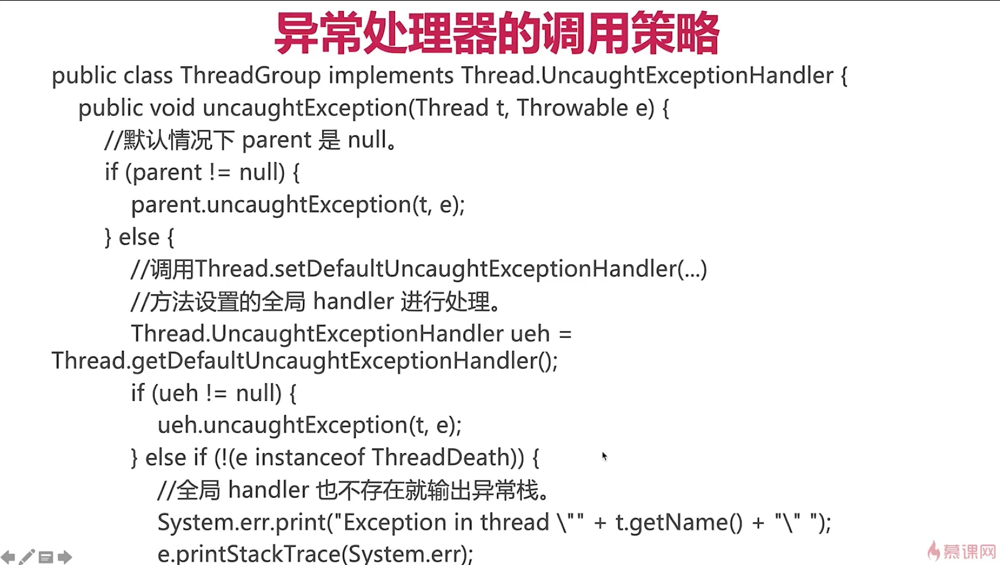

# 内容索引

- 线程 8 大核心基础
    - 实现多线程的方法: 2 种,本质上就一种(构建 Thread)
    - 启动线程的正确和错误方法: `start()`
    - ==停止线程的正确方法==: `interrupt`
    - 线程的 6 个状态
    - Thread 和 Object类中和线程相关的重要方法
    - 线程的各种属性
    - 线程未捕获异常 UncaughtException 应该如何处理
    - 多线程会导致性能问题(线程引入的开销, 上下文切换)
- Java 内存模型


## 关键字

异常处理器的调用策略, 


# 线程简介

- 线程就是独立的执行路径
- 在程序运行时, 即使没有创建线程,后台也会有多个线程, 如 main 线程, GC 线程
- main 线程是主线程, 为系统的入口, 用于执行整个程序.
- 在一个进程(process)中, 如果开辟了多个线程, 线程的运行由调度器安排调度, 调度器是和操作系统紧密相关的, 先后顺序无法人为干预.
- ==**对同一份资源进行操作的时候, 会存在资源抢夺的问题,需要加入并发控制.**==
- 线程会带来额外的开销, 比如 CPU 调度时间, 并发控制开销.
- ==**每个线程在自己的工作内存交互, 内存控制不当会造成数据不一致.**==

# 第一章 线程 8 大核心基础

## 1. 实现多线程的方法

==**Oracle 官网文档声明是: 两种!!! (继承Thread, 实现 Runnable)**==
- 方法一: ==实现 `Runnable` 接口并传入 `Thread` 类==
- 方法二: ==继承 `Thread` 类然后重写 `run()` 方法==
- 其实还可以通过 `Callable` 接口来实现有==**返回值**==的线程.

==**这个问题最精准的描述**== : 查看附录中的面试问题

### 1.1 继承 `Thread` 和实现 `Runnable` 演示, 以及 `Callable` 实现

```java
public class ThreadStyle extends Thread {
    @Override
    public void run() {
        System.out.println("继承 Thread 的方式实现多线程");
    }

    public static void main(String[] args) {
        new ThreadStyle().start();
    }
}

public class RunnableStyle implements Runnable {
    @Override
    public void run() {
        System.out.println("实现 Runnable 的方式实现多线程");
    }

    public static void main(String[] args) {
        new Thread(new RunnableStyle()).start();
    }
}

/**
 * 实现 Callable 的方式创建线程
 * 1. 实现 Callable 接口, 并指定返回值泛型
 * 2. 重写 call 方法
 * 3. 创建对象
 * 4. 创建 ExecutorService 服务
 * 5. 提交执行
 * 6. 获取返回值
 * 7. 关闭服务
 */
public class CallableExample implements Callable<Boolean> {

    private String url;
    private String targetName;

    public CallableExample(String url, String targetName) {
        this.url = url;
        this.targetName = targetName;
    }

    @Override
    public Boolean call() throws Exception {
        FileUtil.download(url, targetName);
        return true;
    }

    public static void main(String[] args) throws ExecutionException, InterruptedException {
        CallableExample callable1 = new CallableExample("https://www.baidu.com/img/flexible/logo/pc/result@2.png", "1.jpg");
        CallableExample callable2 = new CallableExample("https://www.baidu.com/img/flexible/logo/pc/result@2.png", "2.jpg");
        CallableExample callable3 = new CallableExample("https://www.baidu.com/img/flexible/logo/pc/result@2.png", "3.jpg");

        // 创建线程池
        ExecutorService executorService = Executors.newFixedThreadPool(3);

        // 提交执行
        Future<Boolean> submit1 = executorService.submit(callable1);
        Future<Boolean> submit2 = executorService.submit(callable2);
        Future<Boolean> submit3 = executorService.submit(callable3);

        // 获取返回值
        Boolean aBoolean1 = submit1.get();
        Boolean aBoolean2 = submit2.get();
        Boolean aBoolean3 = submit3.get();

        // 关闭服务
        executorService.shutdown();
    }
```

### 1.2 两种方式的对比

==**结果: 使用 Runnable 的方式更好**==

==原因:==

1. 首先, Java 不支持多继承,限制了扩展性, 使用 Runnable 有更好的扩展性
2. 从代码架构上来说, ==**具体的任何(run方法)应该和"创建和运行线程的机制(Thread 类)"解耦,用 Runnable 对象可以实现解耦.**==
3. 使用继承 Thread 方式的话, 每次想创建一个任务, 就只能新建一个独立的线程, 而这样做的==消耗会比较大==(比如重新创建一个类, 继承 Thread, 再启动,执行,销毁. 如果线程的实际工作内容, 也就是 run 方法只是打印一行文字的话, 那么线程的实际工作内容还不如消耗来的大). ==使用 Runnable 和线程池就可以大大减少这样的消耗==

==两种方法的本质对比:==

两种方法在本质上, 并没有什么区别, 都是最终调用 `start()` 方法来新建线程. 主要区别在于 `run()` 方法的内容来源.
- 实现 Runnable : ==最终调用` target.run()`==, 也就是说调用的是 Thread 源码中的 run 方法, 只不过是使用传入的 Runnable 对象来调用的
    ```java
        // Thread 类源码
        private Runnable target;
        @Override
        public void run() {
            if (target != null) {
                target.run();
            }
        }
    ```
- 继承 Thread : ==`run()`整个都被重写==, 所以调用的其实是重写后的 run()方法.

### 1.3 同时使用两种方法会是什么结果?

```java
public class BothRunnableThread {
    public static void main(String[] args) {
        new Thread(new Runnable() {
            @Override
            public void run() {
                System.out.println("我来自 Runnable!");
            }
        }){
            @Override
            public void run() {
                // super.run();
                System.out.println("我来自 Thread!");
            }
        }.start();
    }
}

运行结果: 我来自 Thread!
解析: 在 main 方法中, 创建了一个内部类 Thread, 并且 new 了一个 Runnable 给 Thread, 然后又重写了 Thread 的 run 方法
    前边讲过使用 Thread 和使用 Runnable 两种方式创建多线程的本质区别是两种方式的 run 方法的来源不同.
        实现 Runnable 接口是重写了 Runnable 的方法, 并把 Runnable 作为参数传递给 Thread 类, 通过 Thread 类的源码中的 Run 方法进行调用,最终调用的是 Runnable 方法的 run 方法.
        继承 Thread 的方式是重写了 Thread 的 run() 方法, 所以就把 Thread 源码中的经典的 run()方法给覆盖掉了.
    所以, 这段代码由于重写了 Thread 类的 run 方法, 在启动线程后执行的就是重写的 run 方法, 而父类 Thread 的 run 方法就不会得到执行,也就没有 target.run 这几行代码了, 所以 runnable 的 run 得不到执行,最终就只会输出 "我来自 Thread!"这一句话.

// super.run();    
如果把这行代码打开,那么就会先执行 "我来自 Runnable!", 再执行"我来自 Thread!", 因为调用了Thread 源码中的 run 方法.
```

### 1.4 一些错误的观点

1. =="线程池也是一种创建线程的方法. 这种说法不够准确"==

    ```java
    public class ThreadPoolStyle {
        public static void main(String[] args) {
            ExecutorService executorService = Executors.newCachedThreadPool();
            for (int i = 0; i < 1000; i++) {
                executorService.submit(new Task(){});
            }
            executorService.shutdown();
        }
    }
    
    class Task implements Runnable {
        @Override
        public void run() {
            try {
                Thread.sleep(500);
            } catch (InterruptedException e) {
                e.printStackTrace();
            }
            System.out.println(Thread.currentThread().getName());
        }
    }
    
    解析:
        跟源码可以发现, 底层使用的还是 new Thread 的方式.
        Executors.newCachedThreadPool()
    --> new ThreadPoolExecuto()
    --> Executors.defaultThreadFactory()
    --> new DefaultThreadFactory()
    --> newThread() 方法, 内部使用的是 new Thread() 构建 Thread 的方式.
    ```

1. =="通过` Callable` 和` FutureTask` 创建线程, 也算是一种新建线程的方式. 这种说法也不准确"==
2. ==*定时器 Timer, 它并不是一种新的创建线程的方式, TimerTask 实现 Runnable***==


## 2. 启动线程的正确和错误方法

==正确的启动方式是 start()方法==  run()方法其实并不是一种正确的启动线程的方法.


### 2.1 start() 和 run() 的比较

```java
public class StartAndRunMethod {
    public static void main(String[] args) {
        Runnable runnable = () -> {
            System.out.println(Thread.currentThread().getName());
        };
        runnable.run();

        new Thread(runnable).start();
    }
}

运行结果:
    main // 其实是主线程调用的.
    thread-0
```


#### ==**start()方法分析**==

- start() 的作用是启动新线程, 告知 JVM 这个线程可以运行了, 待分配到时间片就可以执行.
- start() 方法其实会让两个线程启动, 一个是主线程, 一个是新线程. `new Thread().start()`这句话就是主线程调用的.
- 不能重复的执行 start() 方法. `IllegalThreadStateException`
- 当有多个线程, 分别执行 `start()`的时候, 先 start, 并不代表线程会先执行.


==start()方法的执行流程==

```java
 public synchronized void start() {
        
        if (threadStatus != 0)
            throw new IllegalThreadStateException();
            
        group.add(this);

        boolean started = false;
        try {
            start0();
            started = true;
        } finally {
            try {
                if (!started) {
                    group.threadStartFailed(this);
                }
            } catch (Throwable ignore) {
                /* do nothing. If start0 threw a Throwable then
                  it will be passed up the call stack */
            }
        }
    }
    private native void start0();

```
#### `start()` 方法执行流程:

1. 检查线程状态(`threadStatus`是否等于 0,新创建线程 `threadStatus` 初始化为 0.), 只有 new 状态下的线程才能启动(threadStatus == 0), 否则会抛出`IllegalThreadStateException`异常.
2. 加入线程组.
3. 调用 start0() (一个 native 方法) 方法启动线程. 


#### ==**run()方法分析**==

run()方法有两种情况, 一直是重写了 run() 方法, 一种就是传入 Runable, 调用 target.run()

```java
    @Override
    public void run() {
        if (target != null) {
            target.run();
        }
    }
    
所以在直接调用 run 方法的时候, 就是个普通方法.就没有通过创建的线程,而是直接通过主线程来调用的.
```


## 3. 停止线程的正确方法

==**总结: 使用` interrupt()` 来通知, 然后通过 `isInterrupt()` 判断是否有 interrupt 标记, 如果有, 则说明线程需要中断了, 然后在方法中, 就可以根据自己的逻辑来决定是否需要中断或者是什么时候中断..**==


### 1. 线程通常会在什么情况下停止?

1. run 方法执行完毕了, 正常停止.
2. 抛出了异常, 也会停止.


### 2. 停止线程原理介绍

其实 Java 中, 最好的停止线程的方式是使用 `Interrupt`, 但是这仅仅是会通知到需要被停止的线程:你该停止运行了...==**被终止的线程自身拥有决定权(决定是否, 以及何时停止)**==. 这需要请求停止方和被停止方遵守约定好的规范.因为一段代码最好的情况就是自己运行结束. 即使是要停止, 也需要做一些后续操作, 比如关闭资源啊等, 具体怎么做后续操作只有这段代码知道的最清楚, 所以一般停止线程是通过 `interrupt`进行通知, 然后被要被停止的线程自己去决定是否要停止,或者什么时候停止.


### 3. 正确停止线程


#### ==普通情况下停止线程(没有阻塞)==

解析: 

1. 对线程 thread 调用 `interrupt()`进行打标, 说明这个线程需要进行停止
2. 然后在 thread 运行过程中, 使用 `isInterrupt()` 判断当前线程是否被打上了需要停止的标记, 如果打上了, 则使线程停止.例如 if 判断,只有在没有打标的情况下,才执行 thread 的线程体.


#### ==线程允许阻塞(sleep)==

sleep 遇到 interrupt, 就会抛出异常. 


#### ==(需要注意)每次循环都阻塞时停止线程==

- 需要注意, ==**如果 while 里边放 try/catch, 那么会导致停止失效!!!**== 原因是因为 `sleep` 函数一旦响应中断, 就会把 interrupt 的中断标志位清除掉. 


```java
public class StopThreadWithInterruptAndSleep {

    public static void main(String[] args) throws InterruptedException {
//        stopByInterrupt();
//        stopByInterruptWithSleep();
        stopByInterruptWithSleepEveryLoop();
    }

    /** 普通情况下停止线程.*/
    public static void stopByInterrupt() throws InterruptedException {
        Thread thread = new Thread(() -> {
            int num = 0;
            while (num < Integer.MAX_VALUE / 2 && !Thread.currentThread().isInterrupted()) {
                if (num % 10000 == 0) {
                    System.out.println(num + " 是 10000 的倍数!");
                }
                num++;
            }
            System.out.println("线程运行完毕");
        });

        thread.start();
        Thread.sleep(1000);
        thread.interrupt();
    }

    /** 阻塞情况下停止线程.*/
    public static void stopByInterruptWithSleep() throws InterruptedException {
        Thread thread = new Thread(() -> {
            int num = 0;
            while (num < Integer.MAX_VALUE / 2 && !Thread.currentThread().isInterrupted()) {
                if (num % 10000 == 0) {
                    System.out.println(num + " 是10000 的倍数!");
                }
                num++;
            }
            try {
                Thread.sleep(10000);
            } catch (InterruptedException e) {
                e.printStackTrace();
            }
            System.out.println("线程运行完毕");
        });

        thread.start();
        Thread.sleep(100);
        thread.interrupt();
    }

    /** 每次循环都阻塞的情况下停止线程.*/
    public static void stopByInterruptWithSleepEveryLoop() throws InterruptedException {
        Thread thread = new Thread(() -> {
            int num = 0;
            try {	// try/catch 要放在 while 外边, 如果放 while 里边, 会导致停止失效.
                while (num < Integer.MAX_VALUE / 2 && !Thread.currentThread().isInterrupted()) {
                    if (num % 10000 == 0) {
                        System.out.println(num + " 是10000 的倍数!");
                    }
                    num++;
                    Thread.sleep(10000);
                }
            } catch (InterruptedException e) {
                e.printStackTrace();
            }
            System.out.println("线程运行完毕");
        });

        thread.start();
        Thread.sleep(1000);
        thread.interrupt();
    }
}
```


#### ==实际开发中, 停止线程的最佳方式==

在实际开发中, `run()`方法可能无法涵盖所有的业务, 很有可能需要在 `run()` 方法中调用其他的方法.

##### 原则一: 优先在方法上抛出异常

在 `run()`中调用其他方法时, 假如其他方法有可能发生 `InterruptedException`异常, 那么不能 try/catch, 应优先在方法签名中抛出异常. 原因是这样做的话, 由于 `run()`方法是顶层方法, 无法抛出异常, 只能用 try/catch, 那么在 `run()`方法中就会强制要求去try/catch!  然后在 catch 中就可以进行一些操作. 比如保存日志啊, 发送提示短信啊什么的.

```java
public class StopThreadInProd implements Runnable {

  @Override
    public void run() {
        try {// sleep 会清除掉 interrupt 标记, 所以 try/catch 放在 while 里边, 不会停止线程, 需要放在 while 外边.
            while (true && !Thread.currentThread().isInterrupted()) {
                System.out.println("run....");
                throwInterruptedException();
            }
        } catch (InterruptedException e) {
            System.out.println("进行保存日志逻辑");
            e.printStackTrace();
        }
    }

    // 不能在方法内用 try/catch, 需要在方法上抛出异常, 这样在 run()方法中就会强制去 try/catch
    public void throwInterruptedException() throws InterruptedException {
        Thread.sleep(2000);
    }

    public static void main(String[] args) throws InterruptedException {
        Thread thread = new Thread(new StopThreadInProd());
        thread.start();
        Thread.sleep(1000);
        thread.interrupt();
    }
}
```


##### 原则二:在 catch 中再次 interrupt

如果在方法中使用 `sleep` 后, 无法或者不想在方法的抛出异常, 就任性, 就想 try/catch, 那么==**就在 catch 中再次调用 `Thread.currentThread.interrupt()`,相当于再次对当前线程打了一个interrupt 中断标记.**====**因为 sleep 会清除掉标记**==.



```java
public class StopThreadInProd2 implements Runnable {

    @Override
    public void run() {
       while (true) {
            if (!Thread.currentThread().isInterrupted()) {
                System.out.println("Interrupted, 停止线程");
                break;
            }
            System.out.println("run....");
            reInterrupt();
        }
    }

    // 在 catch 中, 再次打 interrupt 标记. 相当于在 sleep 清除标记后, 重新将中断标记恢复
    public void reInterrupt() {
        try {
            Thread.sleep(2000);
        } catch (InterruptedException e) {
          // 再次打 interrupt. 相当于恢复中断.(因为 sleep 会清除 interrupt 标记)
            Thread.currentThread().interrupt();
            e.printStackTrace();
        }
    }

    public static void main(String[] args) throws InterruptedException {
        Thread thread = new Thread(new StopThreadInProd2());

        thread.start();
        Thread.sleep(1000);
        thread.interrupt();
    }
}
```


#### 可以相应中断的方法

- Object.wait()
- Thread.sleep()
- Thread.join()
- BlockingQueue.take()/put()
- Lock.lockInterruptibly()
- CountDownLatch.await();
- CyclicBarrier.await()
- Exchanger.exchange()
- Nio.channels.InterruptibleChannel 相关方法
- nio.channels.Selector 的相关方法

## 4. 线程的生命周期

### 1. 线程一生有 6 个状态(生命周期)

1. `New`: 新建状态. 已经创建, 但是还没有执行 start() 方法
2. `Runnable`: 就绪状态. 一旦调动 start() 方法, 就成了就绪方法
3. `Blocked`: 当一个线程进入到被 `synchronized`修饰的代码块的时候, 并且锁已经被其他线程拿走了, 线程的状态就是 `Blocked`
4. `Waiting`: 等待
5. `Timed Waiting`: 计时等待
6. `Terminated`: 终止

==**需要注意的是, `Blocked`状态是只针对`synchronized`关键字的状态. 其他的锁什么的, 虽然会让线程等待, 但是那个等待的状态不是 Blocked**==


==**通过这个转换图可以看出:**==

- `new` -> `runnable` -> `terminated` 为单向,不可逆向转换.
- `new `必须先转换成 `Runnable` 状态后, 才能变为 `terminated`.
- `Blocked`, `Waiting`, `Timed-Waiting` 三种状态可以和 `Runnable` 状态相互转换, 并且可以通过 `Runnable` 想换转换为其他两种状态.
- 有两种情况会进入 `Blocked`:(Blocked 抢到锁后, 会进入 Runnable 状态)
  1. 首先是将要进入 synchronized 修饰的代码块
  2. 在执行 wait 后, 是释放掉锁,当被其他线程唤醒后, 它会重新进入 synchronized 代码块, 这时也会进入 Blocked 状态.
- 当发生异常的时候, 可以直接跳到 Terminated 状态. 不再遵循路径.

### 2. 线程状态转换演示


#### 1. 状态演示

```java
/**
 * @description: Thread 状态演示. 此类演示 new, runnable, terminated 三种状态
 */
public class NewRunnableTerminated implements Runnable{
    @Override
    public void run() {
        while (!Thread.currentThread().isInterrupted()) {

        }
    }

    public static void main(String[] args) throws InterruptedException {
        Thread thread = new Thread(new NewRunnableTerminated());
        System.out.println("before start: " + thread.getState());

        thread.start();
        System.out.println("after start: " + thread.getState());

        Thread.sleep(1000); // 保证此时子线程已经开始运行
        System.out.println("thread is running: " + thread.getState());

        thread.interrupt(); // 让线程停止运行,以便演示 `Terminated` 状态

        Thread.sleep(100);  // 保证线程已经停止运行
        System.out.println("thread complete: " + thread.getState());
    }
}
```


## 5. (重要)Thread 和 Object类中和线程相关的重要方法

### 涉及的问题

1. 为什么线程通信的方法 `wait()`, `notify()`, `notifyAll()`被定义在 `Object` 类里, 而 `sleep()` 被定义在 `Thread` 类里
2. 用 3 种方式实现生产者模式.(是 wait/notify 的一大用处)
3. `join()`, `sleep()`, `wait()` 期间, 线程的状态分别是什么? 为什么?


### 1. 方法概览

#### Thread 类方法:

- `sleep`: 
- `join`: 等待其他线程执行完毕
- `yield`: 放弃已经获取到的 CPU 资源
- `currentThread`: 获取当前执行线程的方法
- `start`, run: 启动线程相关
- `interrupt`: 中断
- `stop`, `suspend`, `resuem`: 已废弃

#### Object 类方法:

- `wait`/`notify`/`notifyAll` : 让线程暂时休息和唤醒
- notify
- notifyAll


### 2. wait, notify, notifyAll 详解

==**注意注意注意: wait, notify, notifyAll 都要在被 synchronized 修饰的代码块中(既然在synchronized代码块中, 则说明已经持有了锁)执行, 否则会抛出异常.**==

#### ==作用, 用法==: 阻塞阶段, 唤醒阶段, 遇到中断

##### 1. ==**阻塞阶段**==

- 想让一个或多个线程暂时休息(wait), 等到需要它的时候或者等到条件满足后, 再去唤醒它(notify/notifyAll).
- ==**注意**==: 执行 wait 的是一个对象, 这个对象就是 synchronized 的锁.
  - 执行 wait 的时候, 必须先拥有这个方法的 ==**monitor锁**==.
  - 执行 wait 后, 会释放掉当前对象持有的 ==**monitor 锁**==.
  - 执行 wait, 只会释放当前 ==**monitor 锁**==


==调用 `wait()` 的线程, 就会进行阻塞状态. 直到以下 4 种情况一直发生, 才会被唤醒:==

1. 另一个线程调用这个对象的 `notify()`方法, 且==**刚好被唤醒的是本线程**==.
2. 另一个线程调用这个对象的 `notifyAll()` 方法.
3. 调用 wait()时, 设置了超时时间, 也就是 wait(超时时间), 那么超时就会唤醒. 0 标识永久等待.
4. 等待的过程中,线程自身调用了 `interrupt()`, 那么就会被唤醒.


##### 2. ==**唤醒阶段**==

- `notify`: 会随机唤醒一个在等待某对象 ==**monitor 锁**==的线程.
- `notifyAll`: 会将所有等待的线程, 一次性全部唤醒.


##### 3. ==**遇到中断**==

当一个线程拥有 monitor锁的时候, 如果已经执行了 wait() 方法,如果被中断了, 

- 则会抛出 `InterruptedException`异常
- 并且释放掉已经持有的 ==**monitor 锁**==


#### ==代码演示==

```java
/**
 * @description: 展示 wait 和 notify 的基本用法
 * 1: 代码执行顺序
 * 2. wait 释放锁
 */
public class Wait {

    private static Object object = new Object();

    static class Thread1 extends Thread {
        @Override
        public void run() {
            synchronized (object) {
                System.out.println(Thread.currentThread().getName() + " 获取到锁, 开始执行");
                try {
                    System.out.println(Thread.currentThread().getName() + " 将要调用 wait 方法, 调用 wait 会释放锁");
                    object.wait();  // 调用 wait 会释放锁. 当其他线程调用锁对象的 notify 方法后, 会唤醒此线程, 然后此线程可以继续执行.
                } catch (InterruptedException e) {
                    e.printStackTrace();
                }
                System.out.println(Thread.currentThread().getName() + " 再次获取到锁, 开始执行");
            }
        }
    }

    static class Thread2 extends Thread {
        @Override
        public void run() {
            synchronized (object) {
                System.out.println(Thread.currentThread().getName() + " 获取到锁, 开始执行");
                object.notify();    // 唤醒 等待 object 锁的线程.
                System.out.println(Thread.currentThread().getName() + " 执行完毕, 释放锁");
            }
        }
    }

    public static void main(String[] args) throws InterruptedException {
        Thread1 thread1 = new Thread1();
        Thread2 thread2 = new Thread2();

        thread1.start();
        Thread.sleep(200);	  // 保证 thread1 先执行,先获取到锁.
        thread2.start();
    }
}


/**
 * @description: notify 和 notifyAll 的区别
 * 1: notify : 随机唤醒一个需要当前锁的线程
 * 2: notifyAll: 唤醒所有需要当前锁的线程
 */
public class WaitAndNotifyAndNotifyAll {

    private static final Object resourceA = new Object();
    private static final Object resourceB = new Object();

    public static void main(String[] args) throws InterruptedException {
        Runnable runnable1 = () -> {
            synchronized (resourceA) {
                System.out.println(Thread.currentThread().getName() + " 获取到锁, 开始执行");
                try {
                    System.out.println(Thread.currentThread().getName() + " 将要开始 wait, 会释放锁");
                    resourceA.wait();
                } catch (InterruptedException e) {
                    e.printStackTrace();
                }
                System.out.println(Thread.currentThread().getName() + " 再次获取到锁, 执行完毕");
            }
        };

        Runnable runnable2 = () -> {
            synchronized (resourceA) {
                System.out.println(Thread.currentThread().getName() + " 获取到锁, 开始执行, 将会执行 notifyAll");
                resourceA.notifyAll();
                System.out.println(Thread.currentThread().getName() + " 执行 notifyAll 完毕毕");
            }
        };

        // 当启动这个线程的时候, 当执行 wait 进入等待, 并释放锁后, 由于没有其他线程获取 resourceB锁, 导致没有线程可以
        // 调用 resourceB.notify方法,  也就导致没有线程可以唤醒 此线程, 所以陷入无尽的等待
        Runnable runnable13= () -> {
            synchronized (resourceB) {
                System.out.println(Thread.currentThread().getName() + " 获取到锁, 开始执行");
                try {
                    System.out.println(Thread.currentThread().getName() + " 将要开始 wait, 会释放锁");
                    resourceB.wait();
                } catch (InterruptedException e) {
                    e.printStackTrace();
                }
                System.out.println(Thread.currentThread().getName() + " 再次获取到锁, 执行完毕");
            }
        };

        new Thread(runnable1).start();
        new Thread(runnable1).start();
//        new Thread(runnable13).start();
        Thread.sleep(200);
        new Thread(runnable2).start();
    }
}


/**
 * @description: 证明 wait 只释放当前的那把锁
 */
public class WaitNotifyReleaseOwnMonitor {

    private static final Object resourceA = new Object();
    private static final Object resourceB = new Object();

    public static void main(String[] args) {
        Runnable runnable1 = () -> {
            synchronized (resourceA) {  // 1. 当前线程获取 resourceA 锁
                System.out.println("ThreadA 获取到 resourceA 锁");
                synchronized (resourceB) {  // 2. 当前线程获取 resourceB 锁
                    System.out.println("ThreadA 获取到 resourceB 锁");
                    System.out.println("ThreadA 释放 resourceA 锁");
                    try {
                        resourceA.wait();   // 3. 当前线程释放 resourceA 锁
                    } catch (InterruptedException e) {
                        e.printStackTrace();
                    }
                    System.out.println("ThreadA 重新获取到 resourceA 锁");
                }
            }
        };

        Runnable runnable2 = () -> {
            synchronized (resourceA) {
                System.out.println("ThreadB 获取到 resourceA 锁");  // 4. 线程 A 释放掉了 resourceA , 所以这里可以获取到锁
                synchronized (resourceB) {  // 5. 线程 A 没有执行 resourceB.wait, 所以也就没有释放 resourceB, 所以线程 B 获取不到 resourceB
                    System.out.println("ThreadB 获取到 resourceB 锁");
                }
            }
        };

        new Thread(runnable1).start();
        new Thread(runnable2).start();
    }
}
```


#### ==**(重点)特点性质**==

- 都属于 Object 类的方法.

- 执行 `wait()/notify()/notifyAll()`的前提是获取到 monitor 锁 .
- `notify()` 只能随机唤醒一个需要当前 monitor 锁的线程.
- 只会释放当前的 monitor 锁


#### ==基于 wait/notify 实现生产者消费者模式==

==查看 设计模式 文档==

实现原理: 通过一个阻塞队列将生产者和消费者进行解耦, 然后在队列中实现存放数据和拿取数据方法. 并实现 在存放数据的时候, 如果队列满了, 就进行等待(wait), 只要队列不是满的,就通知(notify). 在拿取数据的时候, 只要队列是空的, 就等待(wait), 只要队列不是空的, 就通知(notify).

也就是, 当队列是满的时候, 就进行阻塞! 只能拿数据, 不能存数据! 在拿数据时, 只要队列不是空的, 就通知....


#### ==注意点==

- 必须在同步代码快中调用.
- 调用 wait 后, 释放锁


#### ==常见面试问题==


### 3. sleep 详解

#### 作用:

- 让线程在预期的时间内执行, 其他时候不占用 CPU 资源.
- ==**不释放锁(只要是持有的锁, 都不释放)**==


#### ==**响应中断(sleep的时候遇到 interrupt)**==:

- 抛出 InterruptException 异常
- 移除中断状态


```java
/**
 * @description: 每隔一秒种, 输出一次当前时间. 并在 5 秒后停止线程
 */
public class SleepAndInterrupt {

    public static void main(String[] args) throws InterruptedException {
        Thread thread = new Thread(() -> {
            try {
                for (int i = 0; i < 100; i++) {
                    if(Thread.currentThread().isInterrupted()) break;
                    System.out.println(LocalDateTime.now());
                    Thread.sleep(1000);		// ==> TimeUnit.SECONDS.sleep(1);
                }
            } catch (InterruptedException e) {
                System.out.println("WTF!!!! 老子被中断了");
                e.printStackTrace();
            }
        });
        thread.start();
        Thread.sleep(5000);
        thread.interrupt();
    }
}
```

`Thread.sleep(xx) <==> TimeUnit.SECONDS.sleep(xx)`, 另外还有小时, 分钟等..


#### sleep总结:

sleep 可以让线程进入 `waiting` 状态, 并且不占用 CPU 资源, 但是==**不释放锁**==, 直到规定时间后再执行, 休眠期间如果被中断(`thread.interrupt()`), ==**会抛出异常并清除中断状态**==


#### 常见面试问题

1. wait/notify 和 sleep 有什么异同?


### 4.4. join 详解

#### 1. 作用: ==**谁 join, 就等待谁执行完毕后再执行.**==

==**因为新的线程加入了我们, 所以我们要等待他执行完再出发.**==


#### 2. 用法

通常是在 main 线程中等待子线程 thread 执行完毕. 注意是谁等待谁: ==**主线程等待子线程.**==

通过上面那句话解释就是: ==**子线程**== 加入 ==**main 线程**==,  子线程 `thread.join()`, 此时 main 线程就会等待 thread 线程执行完毕后再执行.


#### 3. 场景举例

启动服务的时候, 需要初始化一些资源, 比如初始化 5 个资源, 那么这里就可以通过 5 个子线程 join, 此时主线程就会等待这 5 个子线程执行完毕后再执行.


#### 4. 演示

```java
/**
 *  演示 main 线程等待子线程执行完毕后, 再执行.
 */

public class Join {
    public static void main(String[] args) throws InterruptedException {
        Thread thread1 = new Thread(() -> {
            try {
                Thread.sleep(1000);
            } catch (InterruptedException e) {
                e.printStackTrace();
            }
            System.out.println(Thread.currentThread().getName() + " 执行完毕");
        });

        Thread thread2 = new Thread(() -> {
            try {
                Thread.sleep(1000);
            } catch (InterruptedException e) {
                e.printStackTrace();
            }
            System.out.println(Thread.currentThread().getName() + " 执行完毕");
        });

        thread1.start();
        thread2.start();
        System.out.println("main 线程将要开始等待子线程执行完毕");

        /**
         * 对于 main 线程来说, 执行到这里后, 就会开始等待子线程执行,等子线程执行完毕后, main 线程才会执行.
         * 所有结果应该是先打印 "main 线程将要开始等待子线程执行完毕", 然后打印两个子线程的内容,
         * 最后打印 "所有子线程执行完毕".
         *
         * 如果将两个 join 注释掉,对于主线程来说就不会再等待子线程执行完毕, 所以在执行完上面那句后,
         * 马上输出 "所有子线程执行完毕".
         */
//        thread1.join();
//        thread2.join();
        System.out.println("所有子线程执行完毕");
    }
}
```


#### 5. join 期间遇到中断

在子线程 join 的时候, 

- 普通中断
- 遇到中断

```java
/**
 *  join 期间 interrupt, 其实是主线程中断. 所以对于子线程的中断应该是在 join 的catch 中进行传递,
 *  也就是使用子线程的对象调用 interrupt
 */
public class JoinWithInterrupt {
    public static void main(String[] args) {
        Thread mainThread = Thread.currentThread();

        Thread thread = new Thread(() -> {
            try {
                mainThread.interrupt();
                Thread.sleep(5000);
                System.out.println("子线程运行完毕.");
            } catch (InterruptedException e) {
                System.out.println("子线程中断. 可以运行子线程的");
            }
        });

        thread.start();
        System.out.println("1. main 线程等待子线程运行完毕");
        try {
            System.out.println("2. 子线程开始进行 join");
            thread.join();
        } catch (InterruptedException e) {
            // 到这里为止其实是 main 线程中断了.
            System.out.println("3. " + Thread.currentThread().getName() + " 线程中断!");
            // 如果不将中断传递给子线程, 那么子线程还是会继续往下运行, 会输出 "子线程运行完毕."
            // 如果将中断传递给子线程, 那么在子线程 sleep 的时候, 就会获取到中断, 然后运行 catch, 打印出 "子线程中断". 其实这里就是中断时,
            // 子线程的善后操作
            thread.interrupt();
        }
        System.out.println("主线程打印的 子线程运行完毕");
    }
}
```


#### 6. join 期间, 主线程的状态.

结论: 

```java
/**
 * <p>Join 时, 线程的状态</p>
 */
public class JoinThreadState {
    public static void main(String[] args) throws InterruptedException {
        Thread mainThread = Thread.currentThread();

        Thread thread = new Thread(() -> {
            try {
                Thread.sleep(1000);
                System.out.println("主线程状态: " + mainThread.getState());	// WAITING
            } catch (InterruptedException e) {
                e.printStackTrace();
            }
        });

        thread.start();
        System.out.println("主线程开始等待子线程运行完毕");
        thread.join();
        System.out.println("子线程运行完毕");
    }
}
```


#### (推荐)CountDownLatch/CyclicBarrier

`join`的作用是让一个线程等待另一个或者多个线程执行完毕后再执行, 其实这个功能 JDK 已经进行了封装, 就是 `CountDownLatch` 或者 `CyclicBarrier`.


#### 7. (重要)原理, 分析出 join 的等价代码

源码:

```java
public final void join() throws InterruptedException {
        join(0);
}

public final synchronized void join(long millis)
    throws InterruptedException {
        long base = System.currentTimeMillis();
        long now = 0;

        if (millis < 0) {
            throw new IllegalArgumentException("timeout value is negative");
        }

        if (millis == 0) {
            while (isAlive()) {
              // 当等待时间为 0 时, 会一直等待下去. 虽然 join 方法中没有显式的调用 notify 方法, 但是 Thread 的 run 方法执行完后,
              // 都会默认的去调用 notify 方法, 这也是 join 后, 线程运行完毕后, 会被唤醒的原因.
                wait(0);	
            }
        } else {	// 不为 0 时, 到时间后会自动唤醒.
            while (isAlive()) {
                long delay = millis - now;
                if (delay <= 0) {
                    break;
                }
                wait(delay);
                now = System.currentTimeMillis() - base;
            }
        }
    }
```

- 由源码可见, 其实 `join` 是基于 `wait` 实现的.


通过源码, 可以分析出一下 join 的等价代码:

```java
/**
 * <p>通过分析Join 原理, 分析出 Join 的代替代码</p>
 */
public class JoinPrinciple {
    public static void main(String[] args) throws InterruptedException {
        Thread mainThread = Thread.currentThread();
        Thread thread = new Thread(() -> {
            try {
                Thread.sleep(1000);
                System.out.println("join 期间, 线程状态为: " + mainThread.getState());
            } catch (InterruptedException e) {
                e.printStackTrace();
            }
            System.out.println(Thread.currentThread().getName() + " 运行完毕");
        });

        thread.start();
        System.out.println(Thread.currentThread().getName() + " 开始等待子线程运行完毕");
//        thread.join();
        // 通过 join 源码可以知道, join 是基于 wait 实现的, 那么 thread.join() 可以使用wait 来实现等价代码
        synchronized (thread) { // 因为 wait 需要在同步代码块中执行, 所以这里使用 synchronized, 获取到 thread 对象作为锁.
            thread.wait();  // 进行等待. 在 thread 的 run 方法执行完毕后,会默认的调用类似 notify 的方法,所以可以继续往下执行.
        }
        System.out.println("所有子线程运行完毕");
        System.out.println("所有子线程运行完毕后, 线程状态为: " + mainThread.getState());
    }
}
```

结论:

```java
thread.join() 
  等价于:
synchronized(thread){
  thread.wait()
}
```


#### 面试问题

1. 在 join 期间, 线程处于那种线程状态? WAITING

### 5. yield 方法

#### 1. 作用

==**释放当前线程持有的 CPU 时间片**==, 释放时间片后, 状态依然是 `runnable`, 因为虽然释放时间片, 但是==**不会释放持有的锁, 也不会陷入阻塞**==. 可能释放时间片后, 马上又抢到了....WTF....


#### 2. 和 sleep 的区别

yield 和 sleep 作用比较相近, 但是 yield 后, 状态依然是 runnable , 而 sleep 后, 线程状态就是阻塞状态. 并且 yield 后, 可能马上又会抢到CPU时间片, sleep 就需要等待睡醒...


### 6. 获取当前线程 Thread.currentThread()


### 7. run 和 start 方法


### 8. stop, suspend, resume


### 9. 常见面试问题.


## 6. 线程的各种属性

先提出一些问题:

- 什么时候需要设置 ==**守护线程**==?
- 如何利用 ==**线程优先级**== 来帮助程序运行? 有哪些紧急?
- 不同的操作系统如何处理优先级问题?


### 1. 线程各属性总览


### **2. ==线程 ID==**

- 线程 ID 也就是线程的编号, 每个线程都有自己的 ID, 并且是==**不可修改**==的, 用于标识不同的线程.
- ID 是从 ==**1**== 开始递增的. ==JVM运行起来后, 我们创建的线程的 ID 早已不是 2.==


### 3. ==**线程名字name**==

可以设置线程的名称, 让开发人员在开发, 调试或者运行过程中, 更容易区分每个不同的线程, 定位问题.


### 4. ==**守护线程**==

#### 1. 作用

`isDaemon`是否是守护线程, `true` 代表该线程是守护线程, `false` 代表线程是非守护线程,也即是==**用户线程**==.

守护线程的作用是 ==**给用户自己编写的线程提供服务**==.

区分守护线程和非守护线程的标准是 : 线程是否会阻止 JVM 的停止.

用户自己实现的线程, 在线程运行完毕之前, JVM 肯定是不能停止的, 否则 java 还怎么玩.... 而守护线程, 假如现在运行的线程都是守护线程, 那么所有的守护线程就会和 JVM 一起停止工作, 因为他们守护的对象(用户自己实现的线程)都没有了, 他们在运行就没有意义了.比如 ==**垃圾处理器**==


也就是说 JVM  想要退出的时候只看有没有用户线程, 而不管有没有守护线程.


#### 2. 守护线程的 3 个特性

1. ==**线程类型默认继承自父线程**==, 也就是说用户线程创建的线程还是用户线程, 守护线程创建出来的线程还是守护线程. 
2. ==**被谁启动**==. 通常情况, 所有的守护线程都是被 JVM 启动的(除了 main 线程, main 线程也是被 JVM启动的, 但是 main 线程不是守护线程).
3. ==**不影响 JVM 退出**==. JVM  想要退出的时候只看有没有用户线程, 而不管有没有守护线程.也即是说所有用户线程都运行完了, 哪怕还有 N多个守护线程, JVM 也会义无反顾的退出.


#### 3. 创建守护线程

`thread.setDaemon(true)`


#### 4. 守护线程和用户线程的区别

- 整体没啥区别....WTF....
- 唯一的区别: 是否会影响 JVM 的离开. 用户线程会影响 JVM 的退出, 而守护线程不会响应 JVM 的退出.


#### 5. 常见面试问题

##### 1. 守护线程和用户线程的区别

整体没啥区别, 只不过用户线程会影响 JVM 的退出,而守护线程不会影响 JVM 的退出. 也就是说只要还有用户线程, JVM就不会退出, 假如所有的用户线程都已经运行完了, 就算还有 N 多个守护线程, JVM 也会退出. 而且用户线程运行的时用户的逻辑, 而守护线程是为用户线程服务的.

##### 2. 是否需要人为的把线程设置为守护线程.

总的来说, 其实不应该把用户线程设置为守护线程, 因为守护线程不会影响 JVM 的退出, 也就是说当用户线程都执行完后, JVM 不管有没有守护线程都会退出, 这样的话, 假如真的在守护线程中运行了一些逻辑, 那么就会造成我们想要的逻辑运行的中断.


### 5. ==**线程优先级 Priority**==

优先级的目的是告诉线程调取器, ==**用户希望那些线程相对多运行, 那些少运行.**==

- 优先级有 10 个, 默认的优先级是 5, 这个线程创建的子线程的优先级就会继承这个线程的优先级. 也是 5.
- 优先级高度依赖操作系统. 需要注意的是, ==**程序设计不应该依赖优先级**==. 因为不同操作系统对优先级的理解是不一样的, 比如window 中只有 7 个优先级. 另外还有一个原因是因为优先级会被操作系统改变.

#### 优先级的总结:

- 有 10 个级别, 默认是 5.
- 优先级高并不一定先执行, 而是抢到 CPU 时间片的几率更大一些.
- 程序设计不应该依赖于优先级.


### 6. 各属性总结

ID: 标识不同的线程. 被后续创建的线程使用, 唯一性, 不允许被修改.

name: 定位问题. 一个比较清晰的名字, 默认的名称是 Thread-xx

isDaemon: 守护线程. 父线程是守护线程, 那么他创建的线程也是守护线程.用户创建的线程还是用户线程. 可以通过 `setDaemon(true)`将用户线程设置为守护线程.

priority: 优先级, 有 10 个优先级, 默认是 5. 但是程序设计不应该依赖于优先级.


### 7. 面试常见问题

#### 1. 什么时候需要设置守护线程.

通常情况下不需要设置, 首先是因为守护线程不会影响 JVM 的退出, 也就是说假如当前用户线程都执行完了, 即使还有守护线程在运行, JVM 也会退出. 其次 JVM 创建的守护线程已经够用了


#### 2. 应该如何使用线程的优先级来帮助程序运行? 有哪些禁忌?

首先程序的设计不应该依赖于优先级, 因为优先级高度依赖操作系统. 不同的操作系统对于优先级的理解也不一样, 比如 window 中只有 7 个优先级, 其次优先级可能会被操作系统改变. 比如对于 window 来说, java 中的 12 对应的时 window的 1....


## 7. 线程未捕获异常 UncaughtException 应该如何处理

### 1. 引出问题

1. Java 异常体系图

   1. 

2. 实际工作汇总,如何全局处理异常? 为什么要全局处理? 不处理行不行?

   使用 `UncaughtExceptionHandler`

3. run 方法是否可以抛出异常? 如果抛出异常,线程的状态会怎样?

   run方法是无法抛出异常的! 只能在 run 方法内进行 try/catch.

4. 线程中如何处理某个未处理异常?

   使用 `UncaughtExceptionHandler`


### 2. 子线程异常的解决方案

#### 1. (不推荐) 手动在每个 run 方法里进行 try/catch

```java
public class CantCatchDirectly {
    public static void main(String[] args) throws InterruptedException {
        Runnable runnable = () -> {
            try {
                throw new RuntimeException();
            } catch (RuntimeException e) {
                System.out.println("Caught Exception");
            }
        };

        new Thread(runnable, "thread1").start();
        Thread.sleep(1000);
        new Thread(runnable, "thread2").start();
        Thread.sleep(1000);
        new Thread(runnable, "thread3").start();
        Thread.sleep(1000);
        new Thread(runnable, "thread4").start();
    }
}
```

这样虽然可以达到捕获异常的效果,但是要在每个 run 方法内都进行 try/catch, 太麻烦也太 low...所以不推荐...


#### 2. (推荐)使用 UncaughtExceptionHandler

##### 1. UncaughtExceptionHandler 源码

`UncaughtExceptionHandler` 是 Thread 提供的一个 API,是 Thread 的一个内部接口. 可以 ==**检测出线程由于未捕获异常而终止的情况, 并且进行处理**==

```java
@FunctionalInterface
    public interface UncaughtExceptionHandler {
        /**
         * Method invoked when the given thread terminates due to the
         * given uncaught exception.
         * <p>Any exception thrown by this method will be ignored by the
         * Java Virtual Machine.
         * @param t the thread
         * @param e the exception
         */
        void uncaughtException(Thread t, Throwable e);
    }
```

- `UncaughtExceptionHandler`只有一个方法
- 接收两个参数, thread 是抛出异常的线程, Throwable 是抛出的异常类型. 表示哪个线程抛出了哪个异常!
- 当线程抛出异常的时候, 就会被这个方法回调, 然后进行处理.


##### 2. 线程异常处理器的调用策略:



1. 首先检查是不是有父线程, 如果有, 就会==**递归**==调用, 调用当前方法 `uncaughtException`
2. 如果没有父线程, 就获取当前的 `UncaughtExceptionHandler`.
3. 如果获取到的 `UncaughtExceptionHandler` 不为空(就是开发人员实现了这个接口, 并且通过 `Thread.setDefauleUncaughtExceptionHandler` 进行设置.), 则执行 `uncaughtException`方法.
4. 如果获取到的为空, 就直接打印异常堆栈了...


### 2. UncaughtExceptionHandler

#### 1.需要 `UncaughtExceptionHandler` 的 3 个理由

##### 1.子线程抛出异常, 但是不会影响主线程的运行

在==**单线程**==中, 如果线程出现异常, 会打印出异常堆栈, 并且停止运行! 然后开发人员要去查看异常,解决异常,然后再重新运行...

但是在==**多线程**==中, ==**子线程却不行!!!!**==

```java
/**
 * <p>在子线程中出现异常</p>
 *  单线程的时候, 发生异常, 会抛出异常, 打印异常堆栈, 然后处理.
 *  但是在多线程中, 子线程发生异常, 会有什么不同?
 *  
 *  运行代码会发现, 虽然子线程抛出异常, 但是不会影响主线程的运行! 这样肯定是不行的, 
 *  假如在线上环境, 如果不实时的检测日志, 那么就无法发现子线程发生了异常, 那么程序运行的结果会和预期不一致.
 */
public class ExceptionInChildThread {
    public static void main(String[] args) {
        new Thread(() -> {
            throw new RuntimeException("子线程发生异常");
        }).start();

        for (int i = 0; i < 1000; i++) {
            System.out.println("主线程运行: " + i);
        }
    }
}
```

==**结论一:**== 在多线程环境中, 子线程发生异常, 不会影响主线程的运行, 如果不实时的检测日志, 就无法发现子线程的异常, 程序的运行结果会和预期不一致.


##### 2.而且, ==**在多线程环境中, 子线程的异常无法通过传统方法捕获!!**==

```java
/**
 * <p>演示子线程异常无法通过传统方法捕获</p>
 *  1. 首先不加 try/catch,  预期会抛出 4 个异常, 都带线程名字.
 *      结果和预期一样.
 *  2. 然后加 try/catch, 期望捕获到第一个线程的异常, 余下的三个线程不应该运行, 希望看到打印 Caught Exception.
 *      结果是虽然 try/catch, 但是还是会抛出 4 个异常, 并且没有输出 catch 中的输出语句.
 *      本质原因是因为:
 *          try/catch 只能捕获对应线程的异常, 也就是说虽然 try/catch 了, 但是其实这里只能捕获的主线程的异常.
 *          但是实际上代码是在子线程中抛出的异常, 所以 try/catch 无法捕获到子线程的异常.
 *  3. 执行时发现, 根本没有打印 Caught Exception, 余下的三个线程依然运行, 并且还抛出异常
 */

public class CantCatchDirectly {
    public static void main(String[] args) throws InterruptedException {
        Runnable runnable = () -> {
          throw new RuntimeException();
        };

        try {
            new Thread(runnable, "thread1").start();
            Thread.sleep(1000);
            new Thread(runnable, "thread2").start();
            Thread.sleep(1000);
            new Thread(runnable, "thread3").start();
            Thread.sleep(1000);
            new Thread(runnable, "thread4").start();
        } catch (RuntimeException e) {
            System.out.println("Caught Exception");
        }
    }
}
```

==**本质原因: try/catch 只会捕获当前线程的异常, 所以在上边的代码中, 虽然 try/catch 了, 但是还是会抛出 4 个异常**==


### 3. 实现 UncaughtExceptionHandler

#### 1. 实现方式

1. 编写自己的 Handler, 实现 `UncaughtExceptionHandler` 接口, 并重写里边的处理方法
2. 在要使用的地方, 通过 `Thread.setDefaultUncaughtExceptionHandler(myHandler)`进行设置.

```java
// 实现自己的 Handler
@Slf4j
public class MyUncaughtExceptionHandler implements Thread.UncaughtExceptionHandler {

    // 既然是自己实现的 UncaughtExceptionHandler, 那么就可以给这个 handler 设置一个名称, 这样可以明确的知道是哪个 handler 处理的异常
    private String handlerName;

    public MyUncaughtExceptionHandler(String handlerName) {
        this.handlerName = handlerName;
    }

    @Override
    public void uncaughtException(Thread t, Throwable e) {
        log.warn("线程发生异常, 并终止. UncaughtExceptionHandler: [{}] 捕获了 线程: [{}] 的异常.",
                handlerName,
                t.getName());
        System.out.println("对异常进行处理的代码,这里只是打印出异常. " + e);
    }
}

// 使用自己的 Handler
public class UserOwnUncaughtExceptionHandler {
    public static void main(String[] args) throws InterruptedException {
        Runnable runnable = () -> {
            throw new RuntimeException();
        };

        Thread.setDefaultUncaughtExceptionHandler(new MyUncaughtExceptionHandler("线程异常捕获器"));
        new Thread(runnable, "thread1").start();
        Thread.sleep(1000);
        new Thread(runnable, "thread2").start();
        Thread.sleep(1000);
        new Thread(runnable, "thread3").start();
        Thread.sleep(1000);
        new Thread(runnable, "thread4").start();
    }
}
```


#### 1. 给程序统一设置

#### 2. 给每个线程单独设置

#### 3. 给线程池设置


## 8. 线程安全和性能问题

### 1. 安全问题

#### **线程安全的定义**

当多个线程访问同一个对象的时候, 如果 ==**不用考虑**== 这些线程在运行时环境下的调度和交替执行, ==**也不需要进行额外的同步**==, 或者不用调用方进行任何其他的协调, 调用这个对象的行为都可以获得 ==**正确的结果**==, 那这个对象就是线程安全的.

- 不考虑运行时的调度和交替
- 不需要进行额外的同步
- 不需要调用方进行额外的调度(比如顺序, 无论什么顺序都不需要进行协调)


#### 出现线程安全问题的情况,以及怎么避免

##### 运行结果错误

a++多线程下出现消失的请求现象


##### 活跃性问题

死锁, 活锁, 饥饿


##### 对象发布和初始化时候的安全问题


### 2. 性能问题


#### 2.1. 多线程会导致性能问题(线程引入的开销, 上下文切换)


# 第二章 锁

## synchronized 同步锁


## monitor锁


## 死锁


# 线程池

核心:
- `ExecutorService`
- `Executors` 创建线程池的对象
频繁的创建和销毁线程对于系统的开销是很大的, 所以就可以通过复用的方式来解决这个问题, 比如线程池. 使用线程池来创建一组线程. 当有一组任务的时候, 在线程池中的一个线程执行完毕后, 不会销毁这个线程, 而是让他继续执行其他的任务, 已达到复用的效果.

Java 提供的线程池的对象是 `ExecutorService`, 它会接收一个任务, Java 提供的任务对象有两个, 一个是` Runnable`, 另一个是` Callable`, `Runnable`是没有返回值的任务, 而` Callable` 是有返回值的任务, 当任务执行完毕后, `Executor` 会返回一个` Future`结果.通过这个对象可以获取对应任务的信息, 比如任务是否完成, 可以使用` isDone()`方法. 如果是完成的状态, 就可以通过` get()`方法获取其他数据.

### ==Executors==
Java 提供的创建线程池的对象.

==可以创建以下几种线程池==
- `newSingleThreadExecutor` : 单线程的线程池
- `newFixedThreadPool` : 创建定长的线程池
- `newCachedThreadPool` : 当提交新任务, 如果当前线程池中有空闲的线程,就会使用这个线程来执行任务, 如果当前线程池中没有空闲的线程, 就会创建新线程来执行任务, 并把这个线程放入线程池中.
- `newScheduledThreadPool`: 创建定时线程. 如果提交的任务不想马上执行, 就可以创建这种线程池, 可以指定时间, 指定频率的执行任务.


## java提供的类
### java.util.concurrent
#### Callable<V> 接口
- `Callable<V>`是有返回值的接口. 
- 使用`@FunctionInterface`声明为了==函数式接口==. 
- 只有一个抽象方法 : `V call()`,此方法具有返回值. Callable 的泛型就是返回值类型. `call()`方法等同于`Runnable`的`run()`方法.
- `Callable`的实例不能作为`Thread`线程实例的==target==来使用, `Runnable`可以作为`Thread`实例的==target==, 开启一个线程.

在Java的线程类中, 只有一个`Thread`类, 没有其他的类型, 那么如果`Callable`需要异步执行, 就要想办法赋值给`Thread`的target成员, 即Runnable类型, 所以, Java提供了在`Callable`实例和`Thread`的target成员之间的一个塔桥的类---==FutureTask类==.

#### FutureTask类
为了获取异步线程的返回结果, java1.5后提供一种新的多线程创建方式 : ==FutureTask==. `FutureTask`包含了一系列的java相关的类, 在`java.util.concurrent`包中. 最重要的是`FutureTask`类和`Callable`接口.

- `FutureTask`位于`java.util.concurrent`包中.
- `FutureTask`简介的继承了`Runnable`接口, 从而可以作为`Thread`的==target==执行目标.
- `FutureTask`的构造函数的参数是`Callable`类型, 实际上是对`Callable`的二次封装.可以执行`Callable`的`call()`方法.
- `FutureTask`类就像是`Callable`和`Thread`线程实例之间的桥梁. `FutureTask`内部封装了一个`Callable`, 然后自身又作为`Thread`线程的==target==(因为`FutureTask`简介的继承了`Runnable`接口.)
- 在外部, 如果要获取`Callable`实例的异步执行的结果, 不是调用其`call`方法, 而是需要通过`FutureTask`类的相应方法去获取.
- 总体来说, `FutureTask`类首先相当于一个==搭桥类==的角色: `FutureTask`类能作为`Thread`线程去执行目标==target==, 被异步执行; 其次, 如果要获取异步执行的结果, 需要通过`FutureTask`类的方法去获取, 在`FutureTask`类的内部, 会将`Callable`的`call`方法的真正结果保存起来, 以供外部获取.

在Java语言中吗将`FutureTask`类的一系列操作抽象出了一个接口 : ==Future==接口. `FutureTask`类实现此接口.

#### Future接口
`Future`接口并不复杂, 主要是对==并发任务的执行==及==获取其结果==的一些操作.主要包括三道功能:
1. 判断并发任务是否执行完成
2. 获取并发任务完成后的结果.
3. 取消并发执行中的任务.

==Future源码==

```java
public interface Future<V> {
    /**
     * 取消并发任务的执行
     */
    boolean cancel(boolean mayInterruptIfRunning);
    /**
     * 获取并发任务的取消状态. 如果并发任务在执行完成之前被取消, 则返回true.
     */
    boolean isCancelled();
    /**
     * 判断并发任务是否执行完成, 如果执行完成, 返回true.
     */
    boolean isDone();
    
     /**
     * 获取并发任务执行的结果. 这个方法时阻塞性的. 如果并发任务没有执行完成, 调用此方法的线程会一直阻塞,直到并发任务
     * 执行完成
     */
    V get() throws InterruptedException, ExecutionException;
    /**
     * 获取并发任务执行的结果. 这个方法时阻塞性的. 但是会有阻塞的时间限制. 如果阻塞时间超过设置的timeout时间, 该
     * 方法会抛出异常.
     */
    V get(long timeout, TimeUnit unit)
        throws InterruptedException, ExecutionException, TimeoutException;
}
```

#### Future和FutureTask
`FutureTask`类实现了`Future`接口, 提供了外部操作异步任务的能力. 为了完成异步执行`Callable`类型的任务, 获取任务结果, 在`futureTask`类的内部, 会有一些技能点:

- ==首先, 在FutureTask内部有一个Callable类型的成员, 代表异步执行的逻辑==

`private Callable<V> callable;`

`callable`实例属性必须要在`FutureTask`类的实例构造时进行初始化.

其次, 在`FutureTask`类内部有一个`run`方法, 这个run方法时`Runnable`接口的抽象方法, 在`FutureTask`内部提供了自己的实现. 在`Thread`线程执行实例时, 会将这个`run`方法作为==target==目标去异步执行.在`FutureTask`内部的`run`方法中, 会执行`Callable`的`call`方法. 执行完毕后, 就会结果保存在==**outcome**==中.

`private Object outcome;`

==outcome==保存的结果, 可供`FutureTask`类的结果获取方法来获取.(例如 `get()`方法.)

### com.google.common.util.concurrent
`com.google.common.util.concurrent`是谷歌公司提供的, 对`java.util.concurrent`的补充和扩展. 例如==Guava==的异步任务接口`ListenableFuture`, 扩展了java的`Future`接口. 实现了非阻塞获取异步结果的功能.

为了实现非阻塞获取异步线程的结果, ==Guava==对java的异步回调机制进行了一下增强:
1. 引入一个新的接口`ListenableFuture`, 继承了java的`Future`接口,是的java的`Future`异步任务, 在`Guava`中能被监控和获取非阻塞异步执行的结果.
2. 引入一个新的接口`FutureCallback`,这是一个独立的新接口, 该接口的目的==是在异步任务执行完后, 根据异步结果, 完成不同的回调处理, 并且可以处理异步结果== .

#### FutureCallback
`FutureCallback`是一个新增的接口, 用来填写异步任务执行完后的监听逻辑.`FutureCallback`有两个回调方法:
1. `onSuccess`方法, 在异步任务执行成功后被回调; ==调用时, 异步任务的结果,作为onSuccess方法的参数被传入==
2. `onFailure`方法, 在异步任务执行过程中,抛出异常时被回调; ==调用时, 异步任务所抛出的异常, 作为onFailure方法的参数被传入.==

==FutureCallback源码==

```java
package com.google.common.util.concurrent;

@GwtCompatible
public interface FutureCallback<V> {
  /** 在异步任务执行成功后被回调 */
  void onSuccess(@Nullable V result);

  /**
   * 在异步任务执行过程中,抛出异常时被回调.
   */
  void onFailure(Throwable t);
}

```

==FutureCallback和Callable的区别==
1. Java的`Callable`接口, 代表的是异步执行的逻辑.
2. `Guava`的`FutureCallback`接口, 代表的是异步逻辑执行完毕之后, 根据成功或异常两种情况, 所需执行的善后工作.


`Guava`是对Java Future 异步回调的增强. 使用`Guava`异步回调, 也需要用到java的`Callable`接口. 简单的说, 只有在java的`Callable`任务的执行结果出来后, 才能执行到`Guava`中的`FutureCallback`225.

`Guava`如何实现异步任务`Callable`和`FutureCallback`结果回调之间的监控关系? `Guava`引入了一个新的接口: `ListenableFuture`. `ListenableFuture`继承了`Future`接口, 增强了监控的能力.

#### ListenableFuture
`ListenableFuture`继承了`Future`接口, 是为了实现异步任务java的`Callable`和Guava的`FutureCallable`结果回调之间的监控关系.

==ListenableFuture接口源码==

```java
package com.google.common.util.concurrent;

public interface ListenableFuture<V> extends Future<V> {

  void addListener(Runnable listener, Executor executor);
}
```

`ListenableFuture`接口只添加了一个方法 : `addListener(Runnable listener, Executor executor)`, 它的作用是将`FutureCallback`善后回调工作, 封装成一个内部的`Runnable`异步回调任务, 在`Callable`异步任务完成后, 回调`FutureCallback`进行善后处理.==需要注意的是, addListener方法只在Guava内部调用. 实际编程中, 不会手动的调用addListener方法.==

在实际编程中, 如何将`FutureCallback`回调逻辑绑定到异步的`ListenableFuture`任务呢? 可以使用`Guava`的`Futures`工具类, 它有一个`addCallback`静态方法, 可以将`FutureCallback`的回调实例绑定到`ListenableFuture`异步任务.

#### ListenableFuture异步任务
如果要获取`Guava`的`ListenableFuture`异步任务实例, ==主要是通过向线程池(ThreadPool)提交`Callable`任务的方式来获取, 这里所说的线程池是指Guava自己定制的Guava线程池.==

Guava的线程池是对Java线程池的一种装饰. 创建Guava线程池的方法如下:

```java

```

