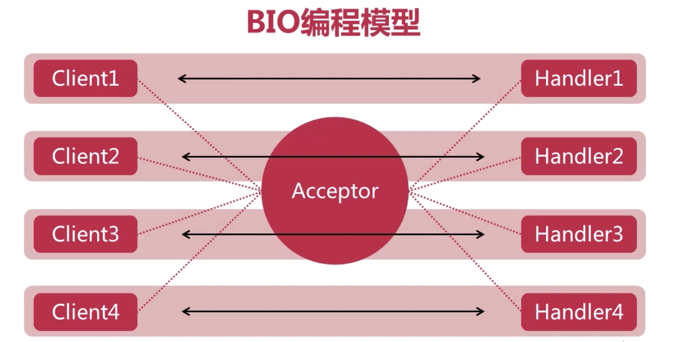

# 1. BIO 时代简介

## 1. Linux 内核

在说 BIO 之前, 需要先铺垫一波.

### 1. Linux 的 IO 操作

#### 1. kernel 简介

首先程序开发好后, 是放在磁盘中的, 然后被加载到内存中执行.

在启动电脑后, 内存中加载的第一个程序是 `kernel`, 也就是 ==**操作系统内核**==. `kernel` 是管理硬件的.

内核加载内内存后, 会注册一个 `GDT`, 叫做 全局描述附表, 会把内存所在的内存空间划分出来, 叫做 ==**内核空间**==, 其他的普通应用的空间, 用作 ==**用户空间**==. 为了更好的保护内核空间, 内核空间和用户空间分别运行在不同的级别上, 在逻辑上是相互隔离的, 所以用户进程在通常情况下无法直接访问内核空间的数据, 也无法使用内核空间的函数.


`Kernel` 是控制硬件的, 那么此时, 一个硬件内, 比如硬盘, 或者网卡内有一个数据, 如果程序(app)想读取这个数据, 应该怎么办?

由于程序无法直接访问内核内的, 也就是无法直接访问硬盘, 或者网卡, 或者其他硬件的. 能直接访问硬件的是 kernel.  

那么就需要通过 kernel 来访问硬件, 但是程序又无法直接访问内核. 所以内核提供一个 `syscall`, 暴露了一系列的方法, 这些方法可以用来读取 `kernel` 内的数据. 但是又因为 APP 无法直接访问 kernel, 所以就出现一个叫做 ==**软中断**==的东西. 通过 软中断 和 kernel 进行交互. 


#### 2. Linux 一切皆文件

在 Linux 内, 一切都可以用文件来表示, 就像 java 的一切皆对象.

通过 `strace -ff -o ./输出目录 java xxx.java` 命令可以查看程序对 kernel 有没有发生什么系统调用.并把日志输出到指定路径下

使用命令后, 


# 2. BIO编程模型

BIO(Blocking IO) 是`同步阻塞式IO`, 是jdk早期 1.4 之前采用的通信模式.


## 1. BIO 编程模型

在具体了解 BIO 之前, 先说三个角色:

- `client`: 客户端. 发起链接请求
- `acceptor`: 接收者. 位于服务端, 仅仅用于接收客户端的链接请求.
- `handler`: 位于服务端, 专门用于处理和客户端的数据通信.




- acceptor 专门用来接收客户端的链接请求.(acceptor 也是一个线程)
- acceptor 接收到 client 的链接请求后, 会为这个 client 创建一个线程, 这个线程专门用来处理和 client 之间的数据通信.
- 再接收到一个 client的链接请求, 就再创建一个专门的线程来负责和这个 client 的数据通信.
- 也就是说, client 和线程是 `1:1`的关系, 一个客户端对应一个线程.

以上就是 BIO 的编程模型, 相对来说比较简单, 但是当任务量比较大的时候, 或者说并发量比较大的时候, 系统就会创建大量的线程来为多个客户端的处理, 性能会急剧下降.


## 2. BIO 中的阻塞

- `serverSocket.accpect()` : accept 是阻塞式的. 服务器端调用 accept 后, 就会一直等待, 直到有一个客户端建立连接,  服务端接收这个链接请求, 然后 accept 才会返回.

- `InputStread.read(), OutputStream.write()`: 所有的输入输出流也是阻塞的. 比如在等待客户端客户输入信息的时候, 这个等待的过程就是阻塞的, 如果客户一直没有输入, 那么和这个客户端对应的线程就会一直阻塞.
- 无法在同一个线程里处理多个 Stream I/O.


# 3. BIO 实现多人聊天室

- 基于 BIO 编程模型
- 支持多人同时在线.(多个 client)
- 每个用户的发言都会被转发给其他所有在线用户.


## 1. 设计思路

**服务器端:**

1. acceptor(主线程)每接收到一个 client 的链接请求, 都要 accept 一下, 创建一个负责这个 client 的线程, 多个 client 就要创建多个线程(ChatHandler).
2. 当其中一个 client 发送了一条信息, 负责处理这个 client 的线程要把接收到的数据发送给其他的 client. 就需要有一个列表或者数组啥的来存储当前在线的 client.

**客户端:**

1. 客户端至少要有两条线程,(主线程)一条用于建立连接和显示服务端返回过来的消息, (创建线程)一条负责从控制台输入消息(等待输入消息是阻塞的).


## 2. 代码演示

==**服务端 ChatServer**==

```java
public class ChatServer {

    private final static String QUIT = "quit";
    private final static int DEFAULT_PORT = 8888;

    private static ServerSocket serverSocket;
    private Map<Integer, BufferedWriter> connectionClients;

    public ChatServer () {
        this.connectionClients = new HashMap<>();
    }

    /** 记录上线的客户端 .*/
    public synchronized void addClient(Socket socket) throws IOException {
        if (null != socket) {
            int port = socket.getPort();
            BufferedWriter writer = new BufferedWriter(new OutputStreamWriter(socket.getOutputStream()));
            connectionClients.put(port, writer);
            System.out.println("客户端: " + port + " 已连接到服务器...");
        }
    }

    /** 客户端下线.*/
    public synchronized void removeClent(Socket socket) throws IOException {
        if (null != socket) {
            int port = socket.getPort();
            if (connectionClients.containsKey(port)) {
                connectionClients.get(port).close();
                connectionClients.remove(port);
                System.out.println("客户端: " + port + " 已和服务器断开连接...");
            }
        }
    }

    /** 转发信息.*/
    public synchronized void forwadMessage(Socket socket, String forwardMsg) throws IOException {
        if (null != socket) {
            int port = socket.getPort();
            for (Integer id : connectionClients.keySet()) {
                if (!id.equals(port)) {
                    BufferedWriter writer = connectionClients.get(id);
                    writer.write(forwardMsg);
                    writer.flush();
                }
            }
        }
    }

    public boolean isQuit(String msg) {
        return msg.equals(QUIT);
    }

    /** 服务器关闭.*/
    public synchronized void close() {
        if (null != serverSocket) {
            try {
                serverSocket.close();
                System.out.println("serverSocket 已关闭...");
            } catch (IOException e) {
                e.printStackTrace();
            }
            System.out.println();
        }
    }

    /** 服务器启动.*/
    public void start() {
        try {
            // 启动服务器, 并绑定监听端口
            serverSocket = new ServerSocket(DEFAULT_PORT);
            System.out.println("ServerSocket 已启动...");
            while (true) {
                // 等待连接
                Socket socket = serverSocket.accept();
                // TODO 建立 chartHandler 线程
                new Thread(new ChatHandler(socket, this)).start();
            }
        } catch (IOException e) {
            e.printStackTrace();
        } finally {
            close();
        }
    }

    public static void main (String[] args) {
        ChatServer chatServer = new ChatServer();
        chatServer.start();
    }
}
```


==**服务端ChatHandler**==

```java
// 每个 client对应的线程
public class ChatHandler implements Runnable {

    private Socket socket;
    private ChatServer chatServer;

    public ChatHandler (Socket socket, ChatServer chatServer) {
        this.socket = socket;
        this.chatServer = chatServer;
    }


    @Override
    public void run () {
        try {
            chatServer.addClient(socket);
            BufferedReader reader = new BufferedReader(new InputStreamReader(socket.getInputStream()));
            String msg = null;
            while ((msg = reader.readLine()) != null) {
                if (chatServer.isQuit(msg)) break;
                msg = "客户端 "+ socket.getPort() +": " + msg + "\n";
                System.out.print(msg);
                chatServer.forwadMessage(socket, msg);
            }
        } catch (IOException e) {
            e.printStackTrace();
        } finally {
            try {
                chatServer.removeClent(socket);
            } catch (IOException e) {
                e.printStackTrace();
            }
        }
    }
}
```


==**客户端ChatClient**==

```java
public class ChatClient {

    private final static String DEFAULT_SERVER_HOST = "127.0.0.1";
    private final static int DEFAULT_SERVER_PORT = 8888;
    private final static String QUIT = "quit";

    private Socket socket;
    private BufferedReader reader;
    private BufferedWriter writer;

    /** 接收服务端发送的消息*/
    private String receive() throws IOException {
        String msg = null;
        if (null != socket.getInputStream()) {
            msg = reader.readLine();
        }
        return msg;
    }

    /** 发送消息*/
    public void send(String msg) throws IOException {
        if (null != socket.getOutputStream()) {
            writer.write(msg + "\n");
            writer.flush();
        }
    }

    public boolean isQuit(String msg) {
        return msg.equals(QUIT);
    }

    public void close() throws IOException {
        if (null != writer) {
            System.out.println("客户端断开连接");
            writer.close();
        }
    }

    public void start () {
        try {
            // 建立连接
            socket = new Socket(DEFAULT_SERVER_HOST, DEFAULT_SERVER_PORT);

            // 创建输入输出流(和服务端交互)
            reader = new BufferedReader(new InputStreamReader(socket.getInputStream()));
            writer = new BufferedWriter(new OutputStreamWriter(socket.getOutputStream()));

            // TODO 创建线程  处理用户输入
            new Thread(new UserInputHandler(this)).start();

            // 接收服务端信息
            String msg = null;
            while ((msg = receive()) != null) {
                System.out.println(msg);
            }
        } catch (IOException e) {
            e.printStackTrace();
        } finally {
            try {
                close();
            } catch (IOException e) {
                e.printStackTrace();
            }
        }
    }

    public static void main (String[] args) {
        ChatClient chatClient = new ChatClient();
        chatClient.start();
    }
}
```

==客户端UserInputHandler==

```java
// 处理用户输入
public class UserInputHandler implements Runnable {

    private ChatClient chatClient;
    public UserInputHandler (ChatClient chatClient) {
        this.chatClient = chatClient;
    }

    @Override
    public void run () {
        try {
            BufferedReader reader = new BufferedReader(new InputStreamReader(System.in));
            while (true) {
                String input = reader.readLine();
                chatClient.send(input);
                if (chatClient.isQuit(input)) {
                    break;
                }
            }
        } catch (IOException e) {
            e.printStackTrace();
        }
    }
}

```


# 4. BIO 的弊端

- 客户端和线程是一对一的, 也就是说当连接多的时候, 就需要创建很多线程.