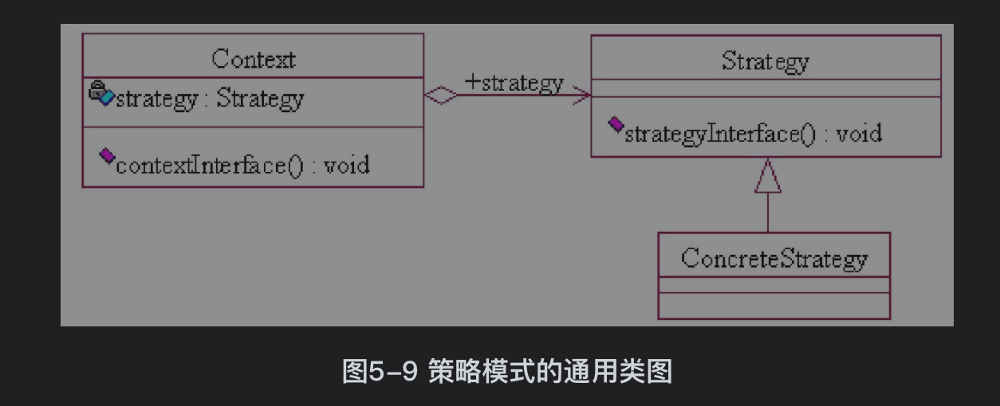

# 策略模式

## 1. 策略模式介绍

策略模式属于设计模式三种类型中的 **==行为型模式==**. 行为型模式关注的是 **==对象的行为==**, 用来解决对象之间的联系问题.


==**策略模式的定义:**==

策略模式也叫 政策模式. ==通过定义一组算法, 将每个算法都封装起来, 并且使他们之间可以互换==, 针对一组算法, 将每一个算法都封装到实现同一个接口的独立的类中, 从而使他们可以相互替换, 在不影响客户端运行的情况下,是算法发生变化. 

其实简单的说就是在针对一个场景, 定义一个接口,然后针对场景的不同算法, 创建这个接口的多个实现类, 然后每一个类实现一种算法.


**==策略模式涉及到的 3 个角色:==**

1. 抽象策略(Strategy): 该角色对策略, 算法进行抽象. 一般用来定义每个策略或算法必须具有的方法和属性. 就是算法的抽象接口.可以是接口, 也可以是抽象类
2. 具体策略(Concrete Strategy):实现抽象策略, 是算法的具体实现. 
3. 环境角色(Context): 也叫上下文角色, 屏蔽高层对算法,策略的直接访问. 持有一个 ==抽象策略的引用.==


**==策略模式的场景==:**

1. 多个类只是在算法或者行为上稍有不同的场景.(比如商场优惠活动, 打 9 折, 打 7 折, 等等)
2. 算法需要自由切换的场景.(比如商场优惠活动, 有打折活动, 有满多少送多少的活动等等)
3. 需要屏蔽算法规则的场景.


## 2. 策略模式 UML

**==策略模式的 UML 类图:==**




**==策略模式简单实现==**

**抽象策略**

```java
public abstract class Strategy {
    public abstract void strategyInterface();
}
```


**具体策略**:

```java
// 具体策略一
public class ConcreteStrategyA extends Strategy {
    @Override
    public void strategyInterface() {
        System.out.println("具体策略 A");
    }
}

// 具体策略二
public class ConcreteStrategyB extends Strategy {
    @Override
    public void strategyInterface() {
        System.out.println("具体策略 B");
    }
}
```


**上线文**:

```java
public class Context {
  	// 上下文中包含一个抽象策略的引用
    private Strategy strategy;

    public Context(Strategy strategy) {
        this.strategy = strategy;
    }

    public void contextInterface(){
        this.strategy.strategyInterface();
    }
}
```


**客户端**:

```java
public class Client {

    public static void main(String[] args) {
        Context contextA = new Context(new ConcreteStrategyA());
        contextA.contextInterface();

        Context contextB = new Context(new ConcreteStrategyB());
        contextB.contextInterface();
    }
}
```

