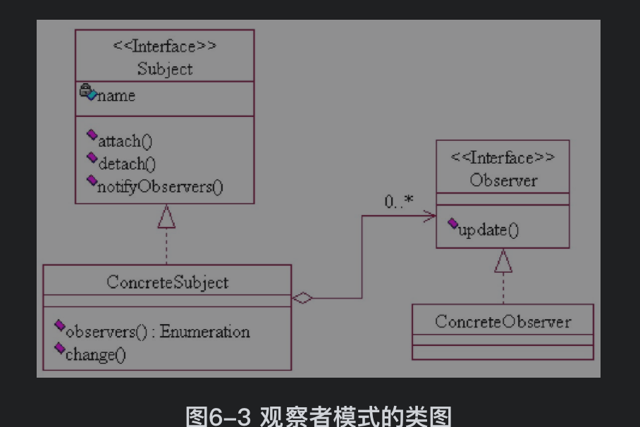

#  观察者模式

## 1. 观察者模式介绍

观察者模式属于设计模式三种类型中的 ==行为型模式==. 行为型模式关注的是 ==对象的行为==.

==**观察者模式的定义:**==

观察者模式也叫 ==订阅发布模式==. 定义一种一对多的关系, 使得每当一个对象改变状态, 则所有依赖于它的对象都会得到通知并被自动更新.

==**观察者模式涉及到的 4 个角色:**==

1. 抽象观察者(Observer): 该角色为所有的具体观察者定义一个接口, 在得到==主题的通知==时更新自己.
2. 具体观察者(Concrete Observer) : 该角色实现抽象观察者所要求的更新接口, 以便使自身的状态与主题的状态相协调.
3. 抽象主题(Subject) : 该角色又称为 ==被观察者==, 可以增加和删除观察者对象.
4. 具体主题(Concrete Subject): 该角色又称 ==具体被观察者==, 它将有关状态存入具体观察者对象, 在==具体主题的内部状态改变时, 给所有登记过的观察者发出通知==.

==**观察者模式的场景**==:

1. 关联行为场景
2. 事件多级触发场景
3. 跨系统的信息交换场景,如消息队列的处理机制.

## 2. 观察者模式UML

==**观察者模式 UML 类图**==:

==观察者模式简单实现==

